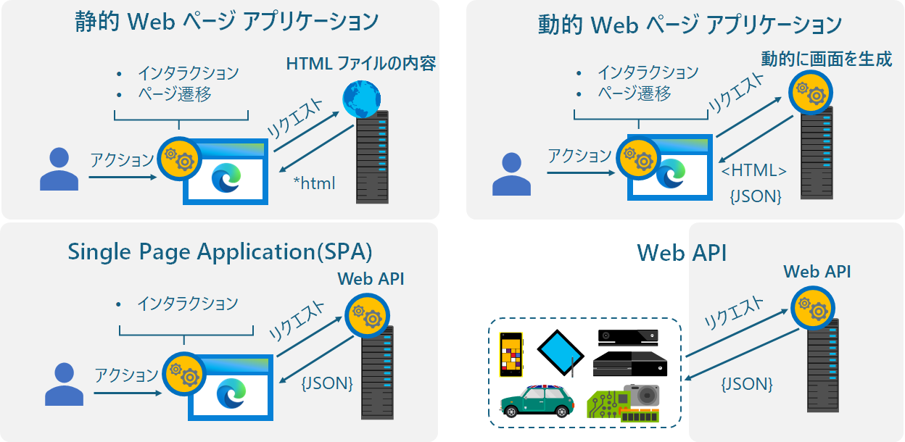

# Azure-AppService-handson
ユーザーにサービスを提供する Web アプリケーションの形態は多岐にわたります。

ユーザーが操作する画面 (UI) を持つものであるか、あるいは API としてのみ機能するものであるか、UI を持つものであっても、その UI 画面がサーバーサイドで描画されるものであるか、あるいはクライアントサイドで描画されるものであるか、といった違いがあります。

具体的には、ユーザーにサービスを提供する Web アプリケーションの形態は、大きく分けて次の 4 つに分類できます。

Microsoft Azure では、完全な静的 Web アプリケーションであれば、[**Azure Storage 静的 Web ホスティング機能**](https://learn.microsoft.com/ja-jp/azure/storage/blobs/storage-blob-static-website-how-to?tabs=azure-portal)、静的 Web ページとサーバー サイドから提供される API を利用する Single Page Application (SPA) であれば、[**Azure Static Web Apps**](https://learn.microsoft.com/ja-jp/azure/static-web-apps/overview) も選択することができます。

また、状態を持たず、一回の呼び出しで処理が完了する関数的な Web API を提供するサービスであれは [**Azure Functions**](https://learn.microsoft.com/ja-jp/azure/azure-functions/functions-proxies) を選択することができますし、より簡易的なものであれば [**Azure Logic Apps**](https://learn.microsoft.com/ja-jp/azure/connectors/connectors-native-reqres?tabs=consumption) を選択することもできます。

動的 Web アプリケーションのホストには PaaS では [**Azure App Service**](https://learn.microsoft.com/ja-jp/azure/app-service) 一択ですが、Azure App Service は、動的 Web アプリケーションのホストだけでなく、前出の静的 Web アプリケーションや SPA、Web API などもホストすることができます。

つまり、AppService の使い方を理解しておくことで、さまざまなタイプの Web アプリケーションをホストすることができます。

このハンズオンでは 動的 Web アプリケーション、SPA、API サービスの機能を持った単一の Web アプリケーションを使用して、ローカルの開発環境から Azure App Service へのデプロイ、アプリケーションの種別の違い、実際にサービスを運用していくうえで必要となる設定や他のサービスの連携などを学びます。

 

## ハンズオンの目的

ローカルの開発環境からアプリケーションを Azure App Service にデプロイするといった初歩的な内容にとどまらず、実際にサービスを運用していくうえで必要となる設定や他のサービスの連携などを学びます。

 

## 対象者

クラウドサービスにおれる IaaS、PaaS、SaaS の違いを理解しており、Azure の基本的な操作に慣れている方を対象としています。

具体的には Microsoft 資格試験である MCP AZ-900 を取得されているか、取得者と同程度の知識を有している方を対象としています。

 MCP AZ-900 の内容については以下をご覧ください。

 * [**試験 AZ-900: Microsoft Azure の基礎の学習ガイド**](https://learn.microsoft.com/ja-jp/credentials/certifications/resources/study-guides/az-900)

 

## ハンズオンの前提条件

このハンズオンでは、以下のアカウントとツール類が必要となります。

アカウント

- [**Microsoft Azure**](https://docs.microsoft.com/ja-jp/dotnet/azure/create-azure-account) のアカウント 
     
- [**GitHub**](https://github.com/join) のアカウント

ツール

- [**Visual Studio 2022**](https://visualstudio.microsoft.com/ja/downloads/) (※)

    (※) Windows 以外の OS を使用していて Visual Studio がインストールできない場合は、以下のページよりあらかじめ Visual Studio がインストールされた Windows 11 の仮想マシンをダウンロードして使用することができます。

    * [**Windows 11 開発環境を取得する**](https://developer.microsoft.com/ja-jp/windows/downloads/virtual-machines/)

- [**git ツール**](https://git-scm.com/downloads)

詳細については、ハンズオンの [**事前準備**](preparation.md)をご覧ください。

 

## 事前準備

Azure のアカウントでサブスクリプションが有効になっていかどうか、開発環境の構築から演習用のプロジェクトの入手とローカル環境での実行まで、ハンズオンを行うにあたって必要な事前準備について説明します。

* [**アカウントの確認とサンプル アプリケーションの入手**](preparation.md)

## 演習

このハンズオンで実施する演習は以下の通りです。

【註】 マイクロソフトの公式なドキュメントに詳細な手順が掲載され
ているものに関しては、そちらへのリンクを掲載しています。

1. [ローカル開発環境上の演習用アプリケーションを Azure App Service にデプロイ](ex01.md)
    1. [Azure SQL Database インスタンスの作成](ex01.md#%E3%82%BF%E3%82%B9%E3%82%AF-1-azure-sql-database-%E3%82%A4%E3%83%B3%E3%82%B9%E3%82%BF%E3%83%B3%E3%82%B9%E3%81%AE%E4%BD%9C%E6%88%90)
    2. [Visual Studio Local DB(SQL Server) の内容を Azure SQL Database に移行](ex01.md#%E3%82%BF%E3%82%B9%E3%82%AF-2-visual-studio-%E9%96%8B%E7%99%BA%E7%94%A8%E3%83%87%E3%83%BC%E3%82%BF%E3%83%99%E3%83%BC%E3%82%B9%E3%81%AE%E5%86%85%E5%AE%B9%E3%82%92-azure-sql-database-%E3%81%AB%E7%A7%BB%E8%A1%8C)
    3. [AppService インスタンスの作成](ex01.md#%E3%82%BF%E3%82%B9%E3%82%AF-3-appservice-%E3%82%A4%E3%83%B3%E3%82%B9%E3%82%BF%E3%83%B3%E3%82%B9%E3%81%AE%E4%BD%9C%E6%88%90)
    4. [開発環境のアプリケーションを Azure App Service にデプロイ](ex01.md#%E3%82%BF%E3%82%B9%E3%82%AF-4-appservice-%E3%81%AB%E3%82%A2%E3%83%97%E3%83%AA%E3%82%B1%E3%83%BC%E3%82%B7%E3%83%A7%E3%83%B3%E3%82%92%E3%83%87%E3%83%97%E3%83%AD%E3%82%A4)

2. Web サイトを運用するための基本的な設定
    1. [ホスティングに関する設定の確認](ex02.md#%E3%82%BF%E3%82%B9%E3%82%AF-1--%E3%83%9B%E3%82%B9%E3%83%86%E3%82%A3%E3%83%B3%E3%82%B0%E3%81%AB%E9%96%A2%E3%81%99%E3%82%8B%E8%A8%AD%E5%AE%9A%E3%81%AE%E7%A2%BA%E8%AA%8D)

    2. [App Service ログの設定と有効化](ex02.md#%E3%82%BF%E3%82%B9%E3%82%AF-2--app-service-%E3%83%AD%E3%82%B0%E3%81%AE%E8%A8%AD%E5%AE%9A%E3%81%A8%E6%9C%89%E5%8A%B9%E5%8C%96)
    3. [バックアップ](ex02.md#%E3%82%BF%E3%82%B9%E3%82%AF-3--%E3%83%90%E3%83%83%E3%82%AF%E3%82%A2%E3%83%83%E3%83%97)
    4. [カスタム ドメインの設定](ex02.md#%E3%82%BF%E3%82%B9%E3%82%AF-4--%E3%82%AB%E3%82%B9%E3%82%BF%E3%83%A0-%E3%83%89%E3%83%A1%E3%82%A4%E3%83%B3%E3%81%AE%E8%A8%AD%E5%AE%9A)
    5. [CORS 設定](ex02.md#%E3%82%BF%E3%82%B9%E3%82%AF-5--cors-%E8%A8%AD%E5%AE%9A%E3%81%AE%E7%A2%BA%E8%AA%8D%E3%81%A8%E5%A4%89%E6%9B%B4)
    6. [認証について](ex02.md#%E3%82%BF%E3%82%B9%E3%82%AF-6--%E8%AA%8D%E8%A8%BC%E3%81%AB%E3%81%A4%E3%81%84%E3%81%A6)

3. Advanced なアプリケーション設定
    1. より高度なデプロイ
        1. デプロイ スロット
        2. GitHub Actions による CI/CD
    2. 可用性設定
        1. スケールアップ/スケールアウト/自動スケーリング
        2. スケジュール/メトリックス設定
        3. スケーリングに伴う追加サービスと設定について
    3. 高度なログ監視
        1. Application Insights
        2. Log Analytics (警告,メトリック、ログ)
4. Advanced なネットワーク設定
    1. 仮想ネットワーク統合
    2. プライベート エンドポイント
5. REST API サービスと SPA のホスト
    1. Azure API Managenent を使用した API サービスのホスト
    2. Azure Storage 静的 Web Site を使用した SPA の AppShell のホスト

---
## LICENSE

このドキュメントに記載されている情報 (URL や他のインターネット Web サイト参照を含む) は、将来予告なしに変更することがあります。別途記載されていない場合、このソフトウェアおよび関連するドキュメントで使用している会社、組織、製品、ドメイン名、電子メール アドレス、ロゴ、人物、場所、出来事などの名称は架空のものです。実在する商品名、団体名、個人名などとは一切関係ありません。お客様ご自身の責任において、適用されるすべての著作権関連法規に従ったご使用をお願いいたします。著作権法による制限に関係なく、マイクロソフトの書面による許可なしに、このドキュメントの一部または全部を複製したり、検索システムに保存または登録したり、別の形式に変換したりすることは、手段、目的を問わず禁じられています。ここでいう手段とは、複写や記録など、電子的、または物理的なすべての手段を含みます。

マイクロソフトは、このドキュメントに記載されている内容に関し、特許、特許申請、商標、著作権、またはその他の無体財産権を有する場合があります。別途マイクロソフトのライセンス契約上に明示の規定のない限り、このドキュメントはこれらの特許、商標、著作権、またはその他の知的財産権に関する権利をお客様に許諾するものではありません。

製造元名、製品名、URL は、情報提供のみを目的としており、これらの製造元またはマイクロソフトのテクノロジを搭載した製品の使用について、マイクロソフトは、明示的、黙示的、または法令によるいかなる表明も保証もいたしません。製造元または製品に対する言及は、マイクロソフトが当該製造元または製品を推奨していることを示唆するものではありません。掲載されているリンクは、外部サイトへのものである場合があります。これらのサイトはマイクロソフトの管理下にあるものではなく、リンク先のサイトのコンテンツ、リンク先のサイトに含まれているリンク、または当該サイトの変更や更新について、マイクロソフトは一切責任を負いません。リンク先のサイトから受信した Web キャストまたはその他の形式での通信について、マイクロソフトは責任を負いません。マイクロソフトは受講者の便宜を図る目的でのみ、これらのリンクを提供します。また、リンクの掲載は、マイクロソフトが当該サイトまたは当該サイトに掲載されている製品を推奨していることを示唆するものではありません。

Copyright (c) Microsoft Corporation. All rights reserved.

