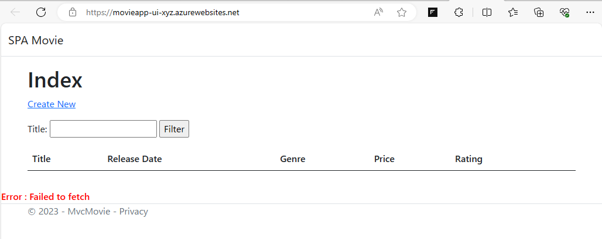

このタスクでは、[**演習 2 - タスク 5 : CORS 設定の確認と変更**](https://github.com/osamum/Azure-AppService-handson/blob/main/ex02.md#%E3%82%BF%E3%82%B9%E3%82%AF-5--cors-%E8%A8%AD%E5%AE%9A%E3%81%AE%E7%A2%BA%E8%AA%8D%E3%81%A8%E5%A4%89%E6%9B%B4) で使用した  MovieApp の SPA の UI 部分を App Service 上にデプロイし、タスク1 で仮想ネットワーク環境内からのみアクセス可能になっている `MovieApps-XYZ` の API を参照できるように仮想ネットワーク統合を行います。

なお、この演習では Visual Studio Code と Azure App Service 拡張機能を使用して App Service 上にアプリケーションをデプロイしますので、事前に以下のいずれかのリンクから拡張機能をインストールしておいてください。

* [**Azure App Service 拡張**](https://marketplace.visualstudio.com/items?itemName=ms-azuretools.vscode-azureappservice)

* [**Azure Tools 拡張**](https://marketplace.visualstudio.com/items?itemName=ms-vscode.vscode-node-azure-pack)

タスクの具体的な手順は以下のとおりです。

1. ローカル環境の Visual Studio Code で、**演習 2 - タスク 5 : CORS 設定の確認と変更**で使用した  MovieApp の SPA の UI 部分である [SPA-Movie](https://github.com/osamum/SPA-Movie) を開きます

2. プロジェクト中のファイル js/site.js の 2 行目にある変数 MOVIEAPP_API の値が以下のようになっていることを確認します

    ```javascript
        const MOVIEAPP_API = "https://movieapp-xyz.azurewebsites.net/api/movie";
    ```

    (※) URL 中の `movieapp-xyz` は自身のアプリケーション名に置き換えてください


3. Visual Studio Code の左側のメニュー バーから Azure のアイコンをクリックします

    はじめて Azure 拡張機能を使用する場合は、メニュー バーの右隣のツリーより \[**Sign in Azure**\] をクリックします

    

    メッセージ ボックスに `The extension 'Azure Resources' wants to sign in using Microsoft.` と表示されるので \[**Allow**\] ボタンをクリックすると Web ブラウザーが起動し認証が行われ、認証が完了すると Visual Studio Code に Azure サブスクリプションの一覧が表示されます。

4. サブスクリプションのアイコンをクリックすると、Azure リソースのアイコンの一覧が表示されるので、\[**App Service**\] を右クリックし、表示されたコンテンツの中から \[**Create New Web App...(Advanced)**\] をクリックします

    

5. Visual Studio Code 画面上部のコマンド パレットがドロップダウンし、Web App (App Service) を作成するためのプロンプトが表示されるので、各項目を以下のように設定します


    |プロンプト|設定値|
    |:---|:---|
    |Enter a globally unique name for the App Service plan|`MovieApp-UI-XYZ`|
    |Select a resource group for new resources|`PaaS_Handson`|
    |Select the runtime stack|`.NET 7(STS)`|
    |select an OS|`Windows`|
    |select a Windows App Service plan|`※MovieApp-XYZ が使用している App Service プラン`|
    |select an Application Insights for your app|\[**Skip for now**\]|
    
    すべての項目の設定が完了するとデプロイが開始されます

   
6. App Service の作成が完了後、Visual Studio Code の左側のツリービューから \[**App Service**\] のアイコンをクリックすると、作成した App Service `MovieApp-UI-XYZ` が表示されるので、右クリックし、表示されたコンテンツの中から \[**Deploy to Web App...**\] をクリックします

    

7. コマンドパレットに \[**Select the folder to deploy**\] とプロンプトが表示されるので MovieApp の UI 部分である SPA-Movie アプリケーションのフォルダを選択します

    `Are you sure you eant to deploy to "MovieApp-UI-XYZ"? This will overwrite any previous deployment and cannot be undone.' と書かれたメッセージボックスが表示されるので、同メッセージ中の \[**Deploy**\] ボタンをクリックしで、デプロイを開始します

8. アプリケーションのデプロイが完了した際に表示される \[**Brows Website**\] ボタンをクリックし、デプロイしたアプリケーションの画面が表示されることを確認します

    

    この時点では、App Service 上のアプリケーション `MovieApp-UI-XYZ` は仮想ネットワーク環境内のアプリケーション　MovieApp-XYZ　の API に接続できないため映画のタイトル一覧は表示されません。

