# 演習 2 : Web サイトを運用するための基本的な設定

この演習では、[演習 1](ex01.md) で Azure App Servive(Web App) に移行した アプリケーションを Web サイトとして運用するための基本的な設定を行います。

この演習では、一般的な Web サイトでコンテンツをホストする際に必要となる以下の基本的な内容について手順を実施します。ただし、ドメインの購入など実施が難しいものについては手順の説明のみを行います。

1. [**ホスティングに関する設定の確認**](#%E3%82%BF%E3%82%B9%E3%82%AF-1--%E3%83%9B%E3%82%B9%E3%83%86%E3%82%A3%E3%83%B3%E3%82%B0%E3%81%AB%E9%96%A2%E3%81%99%E3%82%8B%E8%A8%AD%E5%AE%9A%E3%81%AE%E7%A2%BA%E8%AA%8D)

2. [**App Service ログの設定と有効化**](#%E3%82%BF%E3%82%B9%E3%82%AF-2--app-service-%E3%83%AD%E3%82%B0%E3%81%AE%E8%A8%AD%E5%AE%9A%E3%81%A8%E6%9C%89%E5%8A%B9%E5%8C%96)
3. [**バックアップ**](#%E3%82%BF%E3%82%B9%E3%82%AF-3--%E3%83%90%E3%83%83%E3%82%AF%E3%82%A2%E3%83%83%E3%83%97)
4. [**カスタム ドメインの設定**](#%E3%82%BF%E3%82%B9%E3%82%AF-4--%E3%82%AB%E3%82%B9%E3%82%BF%E3%83%A0-%E3%83%89%E3%83%A1%E3%82%A4%E3%83%B3%E3%81%AE%E8%A8%AD%E5%AE%9A)
5. [**CORS 設定**](#%E3%82%BF%E3%82%B9%E3%82%AF-5--cors-%E8%A8%AD%E5%AE%9A%E3%81%AE%E7%A2%BA%E8%AA%8D%E3%81%A8%E5%A4%89%E6%9B%B4)
6. [**認証について**](#%E3%82%BF%E3%82%B9%E3%82%AF-6--%E8%AA%8D%E8%A8%BC%E3%81%AB%E3%81%A4%E3%81%84%E3%81%A6)

<br>


## タスク 1 : ホスティングに関する設定の確認

オンプレミスでの Web サーバーの運用経験者が Azure App Service で Web サイトや Web アプリケーションをホストする際に知っておかなければならないことが 2 つあります。

それはこれまでオンプレミスの環境で確認していたアプリケーションをホストするための設定を、Azure ではどのように設定するのかということと Azure ならではの制限についてです。

これらは細かくは非常にたくさんありますが、このタスクでは基本にして必須のものを紹介します。


### タスク 1.1 : App Service の設定の確認

Web サイトやアプリケーションをホストする際に把握しておくべき環境変数や利用可能なアプリケーションのランタイム、既定のページや仮想ディレクトリなどの設定を確認します。

これらの設定は App Servive の \[**構成**\] 画面で確認することができます。

具体的な手順は以下の通りです。

1. [Azure ポータル](https://portal.azure.com/)にログインします

2. ハンズオンで使用している App Service `MovieApp-XYZ` の画面を開き、画面左側のメニューから \[**構成**\] をクリックします

3. \[**構成**\] 画面に遷移し、\[**アプリケーション設定**\] タブがアクティブな状態で表示されます

    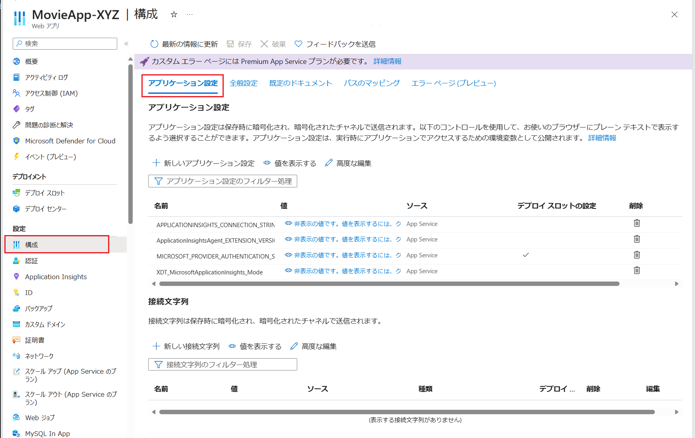


    \[**アプリケーション設定**\] タブでは App Service が参照する**環境変数**と**接続文字列** を設定することができます。

    これらはアプリケーション内から同じく環境変数として参照されますが、**接続文字列** は保存時に暗号化され、暗号化されたチャネルで送信されます。
    たとえば、今回演習で使用している SQL データベースの管理者 ID とパスワードを含む接続文字列を外部から設定する場合は、**接続文字列** に設定することで、安全に送信することができます。
    
    また、**アプリケーションから参照する際**にはデータベースのタイプによって以下の**接頭辞を追加して参照**する(※)必要があるので注意が必要です。

    * SQLServer: `SQLCONNSTR_`
    * MySQL: `MYSQLCONNSTR_`
    * SQLAzure: `SQLAZURECONNSTR_`
    * カスタム: `CUSTOMCONNSTR_`
    * PostgreSQL: `POSTGRESQLCONNSTR_`

    (※) SQLAzure のデータベースへの接続文字列を格納する変数名が `MyDATABASE` である場合、アプリケーションから参照する際は `SQLAZURECONNSTR_MyDATABASE` という名前で参照する必要があります。

4. \[**全般設定**] タブをアクティブにします

    同タブでは App Service がサポートしているランタイム スタック、バージョン、プラットフォーム、HTTP のバージョンや Web ソケットの有効/無効化など、HTTP によるホスト全般に関する設定を行うことができます。

    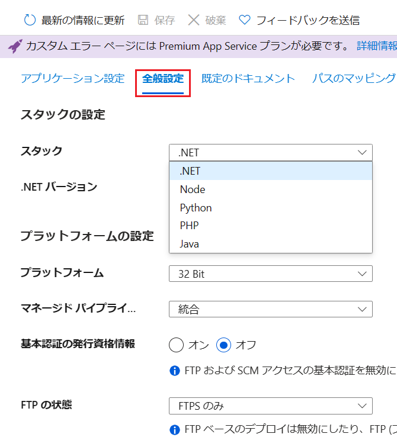

5. \[**既定のドキュメント**] タブをアクティブにします

    同タブでは App Service にアクセスした際の URL がドメイン名のみだった場合に表示される既定のページを設定することができます。

    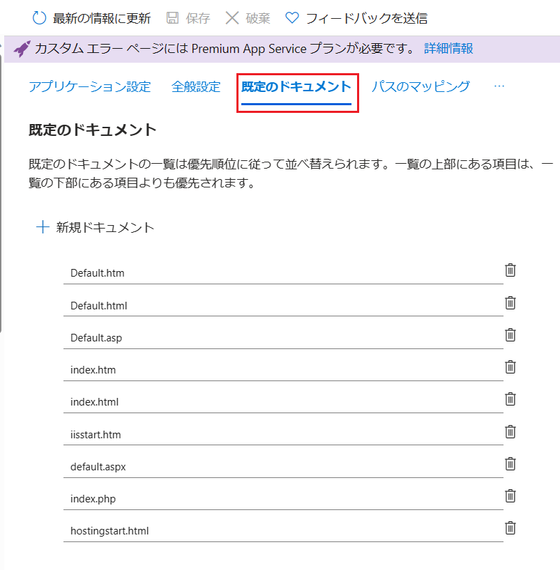

6. \[**パスのマッピング**] タブをアクティブにします

    同タブでは以下の設定が行えます。

    * **ハンドラー マッピング (※)**

        (※)この項目はオペレーティングシステムに Windows が選択されている場合のみ表示されます。

        Windows をプラットフォームとする App Servive の基盤となっている Web サーバー [IIS のハンドラー マッピング](https://learn.microsoft.com/ja-jp/iis/configuration/system.webServer/handlers/#how-create-a-handler-mapping-for-an-aspnet-handler-in-an-iis-7-application-running-in-integrated-mode)の追加が行えます。ハンドラー マッピングを使用すると、特定のファイル拡張子への要求を処理するためのカスタム スクリプト プロセッサを追加できます。
        たとえば、App Service でサポートされていないスクリプト言語が処理できるように構成する、といった用途に使用できます。

    * **仮想アプリケーションとディレクトリ**

        App Service では既定でルート ディレクトリからアプリケーションを起動しますが、一部の Web フレームワークではルート ディレクトリで起動できないものもあります。
        このようにアプリケーションのスタートアップ ファイルが別のフォルダーにあるか、または同一ドメイン上に複数のアプリケーションが含まれている場合は、仮想アプリケーションおよびディレクトリを編集または追加することができます。

    * **ストレージのマウント**

        文字通り、App Service に Azure Storage ファイルをネットワーク共有としてマウントすることができます。この機能を利用することで App Service アプリケーションの永続的なストレージを構成し、ストレージを個別に管理することができます。

        永続ストレージの用途としては、アプリケーションからの動画や画像などの静的なコンテンツの利用や、ネットワーク ファイル共有、ログの保存などがあります。

        > 【メモ】 Azure App Service ではマウントされた Azure Storage アカウントは、[Standard または Premium パフォーマンス レベルのいずれか](https://learn.microsoft.com/ja-jp/azure/storage/files/storage-files-scale-targets#azure-file-share-scale-targets)になります。 アプリの容量とスループットの要件に基づいて、ストレージ アカウントに適したパフォーマンス レベルを選択する必要があります。たとえば、Standard パフォーマンス レベルのストレージ アカウントにアプリケーションのフレームワークによってキャッシュ等を作成すると、アプリケーションのパフォーマンスが充分に発揮されない場合があります。また、サイズの大きいファイルのダウンロードにも注意が必要です。

        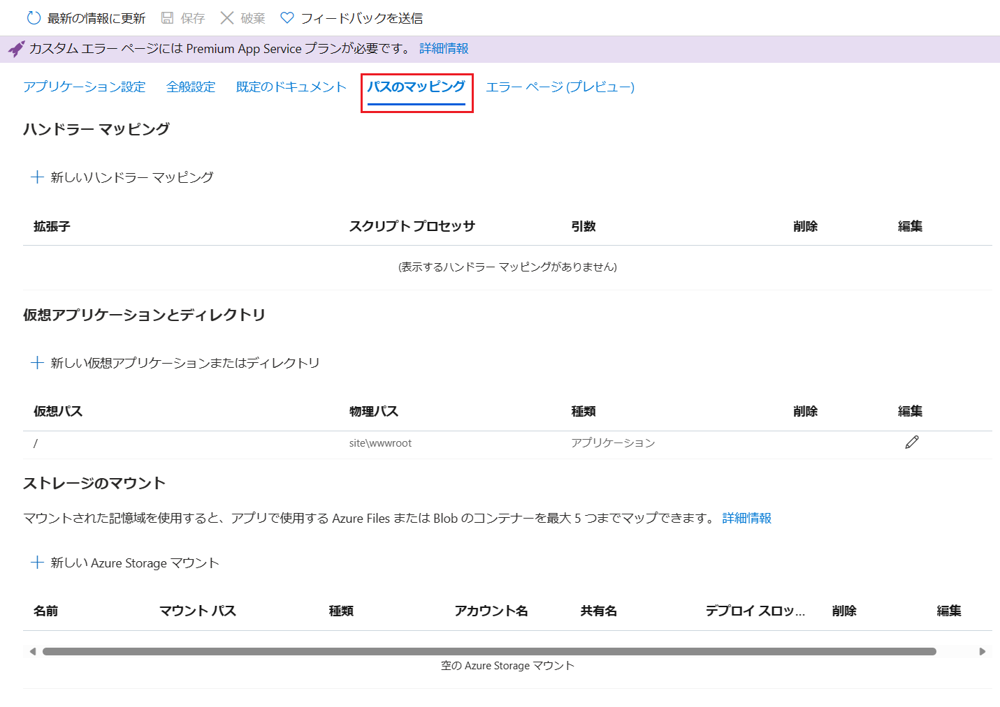

ここまでの手順で App Service のホスティングに関する設定の確認は完了です。

より詳細な内容は以下のドキュメントを参照してください。

* [**App Service アプリを構成する**](https://learn.microsoft.com/ja-jp/azure/app-service/configure-common?tabs=portal)

* [**App Service でローカル共有として Azure Storage をマウントする**](https://learn.microsoft.com/ja-jp/azure/app-service/configure-connect-to-azure-storage)

* [**Azure Files のスケーラビリティおよびパフォーマンスのターゲット**](https://learn.microsoft.com/ja-jp/azure/storage/files/storage-files-scale-targets)

<br>

### タスク 1.2 : クォータについて

Azure でホストされているリソースは選択されているプランによっては、背後にあるハードウェアを他者と共有しているため、一定の制限が設けられています。

たとえば、現在この演習で使用している App Service の Free プランまたは Shared プランでホストされている場合、アプリで使用できるリソースの制限はクォータによって定義されます。

アプリが Basic プラン、Standard プラン、Premium プランでホストされている場合、アプリで使用できるリソースの制限は、App Service プランのサイズ (S、M、L) とインスタンス数 (1、2、3 など) によって設定されます。

アプリが CPU (ショート) 、CPU (1 日) 、**帯域幅のクォータ**を超過すると、クォータがリセットされるまでアプリは停止されます。 この期間中は、すべての受信要求の結果が HTTP 403 エラーになります。

アプリの**メモリ クォータ**を超えた場合は、アプリが一時的に停止されます。

**ファイルシステム クォータ**を超えた場合は、ログへの書き込みも含み、 すべての書き込み操作が失敗することになります。

クォータを引き上げたりアプリから削除したりするには、App Service プランをアップグレードする必要があります。(※[演習 2 タスク 3 : バックアップ](#%E3%82%BF%E3%82%B9%E3%82%AF-3--%E3%83%90%E3%83%83%E3%82%AF%E3%82%A2%E3%83%83%E3%83%97) で手順を紹介します)

現在のクォータの使用状況は以下の手順で確認できます。

1. [Azure ポータル](https://portal.azure.com/)にログインします

2. ハンズオンで使用している App Service `MovieApp-XYZ` の画面を開き、画面左側のメニューから \[**クォータ**\] をクリックします

    遷移した画面で現在のクォータの使用状況が確認できます。

    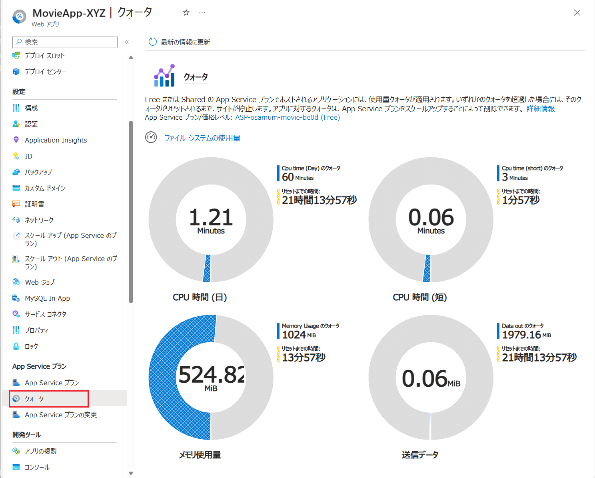

ここまでの手順で App Service のクォータについての確認は完了です。

クォータと App Servive プランの詳細については以下のドキュメントを参照してください。

* [**Azure App Service のアプリの監視 - クォータを理解する**](https://learn.microsoft.com/ja-jp/azure/app-service/web-sites-monitor#understand-quotas)

* [Azure サブスクリプションとサービスの制限、クォータ、制約 - App Service の制限](https://learn.microsoft.com/ja-jp/azure/azure-resource-manager/management/azure-subscription-service-limits#app-service-limits)


<br>

## タスク 2 : App Service ログの設定と有効化

一般的な Web サーバーの場合、既定の状態でアクセスログやエラーログなどのログが出力されますが、App Service では既定ではログが出力されないため、ログの設定と有効化を行う必要があります。

ログの出力先は Azure Storage (Blob) と  App Service ファイル システムの 2 種類がありますが、**アプリケーション ログについては Azure Storage に出力できるものは App Service が Windows でホストされており、かつアプリケーションのランタイムが .NET Framework または .NET Core、Node.js の場合に限られます**。App Service が Linux でホストされている場合、あるいは App Service が Windows でホストされていてもアプリケーションのランタイムが Java、Python、PHP、Ruby などの場合は、アプリケーション ログは App Service ファイル システムに出力されます。


ログの出力先のひとつである Azure Storage アカウントは \[**App Service ログ**\]の設定画面から作成することもできますが、混乱を避けるためにAzure Storage アカウントの作成と、\[**App Service ログ**\] の設定手順を別けて説明します。

はじめに Azure Storage アカウントを作成します。

具体的な手順は以下の通りです。

### タスク 2.1 : Azure Storage アカウントの作成

1. [Azure Portal](http://portal.azure.com) にログインします。

2. ポータル画面上部の \[**+**\] リソースの作成 アイコンか、表示されていない場合は画面左上のハンバーガーメニューをクリックし、\[**リソースの作成**\] をクリックします

    

3. \[**リソースの作成**\] 画面に遷移するので、検索ボックスに `ストレージ` と入力し、表示された検索結果の \[**ストレージ アカウント**\] のタイルをクリックします

    

4. \[**ストレージ アカウント**\] の画面が表示されるので、\[**作成**\] ボタンをクリックします

5. \[**ストレージ アカウントを作成する**\] 画面に遷移するので、各項目を以下の通り入力します

    |項目|値|
    |---|---|
    |サブスクリプション|使用するサブスクリプション|
    |リソース グループ|`PaaS_Handson`|
    |ストレージ アカウント名|`handsonstorage99`(※1)|
    | 地域 * | \[**(Asia Pacific) Japan East**\] |
    |パフォーマンス|\[**Standard**\]|
    |冗長性|\[**ローカル冗長ストレージ(LRS)**\](※2)|
    |ロケーション|使用するリージョン|

    (※1) この名前はユニークでかつ小文字英数字しか使用できないため、数字 `99` を任意の数字に書き換えてください。

    (※2) 今回は演習で使用するため価格の安い LRS を指定しています。実際に運用する際は、データの重要度に応じて GRS などの冗長性の高いものを選択してください。

    

    \[**レビュー**\] ボタンをクリックし、\[**作成**\] ボタンが表示されたらクリックしデプロイを開始します。

6. デプロイが完了すると \[**リソースに移動**\] ボタンが表示されるので、クリックして作成された Azure Storage アカウントの画面に遷移します

7. 画面左のメニューバーから \[**コンテナー**\] をクリックし、遷移した画面上部にある \[ **+ コンテナー**\] ボタンをクリックします

    画面右側に \[**新しいコンテナー**\] ブレードが表示されるので、以下の 2 つの名前のコンテナーをそれぞれ作成します

    * **log-server**
    * **log-app**

    > 【メモ】既定で $logs という名前のコンテナーが作成されていることがありますが、このコンテナーは Azure Storage Analytics ログを保存するもので削除することはできません。詳しくは以下のドキュメントを参照してください。
    > * [Azure Storage Analytics ログ - ログの保存方法](https://learn.microsoft.com/ja-jp/azure/storage/common/storage-analytics-logging#how-logs-are-stored)

    

ここまでの手順で Azure Storage アカウントの作成と、ログを保存するためのコンテナーの作成が完了です。

次に App Service のログの設定を行います。

### タスク 2.2 : App Service ログの設定

🚩 この設定は App Service が Windows ベースであり、かつアプリケーションのランタイムが .NET の場合にのみ有効になります。また、バージョンによってはこの手順で紹介しているほどのログが取得されない場合もあるので、スキップして [タスク 2.4 : ファイル システムへのアプリケーションのログ記録](#%E3%82%BF%E3%82%B9%E3%82%AF-24--%E3%83%95%E3%82%A1%E3%82%A4%E3%83%AB-%E3%82%B7%E3%82%B9%E3%83%86%E3%83%A0%E3%81%B8%E3%81%AE%E3%82%A2%E3%83%97%E3%83%AA%E3%82%B1%E3%83%BC%E3%82%B7%E3%83%A7%E3%83%B3%E3%81%AE%E3%83%AD%E3%82%B0%E8%A8%98%E9%8C%B2) の手順を実施してください。


1. [Azure Portal](http://portal.azure.com) にログインします

2. [演習 1 のタスク 3](ex01.md#%E3%82%BF%E3%82%B9%E3%82%AF-3-appservice-%E3%82%A4%E3%83%B3%E3%82%B9%E3%82%BF%E3%83%B3%E3%82%B9%E3%81%AE%E4%BD%9C%E6%88%90) で作成した App Service `MovieApp-XYZ` の設定画面を開きます

3. 画面左側のメニューから \[**App Service ログ**\] をクリックします

    遷移した画面で \[**アプリケーション ログの記録 (BLOB)**\] トグルボタンを \[**オン**\] にし、 項目 \[**ストレージ コンテナー**\] の下にある \[**()**\] リンクをクリックします

    

4. ストレージ アカウントの一覧が表示されるので タスク 1.1 で作成し
た `handsonstorage99` をクリックします

    続いてコンテナーの一覧が表示されるので、\[**log-app**\] コンテナーを選択し、\[**選択**\] ボタンをクリックします

    

5. \[**App Service ログ**\] の画面に戻るので、\[**リテンション期間 (日)\***\] を任意の日数に設定します

6. \[**サーバー ログ**\] のトグルボタンを \[**ストレージ**\] にし、 項目 \[**ストレージ コンテナー**\] の下にある \[**()**\] リンクをクリックします

    この手順の 4 と同様に、ストレージ アカウントの一覧が表示されるので `handsonstorage99` をクリックし、コンテナーの一覧が表示されるので、\[**log-server**\] コンテナーを選択し、\[**選択**\] ボタンをクリックします
    
7. \[**App Service ログ**\] の画面に戻るので、\[**リテンション期間 (日)\***\] を任意の日数に設定します

8. \[**詳細なエラー メッセージ**\]、\[**失敗した要求のトレース**\] のトグルボタンを \[**オン**\] にし、画面上部にある \[**保存**] ボタンをクリックします

    ここまでの手順で App Service のログの設定が完了です。
<br>

### タスク 2.3 : App Service ログの取得と確認

実際に App Service のアプリケーションにアクセスを行い Web サーバーログにアクセスログを、アプリケーションにエラーを発生させアプリケーションログに情報を取得します。

手順は以下のとおりです。

1. 画面左側のメニューから \[**概要**\] をクリックし、遷移した画面の \[**既定のドメイン**\] リンクをクリックし、Web ブラウザで App Service のアプリケーションにアクセスします

2. アプリケーションの画面が表示されたら、画面上部の \[**Create New**\] リンクをクリックしします。
    
    

    映画情報の新規登録画面に任意の情報を入力して \[**Create**\] ボタンをクリックすると最初の画面に遷移するので追加した映画がリストに表示されていることを確認します。

3. Web ブラウザーのアドレスバーに表示されているアプリケーションの URL を以下のように書き換え、SPA の画面を表示します。ドメイン名の後ろに `/index.html` を必ず付けてください。

    `https://<App Service の名前>.azurewebsites.net/index.html`

    アプリケーションのタイトルが `Movies SPA` に変わっていることを確認します

    この SPA で使用している編集 API は HTTP500 エラーを返すようになっているのでこれを使用してエラーを発生させ、アプリケーション ログにエラー情報を取得します

4. リストされている映画のタイトルから、このタスクで追加した映画の \[**Edit**\] リンクをクリックし、遷移した編集画面で \[**Update**\] ボタンをクリックします

   画面は遷移しませんが、エラーは発生しているので、以降の手順でログに記録されているエラーを確認します。

   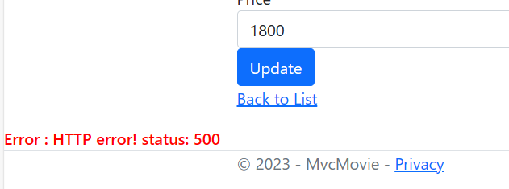

5. この演習の[タスク 1.1](#%E3%82%BF%E3%82%B9%E3%82%AF-11--azure-storage-%E3%82%A2%E3%82%AB%E3%82%A6%E3%83%B3%E3%83%88%E3%81%AE%E4%BD%9C%E6%88%90) で作成した Azure Storage アカウントの画面を開き、画面左側のメニューから \[**コンテナー**\] をクリックします

6. コンテナーの一覧が表示されるので、\[**log-server**\] コンテナーをクリックします
    
7. \[**log-server**\] コンテナーの下には、'MovieApp-**XYZ**' という名前のフォルダーが作成されており、さらに年/月/日の数字のフォルダーが作成されており、その中にログファイルである *.log が作成されているのでクリックします

8. ログファイルの概要が表示されるので、画面上部のメニューから \[**ダウンロード**\] をクリックして *.log ファイルをダウンロードします

    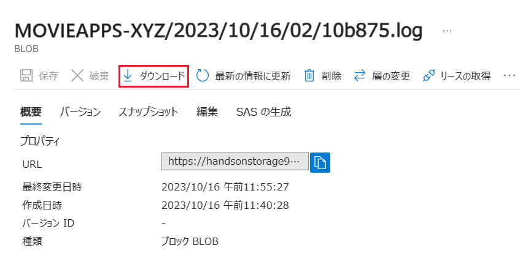

9. ダウンロードした *.log ファイルをテキストエディターで開き、HTTP リクエストについてのログが記録されていることを確認します

    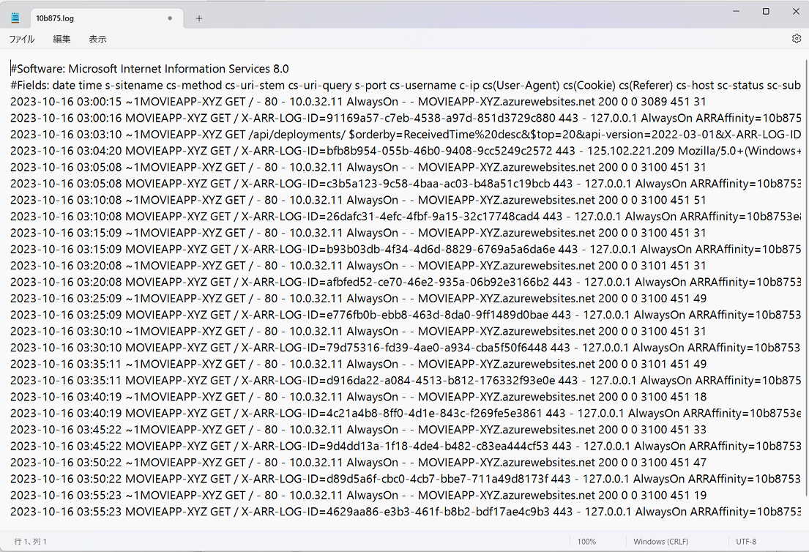

    Web サーバー ログのデータはスペース区切りのテキスト形式で保存されています。

10. この演習の 6 から 9 の手順をコンテナー **log-app** に対しても行います

    アプリケーションログの拡張子は *.txt なのでサーバーログと同様にテキストエディターで内容を確認することができます。

    

    この演習で取得したアプリケーション ログには **Edit** 機能を使用した際に発生した HTTP500 エラーのトレースログが出力されており、エラーの原因が、SQL の UPDATE 文の実行時に書き込み不可の ID を更新しようとしてエラーになっていることがわかります。

このように App Service のログを Azure Storage に保存することで、リクエストの状態や、アプリケーションのトラブルシューティングを行うことができます。

<br>

### タスク 2.4 : ファイル システムへのアプリケーションのログ記録

**App Service が Linux でホストされている場合、あるいは App Service が Windows でホストされていてもアプリケーションのランタイムが Java、Python、PHP、Ruby などの場合は、アプリケーション ログは App Service ファイル システムで取得する必要があります。**

なおこの設定はアプリケーションのパフォーマンスへの影響と、ストレージの過剰な消費を避けるため 12 時間で自動的に無効化されます。

また、ファイル システムへのアプリケーションログを有効にした場合、ログストリームの機能を使用してリアルタイムでログの記録状況を確認することができます。

ファイル システムへのアプリケーションのログ記録の有効化とログの取得の手順は以下の通りです。

1. [Azure Portal](http://portal.azure.com) にログインします

2. [演習 1 のタスク 3](ex01.md#%E3%82%BF%E3%82%B9%E3%82%AF-3-appservice-%E3%82%A4%E3%83%B3%E3%82%B9%E3%82%BF%E3%83%B3%E3%82%B9%E3%81%AE%E4%BD%9C%E6%88%90) で作成した App Service `MovieApp-XYZ` の設定画面を開きます

3. 画面左側のメニューから \[**App Service ログ**\] をクリックします

    遷移した画面で \[**アプリケーションのログ記録(ファイルシステム)**\] トグルボタンを \[**オン**\] にします。

    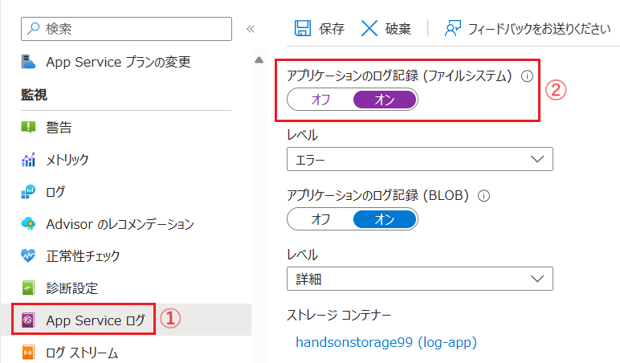

    
 4. \[**詳細なエラー メッセージ**\]、\[**失敗した要求のトレース**\] のトグルボタンを \[**オン**\] にし、画面上部にある \[**保存**] ボタンをクリックします

4. 画面左側のメニューから \[**ログ ストリーム**\] をクリックし、ログストリームの画面を表示します

    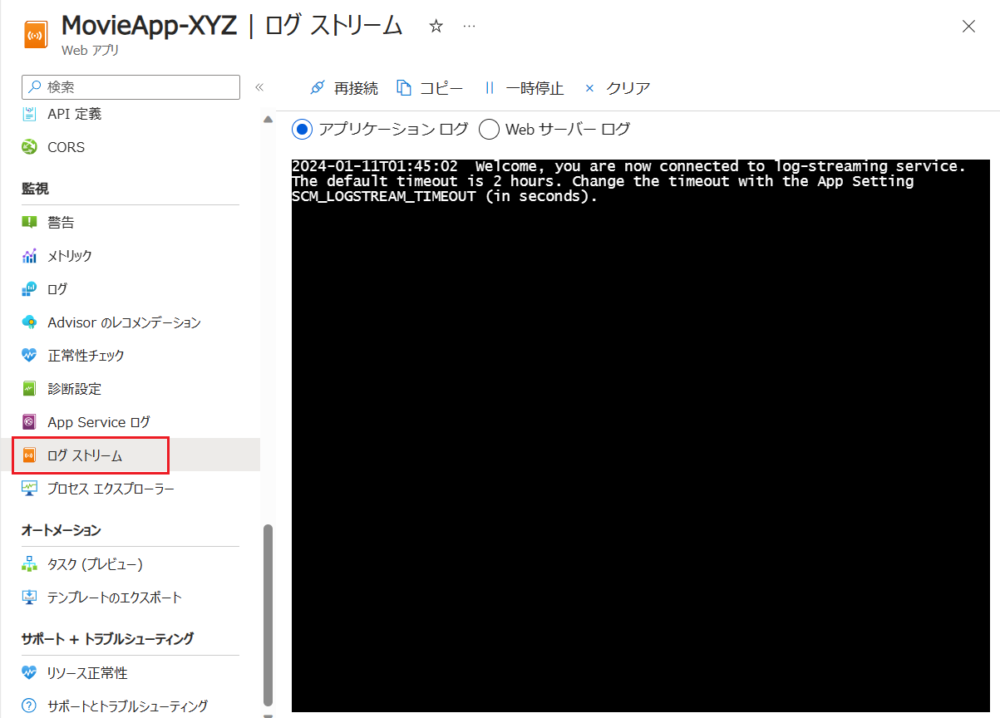


5. Web ブラウザーで新しいタブを開き、演習用アプリケーション MovieApp-XYZ の SPA 画面を表示します。URL は以下のとおりです。ドメイン名の後ろに `/index.html` を必ず付けてください。

    `https://<App Service の名前>.azurewebsites.net/index.html`

    アプリケーションのタイトルが `Movies SPA` に変わっていることを確認します

    この SPA で使用している編集 API は HTTP500 エラーを返すようになっているのでこれを使用してエラーを発生させ、アプリケーション ログにエラー情報を取得します

6. リストされている映画のタイトルから、任意の映画の \[**Edit**\] リンクをクリックし、遷移した編集画面を表示します

    画面を表示します。 \[**Save**\] ボタンをクリックします

   画面は遷移しませんが、エラーは発生しているので、以降の手順でログに記録されているエラーを確認します。

   

7. 再度ログストリームの画面を表示すると、取得されたログがリアルタイムで表示されていることが確認できます

    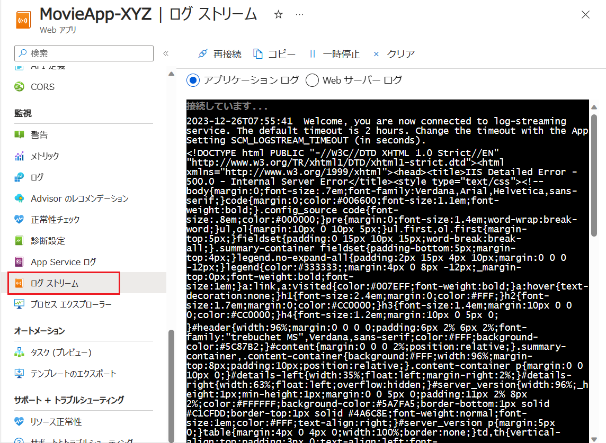

8. ファイルシステムに取得されたアプリケーション ログをダウンロードします

    以下の URL を Web ブラウザーのナビゲーションバーに入力し、アプリケーション ログをダウンロードします

    ```
    https://movieapp-xyz.scm.azurewebsites.net/api/dump
    ```
    ※ この URL は App Service の名前を `movieapp-xyz` とした場合のものです。実際の URL はご自身の App Service の名前に置き換えてください。

    > [!IMPORTANT]
    > ファイルシステムに取得されたアプリケーション ログは、App Service が動作する OS ごとに以下のように異なります。

    > - Linux/custom コンテナー: https://\<app-name\>.scm.azurewebsites.net/api/logs/docker/zip
    > - Windows アプリ: https://\<app-name\>.scm.azurewebsites.net/api/dump

9. ダウンロードされた zip ファイル内の `LogFiles\DetailedErrors` フォルダーにアクセスし、保存されている任意の html をダブルクリックします

    Web ブラウザーにエラーの詳細情報が表示されることを確認します。

    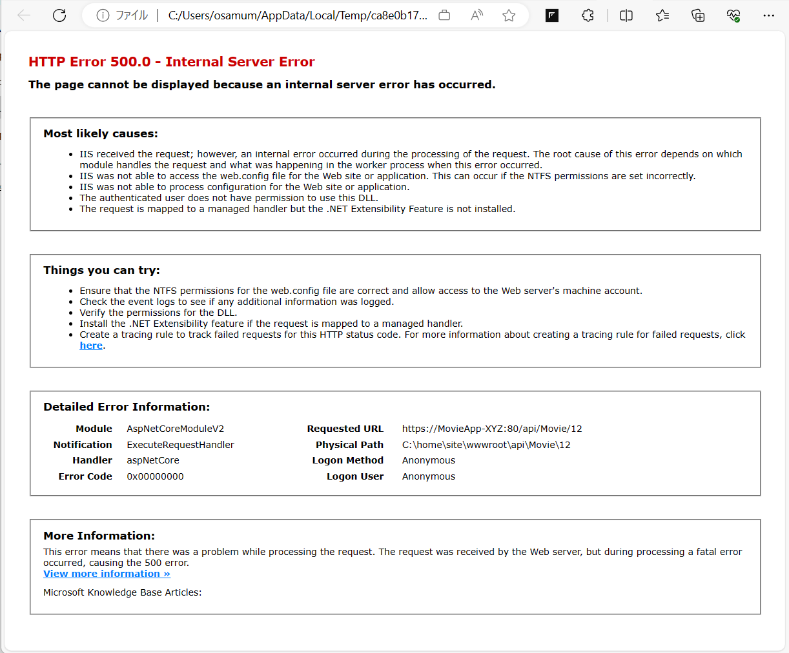


ここまでの手順でアプリケーション ログを App Service のファイルシステムで取得する方法の手順は完了です。同様の手順で Web サーバー ログも取得することができます。

<br>

最後に App Service 画面左のメニューから \[**Advisorのレコメンデーション**\] をクリックし、遷移した画面で '選択したサブスクリプションとリソースについて、すべての推奨事項に従っています。' と表示されているのを確認します。

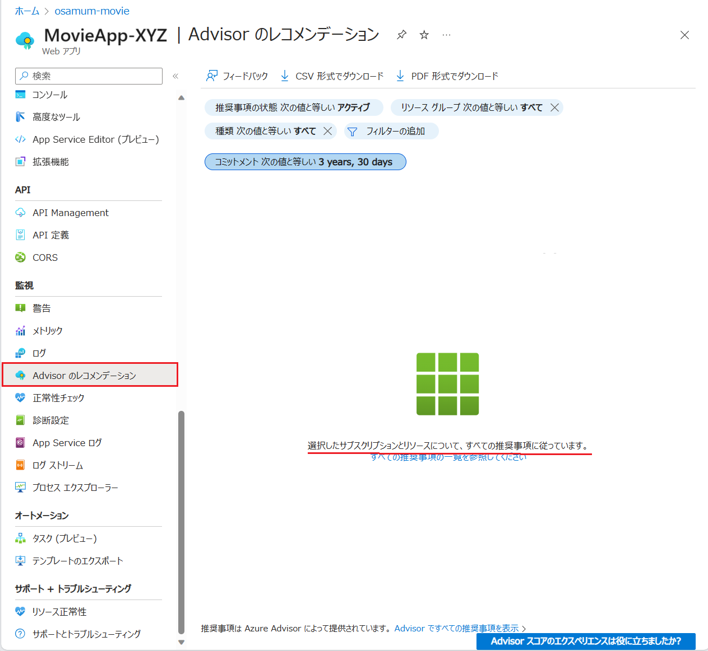

<br>

演習 2 タスク 2 : App Service ログの設定と有効化 の作業は以上です。このタスクでは App Service のログを保存するための Azure Storege アカウントの作成とコンテナーの作成、App Service のログの設定と有効化を行いました。

これで実際のサーバー上で Web サーバーを運用する際と同等のログが取得できるようになりました。

なお、Azure のメリットを活かした、より詳しいログの設定と監視方法については、演習 3 で行います。

<br>

## タスク 3 : バックアップ

Web サイトの情報が誤って削除された場合や、Web サイトの構成が変更されてしまった場合などに備えて、バックアップを取得することができます。

### 演習の準備

Azure App Service でバックアップ機能を利用するには App Servoce プランの変更が必要です。この作業は App Service の \[**バックアップ**\] を選択した際、無料のサブスクリプションを使用していると表示される \[**今すぐアップグレードする**\] ボタンをクリックすることで行うことができますが、今回は一般的な方法であるメニュー \[**App Service プランの変更**\] から行います。

具体的な手順は以下の通りです。

1. App Service の画面左側のメニューから \[**App Service プランの変更**\] をクリックします

2. 遷移した画面で項目 \[**価格レベル**\] の横に表示されている `Free (F1)` リンクをクリックします

      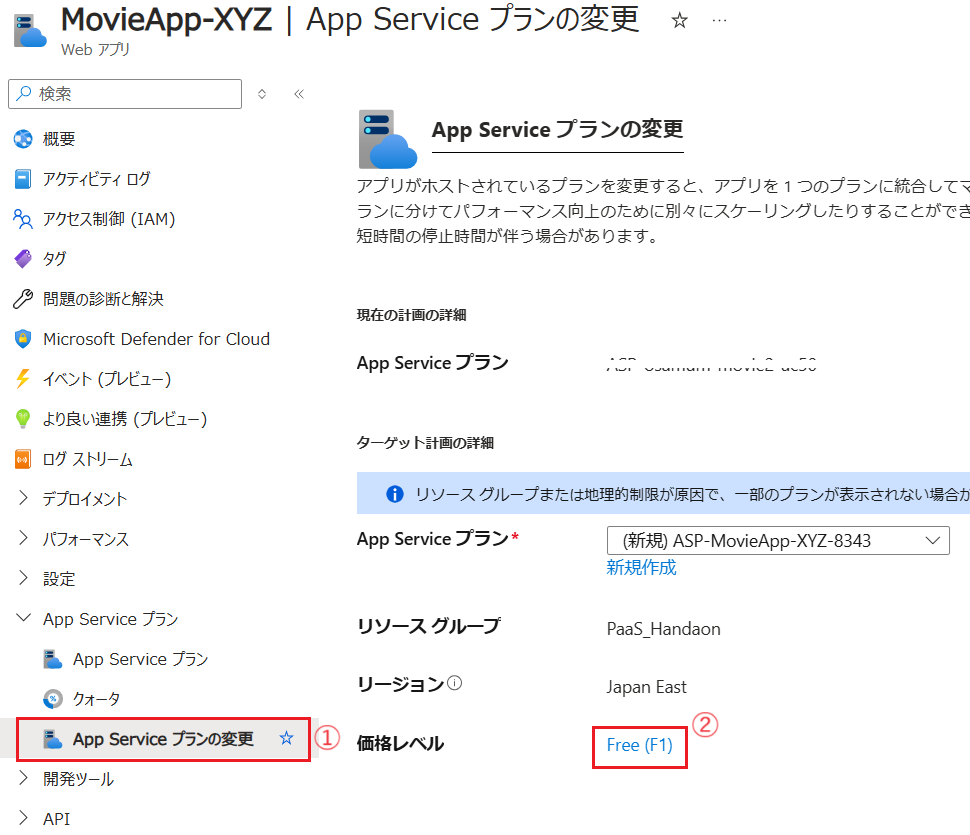

3. \[**App Service 価格プランの選択**\] 画面に遷移するので、表示されている価格プランのリストから \[**Standard S1**\] のチェックボックスにチェックし、画面下部の \[**選択**\] ボタンをクリックします

    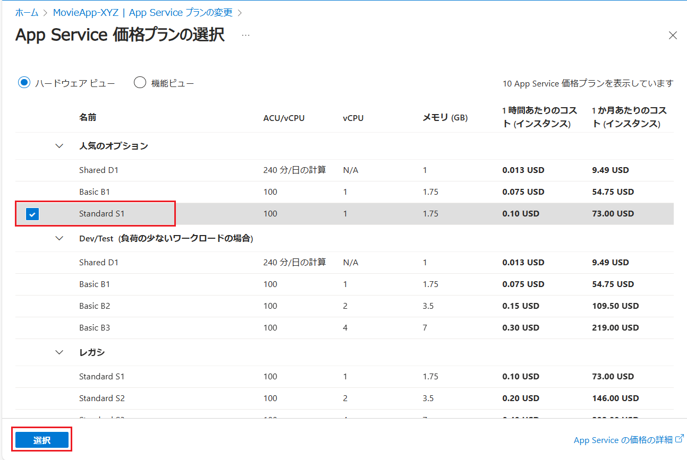

     \[**App Service プランの変更**\] 画面に戻るので\[**OK**\] ボタンをクリックします

以上で App Service プランの変更は完了です。

### バックアップの取得とリストア

App Service では、Basic 以上のプランを選択することでバックアップの取得とリストアを行うことができます。

バックアップの取得は既定の状態で自動で行われており、いつでもリストアすることができますが、カスタム バックアップを使用してオンデマンドで、またはスケジュールに基づき実行できます。

この演習では、App Service でホストしているアプリケーションの SQL データベースへの接続文字列を誤った情報で上書きして動作不能とし、自動バックアップされているイメージからリストアする手順を実施します。

具体的な手順は以下の通りです。

1. [Azure Portal](http://portal.azure.com) にログインします

2. ハンズオンで使用している App Service `MovieApp-XYZ` の画面を開き、画面左側のメニューから \[**バックアップ**\] をクリックします

3. 既に取得されたバックアップの一覧があるはずですが、もし、バックアップが**取得されていなかった場合は**、画面上部の \[**バックアップの構成**\] メニューをクリックし、表示された \[**カスタム バックアップの構成**\] ブレードで設定を行い、その後、\[**今すぐバックアップ**\] メニューをクリックしてバックアップを取得します

    ※ 以下の画像の手順は、バックアップが**取得されている場合はスキップしてください**

    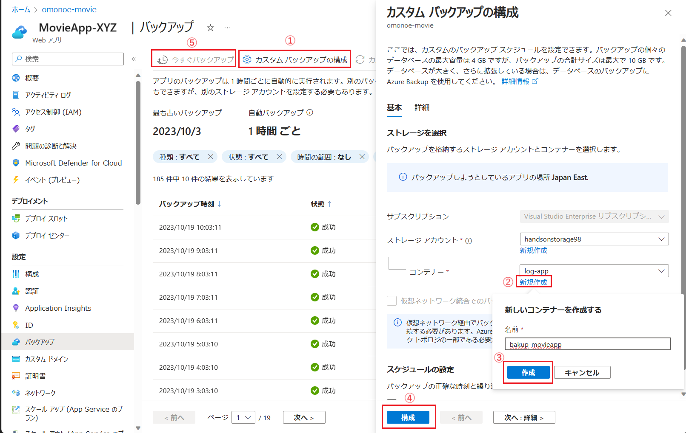

4. バックアップを戻す前にアプリケーションを動作不能とするためにアプリケーションが使用している Azure SQL データベースへの接続文字列を変更します。この作業は ASP.NET Core アプリケーションの場合、App Service の環境変数の設定で行うことができます。

    アプリケーション MovieApp-XYZ をホストしている App Service 画面左側のメニューから \[**構成**\] をクリックします

5. 遷移した画面では　\[**アプリケーション設定**\] タブがアクティブになっているので、同タブ内の \[**+ 新しいアプリケーション設定**\] メニューをクリックします

6. \[**新しいアプリケーション設定**\] ブレードが表示されるので、以下の内容を入力します

    |項目|値|
    |---|---|
    |名前|`ConnectionStrings:MvcMovieContext` (※)|
    |値|なんらかのでたらめな文字列|

    (※)この名前は ASP.NET Core アプリケーションの場合、`appsettings.json` に記述されている以下の JSON の構造に基づいています

    ```
    "ConnectionStrings": {
        "MvcMovieContext": "接続文字列"
    }
    ```
   
    \[**OK**\] ボタンをクリックします

7.  \[**構成**\] の画面に戻るので画面上部の \[**保存**\] ボタンをクリックし、表示された \[**変更の保存**\] で \[**続行**\] ボタンをクリックします

8. アプリケーションの更新を待ち、完了したら画面左のメニュー \[**概要**\] をクリックし、遷移した画面内の \[**既定のドメイン**\] のリンクをクリックし、Web ブラウザで App Service のアプリケーションにアクセスします

    以下のエラーメッセージが表示されることを確認します。

    `HTTP Error 500.30 - ASP.NET Core app failed to start`

9. 動作しなくなったアプリケーションを設定ごとリストアします。画面左側のメニューから \[**バックアップ**\] をクリックします

10. バックアップの一覧が表示されるので、アプリケーションが正常に動作していた最近のバックアップの **復元** アイコンをクリックします

    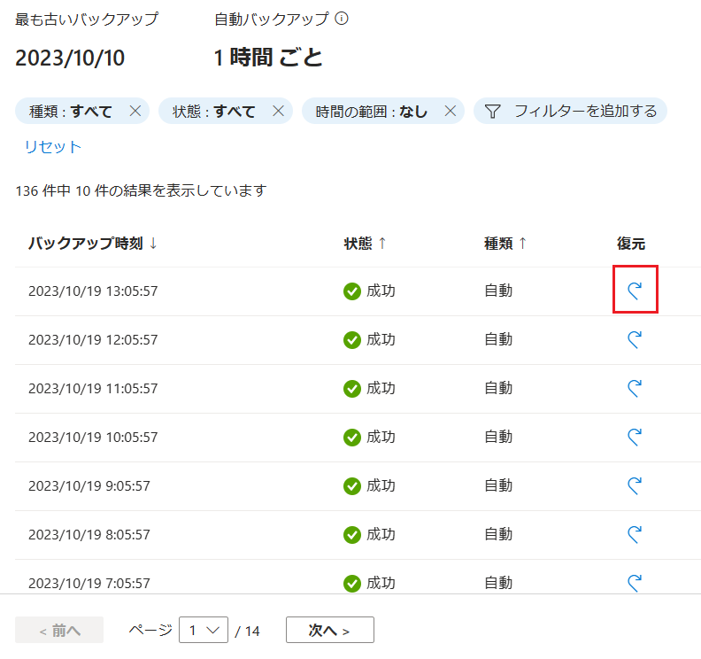

11. \[**バックアップから復元**\] ブレードが表示されます。

    今回は App Service の環境変数に手を加えて障害を発生させているので忘れずに \[**サイト構成の復元**\] にチェックをつけます。(なお、カスタム バックアップの場合は \[**サイト構成の復元**\] は表示されません)

    また、\[**デプロイ スロット\***\] に表示されている名前を覚えておいてください。これは実際にバックアップがリストアされる際に使用されるデプロイスロット スロット名です。デプロイ スロットについては演習 3 で詳しく説明します。
    
    \[**復元**\] ボタンをクリックします

    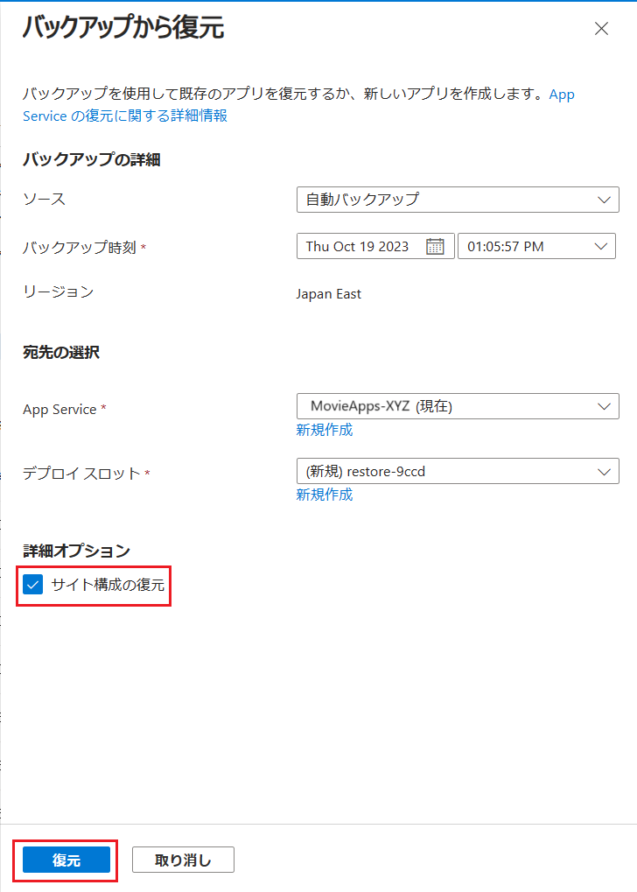

12. 復元が完了したという通知はとくにされないので、App Service の画面左のメニューから \[**デプロイ スロット**\] をクリックします

    デプロイ スロットの一覧が表示されるので、先ほど覚えておいたデプロイ スロット名がリストにあることを確認し、クリックします

    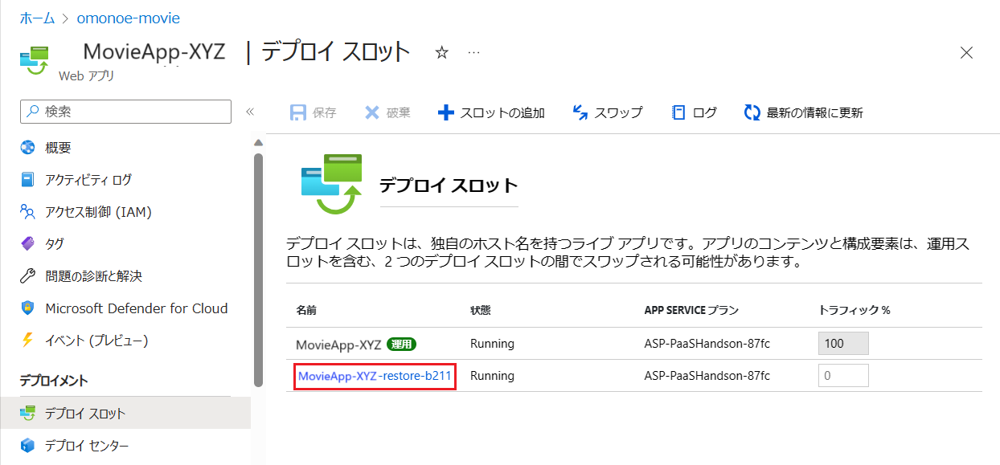

13. 選択したデプロイ スロットの \[**概要**\] 画面が表示されるので、\[**既定のドメイン**\] のリンクをクリックして、アプリケーションが正常に動作していることを確認し、確認が取れたら画面上部 \[**スワップ**\] ボタンをクリックします(※)

    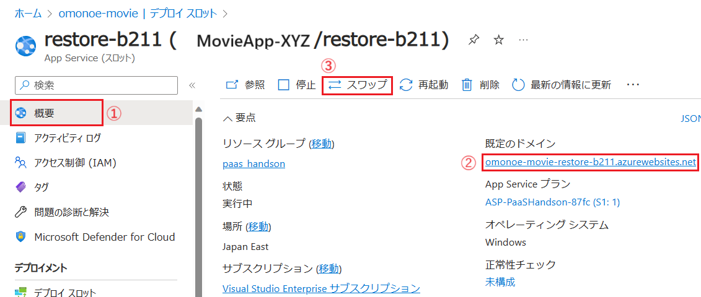


    (※) これまで使用していた App Service のインスタンスと、リストアの際に生成されたデプロイ スロットのインスタンスは、**Production** と **Staging** の関係となっており、スワップを行うことで、デプロイ スロットのインスタンスが Production となり、これまでの Production のインスタンスが Staging となります。このようにデプロイ スロットを使用することで、バックアップからのリストアを行う際に、アプリケーションの停止時間を最小限に抑えることができます。

14. \[**スワップ**\] ブレードが表示されるので、画面下部の \[**スワップ**\] ボタンをクリックします

15. スワップが完了した通知を確認後、アプリケーション MovieApp-XZY の \[**概要**\] 画面から \[**既定のドメイン**\] のリンクをクリックし、アプリケーションの画面が正常に表示されることを確認します。

ここまでの手順で、App Service のバックアップの設定とリストアの作業は完了です。

カスタム バックアップなどのその他の設定や手順につきましては、以下のドキュメントを参照してください。

* [**Azure App Service でアプリをバックアップおよび復元する**](https://learn.microsoft.com/ja-jp/azure/app-service/manage-backup?tabs=portal#automatic-vs-custom-backups)

<br>

## タスク 4 : カスタム ドメインの設定

Azure App Srvice では組織や個人で取得したドメイン名をマップすることができます。また、Azure からドメイン名を購入してマップすることもできます。

このタスクは演習に使用できるドメイン名をお持ちのであれば、そのドメイン名を使用して実施してください。お持ちではない場合は実際の Azure ポータルの画面で、手順と UI の確認のみ行ってください。

また具体的な手順についてはマイクロソフトの公式ドキュメントに詳しく記載されていますので、以下のドキュメントを参照してください。

* ドメイン名のマップ方法について
    
    ⇒ [**既存のカスタム DNS 名を Azure App Service にマップする**](https://learn.microsoft.com/ja-jp/azure/app-service/app-service-web-tutorial-custom-domain?tabs=root%2Cazurecli#1-configure-a-custom-domain)

* ドメイン名の購入について

    ⇒　[**App Service ドメインを購入し、それを使用してアプリを構成する**](https://learn.microsoft.com/ja-jp/azure/app-service/manage-custom-dns-buy-domain)

<br>

## タスク 5 : CORS 設定の確認と変更

演習で使用している MovieApp は RESTful API の機能も提供しており、この機能には以下のエンドポイントからアクセスすることができます。

`https://<AppService の既定のドメイン>.azurewebsites.net/api/movie`

上記の URL を Web ブラウザーのナビゲーションバーに入力してアクセスすると返される JSON を確認することができますが、これをドメインの異なる Web サイトからアクセスしようとすると CORS (Cross-Origin Resource Sharing) の制約によりアクセスが拒否されてしまいます。 

このように App Service では既定の状態では CORS の制約が有効になっているため、別のドメインからのアクセスを許可するためには、CORS の設定を行う必要があります。

これは不特定多数の Web クライアント アプリケーションに対し API を提供する際には必須の設定です。

この演習では、MovieApps アプリケーションの REST API を呼び出す Web クライアント アプリケーションをローカル環境で実行し、エラーが発生することを確認後、CORS の設定を行い、Web クライアント アプリケーションから REST API を呼び出すことができるようにします。

### 演習の準備

この演習ではローカル環境で MovieApp の SPA の UI 部分　(App Shell) を取り出したものを使用します。

以下の GitHub リポジトリをローカル環境にクローンするか、ZIP ファイルをダウンロードしてプロジェクトを入手してください。


* [**SPA-Movie**](https://github.com/osamum/SPA-Movie)


同 SPA を動作させるには HTTP サーバーが必要ですが、この演習では Visual Studio Code とそのプラグインである Live Server を使用します。

インストールされていない場合は以下の URL からインストールしてください。

* [**Visual Studio Code**](https://code.visualstudio.com/) 

* [**Live Server**](https://marketplace.visualstudio.com/items?itemName=ritwickdey.LiveServer)


### 演習 : CORS の設定の確認

Azure App Service の CORS 設定は既定で有効になっていないためホストする REST API を同じドメイン内の Web アプリケーション以外から呼び出すことはできません。

このタスクでは、ローカル環境で動作させる Web クライアント アプリケーションから App Service の REST API を呼び出し、CORS の制約によりエラーが発生することを確認し、その後 CORS の設定を行い、エラーが発生しないことを確認します。

具体的な手順は以下の通りです。

1. Visual Studio Code を起動し、\[**ファイル**\] メニューから \[**フォルダーを開く**\] をクリックし、先ほどクローンしたプロジェクトのフォルダーを選択します

2. プロジェクト中のファイル `js/site.js` の 2 行目にある変数 **MOVIEAPP_API** の値を、ハンズオン用の演習アプリケーションがホストする REST API の URL に変更します

    ```JavaScript
    // MovieApp APIのURL
    const MOVIEAPP_API = 'ここに MovieApp-XYZ API の URL を入力してください';
    ```

    変更が完了したらキーボードの \[Ctrl\] + \[S\] キーを押してファイルを上書き保存します 

3. Visual Studio Code の画面右下にある \[**Go Live**\] ボタンをクリックします

    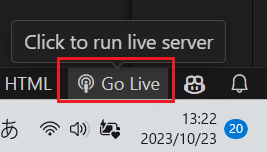

    しばらくすると HTTP でのホストが開始されますので、ホストされるポート番号を覚えておきます。(※既定では 5500 です)

4. ブラウザーが起動し、MovieApp SPA の UI が表示されますが映画のタイトルのリストが表示されず、fetch が失敗したことを示すエラーメッセージが表示されていることを確認します

    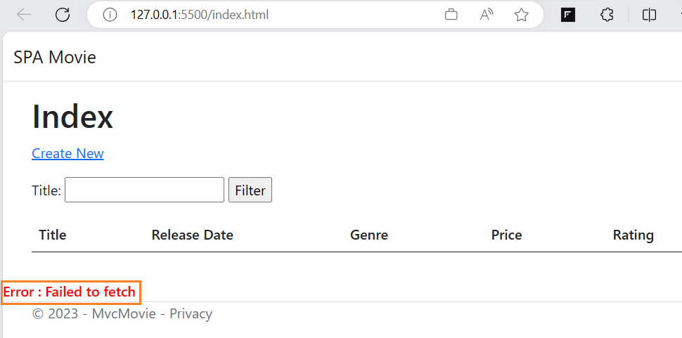

5. App Service の CORS 設定を変更し、ローカル環境からのアクセスを許可すよう設定します

    [Azure ポータル](https://portal.azure.com/)にログインし、ハンズオンで使用している App Service `MovieApp-XYZ` の画面を開き、画面左側のメニューから \[**CORS**\] をクリックします

6. \[**CORS**\] の画面が表示されるので、\[**許可される元のドメイン**\] に `http://127.0.0.1:ポート番号` を入力し、\[**保存**\] ボタンをクリックします

    

5. ブラウザーのリロードボタンをクリックし、MovieApp SPA の UI が正常に表示されることを確認します (※)

    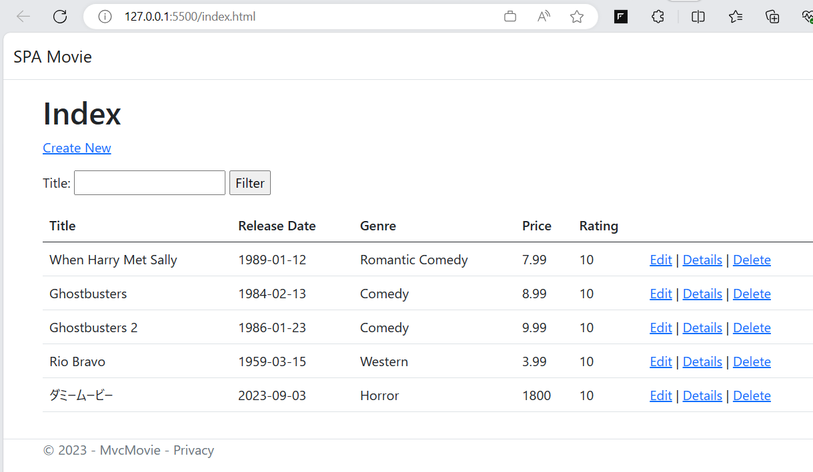

    (※) リストが表示されず、エラーメッセージも表示されない場合は、API 側のサービスの起動に時間がかかっている可能性があります。更新ボタンをクリックし、そのまましばらくお待ちください。

ここまでの手順で、App Service の CORS 設定の演習は終了です。

この手順では、ローカル環境の HTTP サーバーを指す `http://127.0.0.1:ポート番号` を CORS の設定に追加することで、ローカル環境からのアクセスを許可するように設定しました。

しかし、上記の設定を行っても、同じくローカル環境の HTTP サーバーを指す `http://localhost:ポート番号` でアクセスするとエラーが発生します。回避するには、`http://localhost:ポート番号` も CORS の設定に追加する必要があります。

また、特定のドメインではなく、不特定多数に大してアクセスを許可する場合は、`*` を設定することで、すべてのドメインからのアクセスを許可することができます。

より詳しい CORS の設定については以下のドキュメントを参照してください。

* [**チュートリアル:Azure App Service で CORS を使用して RESTful API をホストする**](https://learn.microsoft.com/ja-jp/azure/app-service/app-service-web-tutorial-rest-api)

<br>

## タスク 6 : 認証について

Web サイトのコンテンツやアプリケーションについて、利用を管理しているユーザーに限定したい場合があります。

こうしたニーズを満たすために、かつてはほとんどの Web サーバーでサポートされ、設定も簡単に行える基本認証がよく使用されていましたが、現在ではセキュリティの強化やデータ保護の観点から基本認証は推奨されていません。

Azure App Service では、基本認証の代わりに、Azure Active Directory (Azure AD) や他の ID プロバイダーを使用した認証を行うことができます。

とくに App Service の提供する自動認証 (Easy Auth) を使用すると、コードの記述を行うことなく、OAuth を使用した認証を静的 Web ページのみの Web サイトにも導入することができます。

また、プログラム コードを使用し、認証で得られたトークンをアプリケーション側で取得して使用することもできます。

この手順については、マイクロソフトの公式のクイック スタートで詳しい手順が説明されているので、以下のクイック スタートのドキュメントを参考に MovieApp-XYZ に認証を導入してください。

* [**チュートリアル: Azure App Service で実行されている Web アプリにアプリの認証を追加する**](https://learn.microsoft.com/ja-jp/azure/app-service/scenario-secure-app-authentication-app-service)


ただしく認証が設定されると、MovieApp-XYZ へのアクセス時にログイン画面が表示されるようになります。

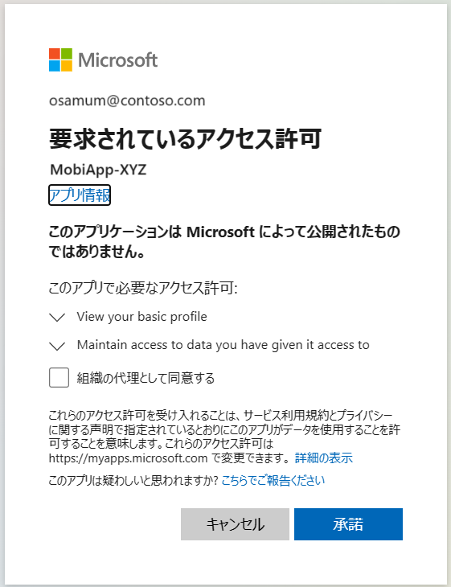

また Web ブラウザーの **InPrivate ウィンドウ** から Web API の以下のエンドポイントにアクセスし、認証なしでは呼び出しできなくなっていることを確認してください。

`https://<AppService の既定のドメイン>.azurewebsites.net/api/movie`


今回は App Service の機能の説明であるためプログラミングについての説明は割愛しますが、自動認証によって得られたトークンの取得方法、認証トークンの更新方法については以下のドキュメントを参照してください。

* [**Azure App Service 認証で OAuth トークンを操作する**](https://learn.microsoft.com/ja-jp/azure/app-service/configure-authentication-oauth-tokens#retrieve-tokens-in-app-code)


<br>

## その他、MIME タイプの追加について

App Service の既定の設定では静的 Web コンテンツの MIME タイプの設定が行われており、`.html` や `.css` などのファイルは既定でホストすることができますが、`.woff` 、`.mp4` などのファイルは既定の状態ではホストすることができません。

こういったファイルをホストするには、App Service の設定で MIME タイプの設定を行う必要があります。

具体的には、プラットフォームが Windows である場合は Web サイトのルート フォルダーにある `web.config` に MIME タイプの設定を記述します。もし、`web.config` が存在しない場合は、`web.config` を作成して設定を記述します。

具体的に方法については以下のドキュメントのサンプルを参考にしてください。

* [**静的コンテンツ MIME マッピング の追加 \<mimeMap\>**](https://learn.microsoft.com/ja-jp/iis/configuration/system.webserver/staticcontent/mimemap#configuration-sample)

プラットフォームが Linux である場合は以下の記事の内容を参考にしてみてください。

*　[**Add MIME Types to Nginx - Linux App Service (PHP 8.x blessed image)**](https://techcommunity.microsoft.com/t5/apps-on-azure-blog/add-mime-types-to-nginx-linux-app-service-php-8-x-blessed-image/ba-p/3786096)


<br>

## まとめ

この演習では、Web アプリケーションやコンテンツをホストする際に、一般的な Web サーバーの管理で行う設定や管理作業を Azure App Service で行う方法について学習しました。

より詳しい内容については、各タスクの最後に記載したドキュメントを参照してください。


<br>

---
👉 : [**演習 3) Advanced なアプリケーション設定**](ex03.md)へ

👈 : [**演習 1) ローカル開発環境上の演習用アプリケーションを Azure App Service にデプロイ**](ex01.md)へ

🏚️ :  [**README**](README.md)


