# 演習 3 : Advanced なアプリケーション設定

[演習 2](ex02.md) では Web サイトを Web サーバーで運用する際に必要となる一般的な設定や操作を App Service で行うための方法について紹介しましたが、この演習 3 では Web アプリケーションを運用するためのより高度な設定を行う以下の方法について紹介します。

 1. [より高度なデプロイ](#%E3%82%BF%E3%82%B9%E3%82%AF-1--%E3%82%88%E3%82%8A%E9%AB%98%E5%BA%A6%E3%81%AA%E3%83%87%E3%83%97%E3%83%AD%E3%82%A4)
    1. [デプロイ スロット](#%E3%82%BF%E3%82%B9%E3%82%AF-11--%E3%83%87%E3%83%97%E3%83%AD%E3%82%A4-%E3%82%B9%E3%83%AD%E3%83%83%E3%83%88)
    2. [GitHub リポジトリを使用した CI/CD](#%E3%82%BF%E3%82%B9%E3%82%AF-12--github-%E3%83%AA%E3%83%9D%E3%82%B8%E3%83%88%E3%83%AA%E3%82%92%E4%BD%BF%E7%94%A8%E3%81%97%E3%81%9F-cicd)
2. [可用性設定](#%E3%82%BF%E3%82%B9%E3%82%AF-2--%E5%8F%AF%E7%94%A8%E6%80%A7%E8%A8%AD%E5%AE%9A)
    1. [スケールアップ](#%E3%82%BF%E3%82%B9%E3%82%AF-21--%E3%82%B9%E3%82%B1%E3%83%BC%E3%83%AB%E3%82%A2%E3%83%83%E3%83%97)
    2. [スケールアウト](#%E3%82%BF%E3%82%B9%E3%82%AF-22--%E3%82%B9%E3%82%B1%E3%83%BC%E3%83%AB%E3%82%A2%E3%82%A6%E3%83%88)
    3. [自動スケーリング](#%E3%82%BF%E3%82%B9%E3%82%AF-23--%E8%87%AA%E5%8B%95%E3%82%B9%E3%82%B1%E3%83%BC%E3%83%AA%E3%83%B3%E3%82%B0)
3. 高度なログ監視
    1. Application Insights
    2. Log Analytics (警告,メトリック、ログ)

<br>


## タスク 1 : より高度なデプロイ

[演習 1 のタスク 4](ex01.md#%E3%82%BF%E3%82%B9%E3%82%AF-4-appservice-%E3%81%AB%E3%82%A2%E3%83%97%E3%83%AA%E3%82%B1%E3%83%BC%E3%82%B7%E3%83%A7%E3%83%B3%E3%82%92%E3%83%87%E3%83%97%E3%83%AD%E3%82%A4) では開発環境のアプリケーションを Visual Studio から直接に新規に作成した App Sevice にデプロイする手順を紹介しました。

しかしこの方法は、実際にユーザーにサービスを提供している稼働中のシステムに対し実運用環境での動作確認もせずに書き換えを行うという手順と同じであり、実際の運用シナリオにおいては望ましくない方法です。またデプロイもアプリケーションの更新があるたびに手動で行う必要があります。

このタスク 1 では、アプリケーションをデプロイする環境と運用環境を別け、かつアプリケーションの更新のタイミングと連動する自動更新の仕組みを確認します。


### タスク 1.1 : デプロイ スロット

App Service プランのサービス レベルが Standard、Premium、または Isolated である場合は、デプロイ スロットを使用して、アプリケーションのステージング、テスト、および本番環境を分離できます。デプロイ スロットを使用すると、アプリケーションの新しいバージョンをテストすることができます。テストが完了したら、トラフィックをデプロイ スロットから本番環境に切り替えることができます。

このハンズオンでは既に演習 2 のバックアップのリストアの手順で既にデプロイ スロットが一つ作成されていますが、このタスクでは新規作成の手順を確認するために、新規にデプロイ スロットを作成します。

具体的な手順は以下のとおりです。

1. [Azure Portal](https://portal.azure.com/) にログインします

2. このハンズオンで使用している App Service、`MovieApp-XYZ` を選択し、画面左のメニューから \[**デプロイ スロット**\] を選択します

3. 遷移した画面で上部の \[**+ スロットの追加**\] をクリックし、画面右に表示される \[**スロットの追加**\] ブレードの各項目を以下のように
設定します

    |項目|値|
    |---|---|
    |名前| `staging` |
    |次から設定を複製:| **設定を複製しない** (※) |

    (※) 今回は現在リクエストを処理している運用 (production) 環境から引継がなければならない環境変数などの固有の設定がないため、設定を複製しないで新規に作成します。設定を複製する場合は、この項目を選択し、引継ぎたい設定を選択します。

    \[**追加**\] ボタンをクリックするとデプロイ スロットの作成が開始されます。

    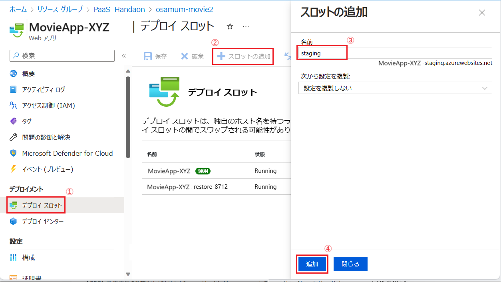

4. デプロイ スロットの作成が完了すると、`スロット 'staging' を正常に作成しました` と \[**追加**\] ボタンの上にメッセージが表示されるので、\[**閉じる**\] ボタンをクリックします。

    \[**デプロイ スロット**\] の画面に戻るので、作成したデプロイ スロットがリストされていることを確認します。

ここまでの手順でデプロイ スロットの作成の手順は完了です。

これで[演習 2 のバックアップの取得とリストア](ex02.md#%E3%83%90%E3%83%83%E3%82%AF%E3%82%A2%E3%83%83%E3%83%97%E3%81%AE%E5%8F%96%E5%BE%97%E3%81%A8%E3%83%AA%E3%82%B9%E3%83%88%E3%82%A2)の手順でリストア作業で行ったように \[**スワップ**\] を行うことで運用環境と今回作成したデプロイ スロット `staging` の App Service インスタンスを切り替えることができるようになりました。

しかし、ここまでの手順で作成したデプロイ スロット `staging` にはアプリケーションがデプロイされていないためインスタンスを切り替えると、運用環境のアプリケーションがデプロイされていない状態になってしまいます。

この先の作業は、タスク 2 GitHub Actions による CI/CD の演習でアプリケーションをデプロイした後に、運用環境とステージング環境を切り替える手順を確認します。 
   
なお、Azure App Service のデプロイ スロットの作成の詳細については以下の公式ドキュメントをご参照ください。 


* [Azure App Service でステージング環境を設定する](https://learn.microsoft.com/ja-jp/azure/app-service/deploy-staging-slots?tabs=portal#swap-two-slots)

<br>

### タスク 1.2 : GitHub リポジトリを使用した CI/CD

演習用アプリケーションの入手元のリポジトリがある GitHub では [GitHub Actions](https://docs.github.com/ja/actions/learn-github-actions/understanding-github-actions) というタスク自動化の仕組みが提供されています。この GitHub Actions を使用することで、アプリケーションのビルド、テスト、デプロイのパイプラインを自動化することができます。

GitHub Actions を使用する際には、ビルドからデプロイまでの処理を YAML ファイルにワークフローとして記述していく必要がありますが、Azure App Service では GitHub Actions 用のワークフローを自動で作成する機能が提供されており、かつ、GitHub と Azure App Service を連携させることで、GitHub にプッシュされたコードを App Service で感知し、自動でビルドとデプロイを行うパイプラインを作成することもできます。

この演習では GitHub にプッシュされたコードを App Service で感知し、自動でビルドとデプロイを行うパイプラインを作成します。

なお、この演習ではこの前のタスク 1.2 で作成したデプロイ スロット `MovieApp-XYZ-staging` に対して自動デプロイを行い、運用環境とステージング環境を切り替える手順を確認します。

具体的な手順は以下のとおりです。

1. Azure ポータルから前のタスク 1.2 で作成したデプロイ スロット、`MovieApp-XYZ-staging` を選択し、画面左のメニューから \[**デプロイ センター**\] を選択します

2. \[**デプロイ センター**\] の画面に遷移するので、同画面のドロップダウンボックス \[**ソース \***\] から \[**GitHub**\] を選択します

3. ドロップダウン ボックスの下に　`GitHub Actions を使用してビルドしています。` というメッセージが表示されるので、その横にある \[**プロバイダーを変更します。**\] のリンクをクリックします

4. \[**ビルド プロバイダー**\] ダイアログ ボックスが表示されるので \[GitHub Actions\] から \[**App Service のビルドサービス**\] に変更(※)します。

    (※) これは \[GitHub Actions\] を選択するとランタイムとして `.NET 3.1` が選択されてしまうためです。この演習で使用しているアプリケーションは `.NET7` で作成されています。

5. 表示された項目を以下のように変更し、画面上部の \[**保存**\] ボタンをクリックします

    |項目|値|
    |---|---|
    |組織| (自身の GitHub アカウント) |
    |リポジトリ| `MovieApp-XYZ` |
    |ブランチ| `main` |

    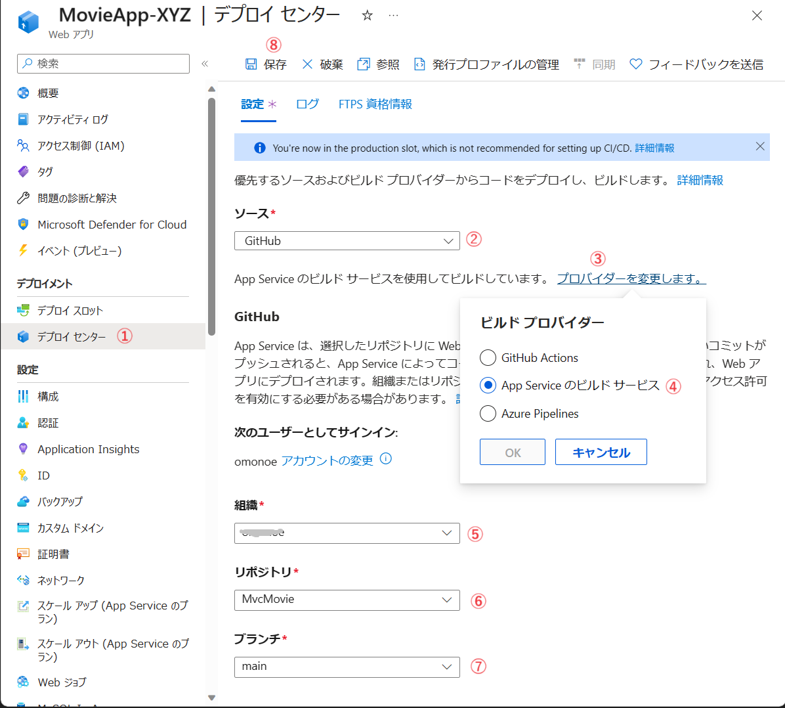

    これでプロジェクトが GitHub にプッシュされると、App Service によって自動でビルドが行われ、App Service にデプロイされるようになりました。

    ローカルの開発環境で演習用アプリケーションのコードを書き換え、GitHub にプッシュして AppService にデプロイされるか確認します。


6. ローカル環境で Visual Studio を起動し、演習用アプリケーションのプロジェクトを開きます

    せっかくの機会なので、SPA UI で正しく動作していないデータの更新機能を修正します。修正箇所は SPA UI が参照している Web API のコードです。

7. プロジェクト中のファイル Models/Movie.cs を開き、69 行目の以下のコードを以下のようにコメントアウトします

    ```csharp 
    // .SetProperty(m => m.ID, movie.ID)
    ```
    
    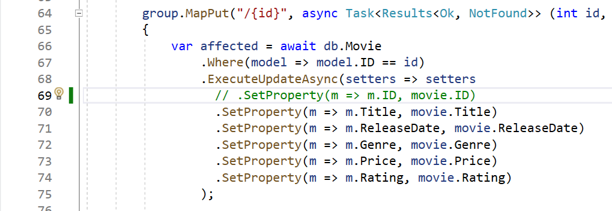

    これで SPA UI でのデータの更新が正しく動作するようになりますが、さらに変更されたことがよくわかるように、SPA UI の画面左上に表示される文字 **SPA Movie** の色を変更します。

8. プロジェクト中のファイル wwwroot/index.html を開き、16 行目の a タグに style 属性を追加し、文字を青色の太字に変更します

    変更前

    ```html
    <a class="navbar-brand" href="/Movies">SPA Movie</a>
    ```

    変更後

    ```html
    <a class="navbar-brand" href="/Movies" style="color:blue;font-weight:bold;">SPA Movie</a>
    ```

9. 変更を保存後、キーボードの \[**F5**\] キーを押下してプロジェクトを実行し、SPA 画面の文字の色が変更されているか、またデータの更新が正しく動作するか確認します

    なお SPA 画面にアクセスするには以下のように URL のドメイン名の後ろに明示的に **index.htnl**　と指定する必要があります。

    ```
    https://localhost:61260/index.html
    ```

    アプリケーションの正常動作が確認できたら、変更したコードを GitHub にプッシュしますが、その前に **appsetting.json** ファイルに記述されている Azure SQL Database の接続文字列を削除します。このはそのまま GitHub にプッシュすると、GitHub に接続文字列が公開されてしまうためです。

10. プロジェクトのルートフォルダにあるファイル **appsettings.json** を開き、JSON ノード **ConnectionStrings/MovieContext** に記述されている接続文字列をメモ帳などのテキストエディタに控えた後、接続文字列を空にします

    ```json
    "ConnectionStrings": {
        "MovieContext": ""
    },
    ```

    SQL Database に接続するための接続文字列は、デプロイ後に環境変数を使用して設定します。

    すべての作業が完了したらキーボードの \[Ctrl\] + \[S\] キーを押下して変更を保存してください。

11. プロジェクトを GitHub リポジトリにプッシュします。

    Visual Studio からプッシュすることもできますが、ここではコマンド ラインからプッシュする方法を紹介します。

    プロジェクトのルートディレクトリをターミナル画面で開き、以下のコマンドを順番に実行します。

    ```bash
    git add .
    git commit -m "update code"
    git push origin main
    ``` 

    ローカル環境の作業は以上で終了です。
    
12. コードを変更したアプリケーションがデプロイ スロット `MovieApp-XYZ-staging` にデプロイされた確認します

    Azure ポータルでデプロイ スロット `MovieApp-XYZ-staging` を選択し、画面左のメニューから \[**デプロイ センター**\] を選択します

13. 遷移した画面で \[**ログ**\] タブを選択し、ログが追加されていることを確認します

     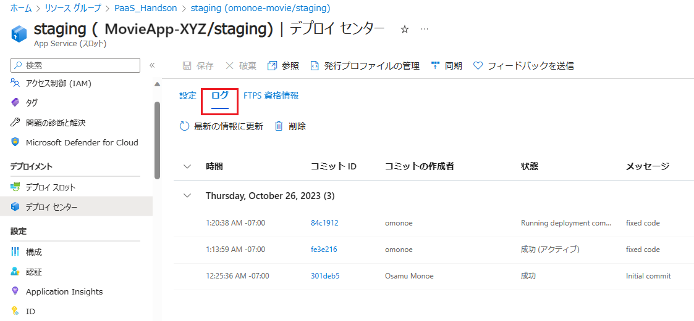

14. アプリケーションのデプロイが確認できたので、環境変数に Azure SQL Database の接続文字列を設定します

    画面左のメニューから \[**構成**\] を選択し、遷移した画面で \[**+ 新しいアプリケーション設定**\] ボタンをクリックします

15. 画面右に表示される \[**アプリケーション設定の追加/編集**\] ブレードの各項目を以下のように設定します

    |項目|値|
    |---|---|
    |名前| `ConnectionStrings:MvcMovieContext` |
    |値| (前の手順でメモした接続文字列) |
    |デプロイ スロットの設定| チェックしない |

    \[**OK**\] ボタンをクリックすると環境変数の設定が完了します。

16. アプリケーションが正しく動作するか確認します。

    画面左のメニューから \[**概要**\] をクリックし、遷移した画面の \[**既定のドメイン**\] に表示されていドメイン名のリンクをクリックしてアプリケーションの画面が表示されるか確認します。

    念のために Web ブラウザーのアドレスバーの URL に明示的に **index.html** を指定してアクセスし、SPA 画面に加えた変更が反映されているか確認します。

    ```
    https://(既定のドメイン)/index.html

    ```

    デプロイ スロットの `MovieApp-XYZ-staging` にアプリケーションがデプロイされていることが確認できたので、運用環境とステージング環境を切り替えます。

17. 画面左のメニューから \[**デプロイ スロット**\] を選択し、遷移した画面上部の \[**スワップ**\] ボタンをクリックします

    画面右に \[**スワップ**\] ブレードが表示されるので、各項目が以下の通りであることを確認し、\[**スワップ**\] ボタンをクリックします

    |項目|値|
    |---|---|
    |ソース| `MovieApp-XYZ-staging` |
    |ターゲット| `MovieApp-XYZ` (運用) |
    |プレビューでスワップを実行| チェックしない |

    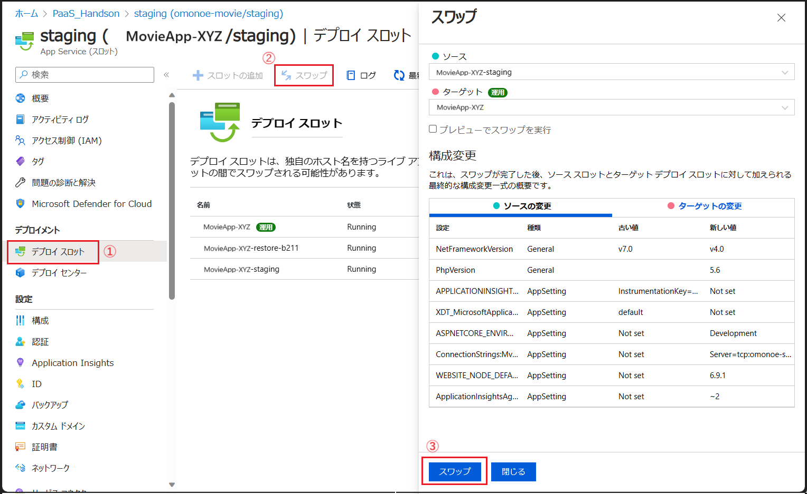

    スワップが完了した通知が表示されるので、\[**閉じる**\] ボタンをクリックします。

    これで運用環境の `MovieApp-XYZ` とステージング環境の `MovieApp-XYZ-staging` が切り替っているはずなので確認します。

18. アプリケーションの運用 (Production) 環境である **MovieApp-XYZ** の \[**概要**\] 画面から \[**既定のドメイン**\] のリンクをクリックし、アプリケーションの画面が正常に表示されることを確認します。

    次に、ドメイン名の後ろに **index.html** を指定してアクセスし、SPA 画面に加えた変更が反映されているか確認してください。

    ```
    https://(既定のドメイン)/index.html

    ```

ここまでの手順で App Service と GitHub リポジトリを使用した CI/CD の手順は完了です。

この手順では、使用されるランタイムの関係で GitHub Actions ではなく App Service のビルドサービスを使用してビルドとデプロイを行いましたが、GitHub Actions の yaml を手動で書き換えることで任意のランタイムでのビルドを行い App Servoce にデプロイを行うこともできます。

GitHub Actions を使用した App Service をはじめとした Azure の各種サービスへのデプロイの詳細について GitHud ドキュメントに詳しく記載されていますので、はじめて使用される方はまず最初に以下のクイックスタートを実施し、

* [GitHub Actions のクイックスタート](https://docs.github.com/ja/actions/quickstart)

その後、アプリケーションのランタイムに応じて以下のドキュメントを参照してください。

* [Azure App Service への **.NET** のデプロイ](https://docs.github.com/ja/actions/deployment/deploying-to-your-cloud-provider/deploying-to-azure/deploying-net-to-azure-app-service)

* [Azure App Service への **Node.js** のデプロイ](https://docs.github.com/ja/actions/deployment/deploying-to-your-cloud-provider/deploying-to-azure/deploying-nodejs-to-azure-app-service)

* [Azure App Service への **Python** のデプロイ](https://docs.github.com/ja/actions/deployment/deploying-to-your-cloud-provider/deploying-to-azure/deploying-python-to-azure-app-service)

* [Azure App Service への **Java** のデプロイ](https://docs.github.com/ja/actions/deployment/deploying-to-your-cloud-provider/deploying-to-azure/deploying-java-to-azure-app-service)

* [Azure App Service への **PHP** のデプロイ](https://docs.github.com/ja/actions/deployment/deploying-to-your-cloud-provider/deploying-to-azure/deploying-php-to-azure-app-service)

* [Azure App Service に **Docker** をデプロイする](https://docs.github.com/ja/actions/deployment/deploying-to-your-cloud-provider/deploying-to-azure/deploying-docker-to-azure-app-service)

* [Azure **Static Web Apps** のデプロイ](https://docs.github.com/ja/actions/deployment/deploying-to-your-cloud-provider/deploying-to-azure/deploying-to-azure-static-web-app)

* [Azure **Kubernetes Service** へのデプロイ](https://docs.github.com/ja/actions/deployment/deploying-to-your-cloud-provider/deploying-to-azure/deploying-to-azure-kubernetes-service)


> 【メモ】演習では手順を簡単にするために Azure SQL Database の環境変数に格納していましたが、この方法はセキュリティ的にはベストではありません。
>  データベースや他のサービスへの接続文字列は暗号化が行われる Azure App Service の \[構成\] メニューにある \[接続文字列\] 、または Azure Key Vault に格納して使用することをお勧めします。
> 詳細は以下の公式ドキュメントをご参照ください。

> * [**チュートリアル: Key Vault を使って .NET App Service からの Cognitive Service 接続をセキュリティで保護する**](https://learn.microsoft.com/ja-jp/Azure/app-service/tutorial-connect-msi-key-vault)
> * [**Azure App Service と Azure Functions でアプリ設定として Key Vault 参照を使用する**](https://learn.microsoft.com/ja-jp/azure/app-service/app-service-key-vault-references?tabs=azure-cli)

<br>


## タスク 2 : 可用性設定

システムが実際に稼働を開始すると、時間の経過とともに利用者が増えていき当初に見積った数よりもリクエスト数が増えてしまったり、特定の時間帯や期間にだけアクセスが集中して負荷がサーバーの処理能力を超えてしまうことがあります。このような場合、サーバーの性能を向上させるために、サーバーのスケールアップやスケールアウトを行う必要があります。

Azure App Service ではオンプレミス上のサーバーのようなハードウェアの調達やセットアップの必要はなく、Azure ポータルや CLI ツールを使用し短い時間でスケールアップやスケールアウトの環境を構築することができます。

また、Azure App Service では、スケジュールによるスケールアウトはもちろんのこと、負荷に応じて自動的にスケールアウトする自動スケーリングの設定も可能です。

このタスクでは、Azure App Service でのスケールアップ、スケールアウト、自動スケーリングの設定方法について確認します。

<br>


### タスク 2.1 : スケールアップ

サーバーのスケールアップとは、文字通りサーバーの処理能力（スケール）を垂直方向に向上させる方法です。具体的には CPU、メモリ、ディスク領域を増やしたり、専用の仮想マシン (VM)、カスタム ドメインと証明書、ステージング スロット、自動スケールのような拡張機能を追加したりします。

Azure App Service では、サーバーのスケールアップは App Service プランのサービス レベルを変更することで行います。App Service のプランの変更では仮想 CPU(vCPU)、[Azure コンピューティング ユニット(ACU)](https://learn.microsoft.com/ja-jp/azure/virtual-machines/acu) の数、メモリとストレージのサイズ、スケール可能な数、SLA を変更できます。

App Service をスケールアップする方法は、Azure ポータル、Azure CLI、Azure PowerShell、REST API、または Azure Resource Manager テンプレートを使用して行うことができます。

このタスクの演習では、Azure ポータルを使用したスケールアップの手順を確認しますが、メニューからプランを選択するだけなので、実際に操作は行わず UI を確認するだけで終了とします。

具体的な手順については、以下の公式ドキュメントの内容に従い作業を行ってください。

* [**Azure App Service でアプリをスケールアップする - 価格レベルのスケールアップ**](https://learn.microsoft.com/ja-jp/azure/app-service/manage-scale-up#scale-up-your-pricing-tier)

<br>


### タスク 2.2 : スケールアウト

スケールアップがサーバーの CPU やメモリといったものを増強して性能を垂直方向に向上させる方法であるのに対し、スケールアウトはサーバー単体の能力はそのままに、処理を複数台のサーバーに分散し処理能力（スケール）を水平方向に向上させる方法です。

Azure App Service では、スケールアウトは App Service プランのインスタンス数を増やすことで行います。App Service プランのインスタンス数を増やすことで、アプリケーションの負荷が増えたときに、負荷を分散することができます。

App Service をスケールアウトする方法は、スケールアップ同様、Azure ポータル、Azure CLI、Azure PowerShell、REST API、または Azure Resource Manager テンプレートを使用して行うことができます。

このタスクの演習では、Azure ポータルを使用した手動スケールアウトの手順を確認します。

Azure App Service で、Azure ポータルから手動スケールアップを行う手順は以下のとおりです。


1. [Azure ポータル](https://portal.azure.com/)にログインし、演習で使用している App Service、`MovieApp-XYZ` を選択します

2. 画面左のメニューから \[**スケール アウト (App Service プラン)**\] を選択します

3. 遷移した画面で \[Scale out method (スケールアウト方法)\] で \[**Manual**(手動)\] を選択し、\[**Instance count** (インスタンス数)\] スライド コントロールで任意の数を選択し、\[**Save**\] ボタンをクリックすることでスケールアウト用のインスタンス数を変更できます 

    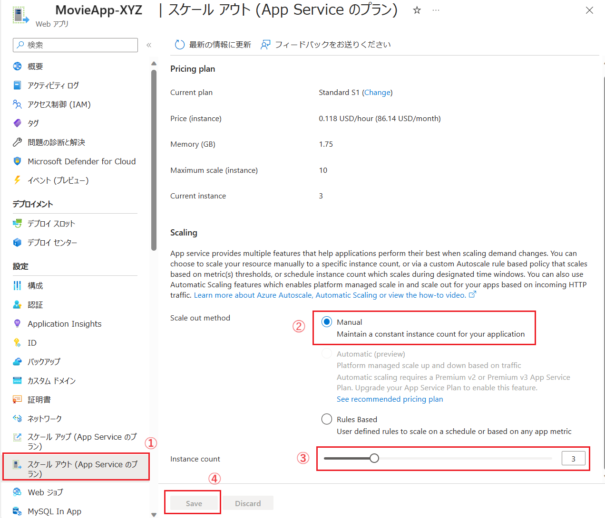

4. 画面左のメニューバーから \[**App Service プラン**\] をクリックし、遷移した画面で \[**Instance count**\] 選択すると、前の手順で指定した数にインスタンス数が変更されていることが確認できます 

    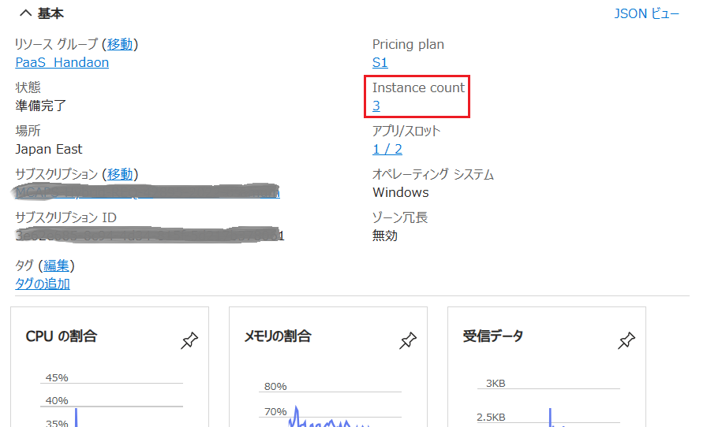

    これで App Service の手動スケールアウトの手順は完了です。

この方法を使用することで任意のタイミングでスケール アウトを行うことができます。

<br>

### タスク 2.3 : 自動スケーリング

タスク 2.2 では App Service の手動スケーリングの手順を紹介しましたが、負荷が増えたときに自動的にインスタンス数を増やす自動スケーリングの設定も可能です。

自動スケーリングを使用すると、負荷が増えたときにインスタンス数を増やし、負荷が減ったときにインスタンス数を減らすことができます。これにより、負荷が増えたときにインスタンス数を増やし、負荷が減ったときにインスタンス数を減らすことができます。これにより、負荷に応じてインスタンス数を自動的に増減させることができます。

自動スケーリングの設定は、Azure ポータル、Azure CLI、Azure PowerShell、REST API、または Azure Resource Manager テンプレートを使用して行うことができます。

このタスクの演習では、Azure ポータルを使用した自動スケーリングの手順を実施します。具体的な手順については、以下の公式ドキュメントの内容に従い作業を行いますが、


具体的な設定手順は以下のとおりです。

1. [Azure ポータル](https://portal.azure.com/)のホーム画面、左上にあるハンバーガーメニューをクリックし、表示されたメニューから \[**モニター**\] を選択します

    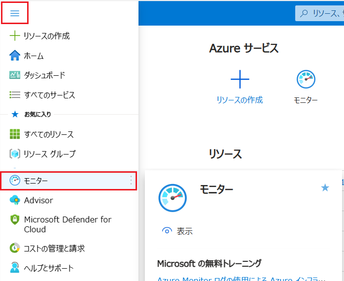

2. \[**モニター**\] 画面に遷移するので画面左のメニューから \[**自動スケーリング**\] を選択します。

    自動スケーリングが適用できるすべてのリソースが表示されるので、演習で使用している App Service、`MovieApp-XYZ` の App Service プランの名前を選択します


    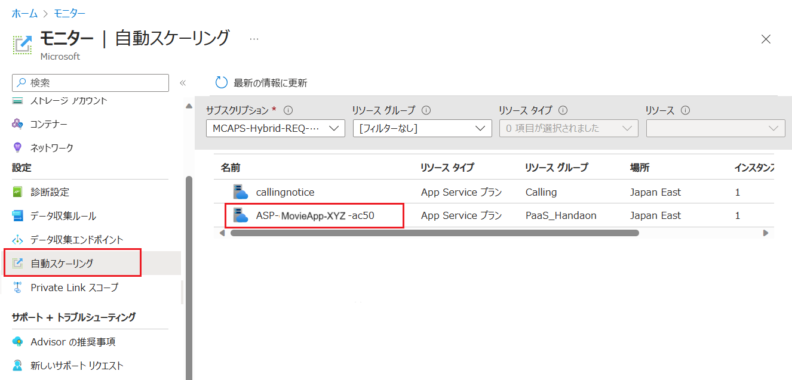

3. \[**自動スケーリング設定**\] の画面に遷移するので、画面内の \[**カスタム自動スケーリング**\] (図中 ①) をクリックし、表示された \[**既定** \*  自動生成された既定のスケール条件\] 内の項目 \[スケールモード\] でオプション ボタン \[**メトリックに基づいてスケーリングする**\] (図中 ➁)を選択し、さらに \[ルール\] の説明文中のリンク <u>**規則を追加する**</u>(図中 ➁)をクリックします。

    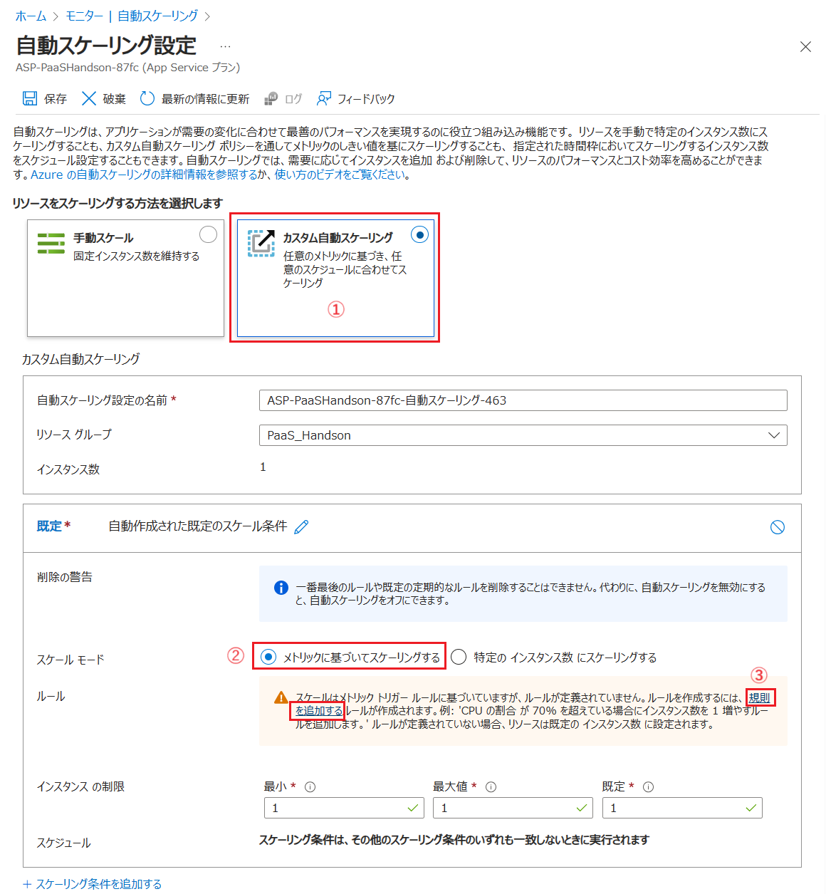

4. 画面右に \[**スケール ルール**\] ブレードが表示されます

    このブレードではスケール アウトする条件を設定しますが、この演習ではなるべく早くスケールアウトの動作を確認したいので、CPU の使用率が 20% を超えたらスケールアウトするよう、ブレード内の項目 [**スケール操作をトリガーするメトリックのしきい値** \*] を `20` に変更します。なお、それ以外の項目はの設定は全て既定のままです。
  
    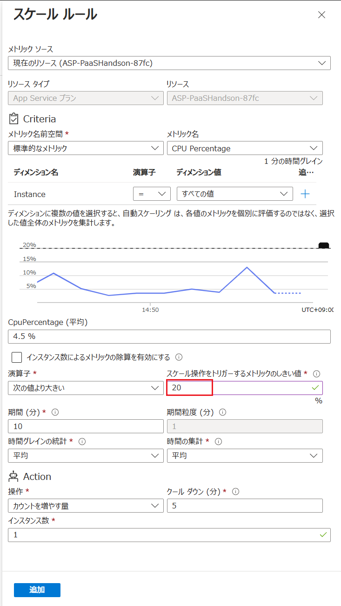

    設定が完了したら \[追加\] ボタンをクリックします。

5. \[**自動スケーリング設定**\] の画面に戻るので画面下部の \[**インスタンスの制限**\] で \[**最大値 \***\] の値を `3` に変更します。

    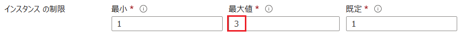

    画面右上の \[**保存**\] ボタンをクリックします。

    
ここまでの手順で自動スケーリングの設定は完了です。

なお、今回の手順では CPU の使用率が上がった際にインスタンスを増やす設定しか行っていないため、一度スケールアウトが発生すると、CPU の使用率が下がってもインスタンス数は減らないままになってしまいます。

このような場合、インスタンス数を減らす(スケールイン)ための設定を行う必要がありますが、この演習では時間の都合上割愛しています。

スケールインの設定手順については、以下のドキュメントに詳しい手順が載っていますのでぜひご参照ください。

* [**Azure での自動スケールの使用 - 最初の自動スケーリング設定を作成する**](https://learn.microsoft.com/ja-jp/azure/azure-monitor/autoscale/autoscale-get-started?toc=%2Fazure%2Fapp-service%2Ftoc.json#create-your-first-autoscale-setting)


次の手順では Azure Load Testing を使用して負荷をかけ、自動スケーリングが正しく動作するか確認します。


<br>

**■ スケーリング確認の前の準備**

Azure Load Testing を使用して負荷をかける対象となる Web アプリケーション MovieApp-XYZ には [演習 2 のタスク 6](ex02.md#%E3%82%BF%E3%82%B9%E3%82%AF-6--%E8%AA%8D%E8%A8%BC%E3%81%AB%E3%81%A4%E3%81%84%E3%81%A6) で App Service の自動認証が設定されており、認証されていないユーザーはアプリケーションの画面にアクセスできないようになっているためこのままでは Azure Load Testing の[クイックテスト](https://learn.microsoft.com/ja-jp/azure/load-testing/quickstart-create-and-run-load-test?tabs=virtual-users#create-a-load-test)で負荷をかけることができません。

次の手順を実施する前に App Service の自動認証を無効にします。

具体的な手順は以下のとおりです。

1. [Azure ポータル](https://portal.azure.com/)で、演習で使用している App Service、`MovieApp-XYZ` を選択します

2. 画面左のメニューから \[**認証**\] を選択します

3. \[**認証の設定**\] 画面に遷移し、項目 \[**ID プロバイダー**\] に [演習 2 のタスク 6](ex02.md#%E3%82%BF%E3%82%B9%E3%82%AF-6--%E8%AA%8D%E8%A8%BC%E3%81%AB%E3%81%A4%E3%81%84%E3%81%A6) で設定した ID プロバイダーが表示されているので、その右側にある \[**削除**\] ボタンをクリックします

    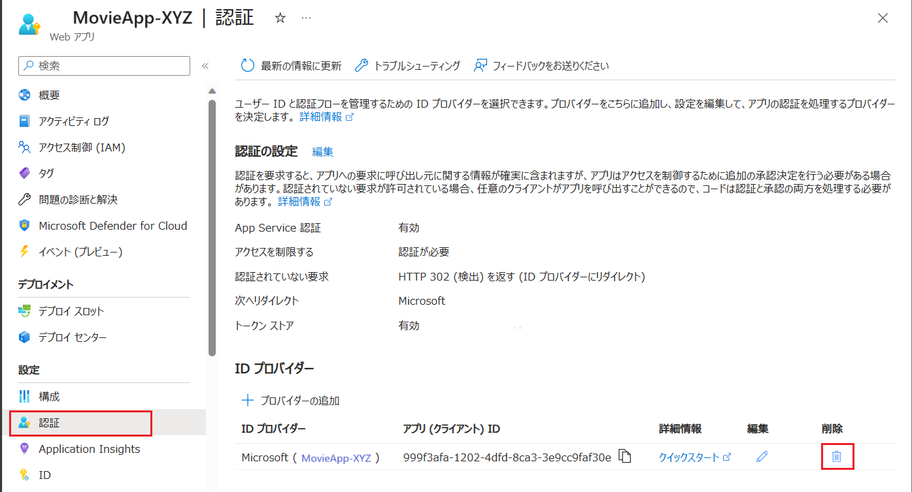

ここまでの手順で App Service の自動認証の設定の削除は完了です。

<br>

**■ トラフィックの作成**

Azure Load Testing を使用して Web アプリケーションに対してトラフィックを作成します。

本来であれば、ユーザーが行うユースケースに合わせたシナリオに沿ったシナリオを用意しテストを行うべきですが、今回は手順を簡略化するめに、単純に Web アプリケーションのトップページに対して負荷をかけます。

具体的な手順は以下のとおりです。

1. Azure の検索ボックスから Azure Load Testing を検索してアクセス

2. 「表示する Azure Load Testing のリソース がありません」と表示されるので \[**Azure Load Testing のリソース作成**\] ボタンをクリック

3. [ロード テストのリソース作成] 画面に遷移するので各パラメーターを以下のように設定し、\[**作成**\] ボタンをクリック

    |項目|値|
    |---|---|
    |リソース グループ| `PaaS_Handson` |
    |名前| `MovieApp-XYZ-LoadTest` |
    |場所| `Japan East` |

    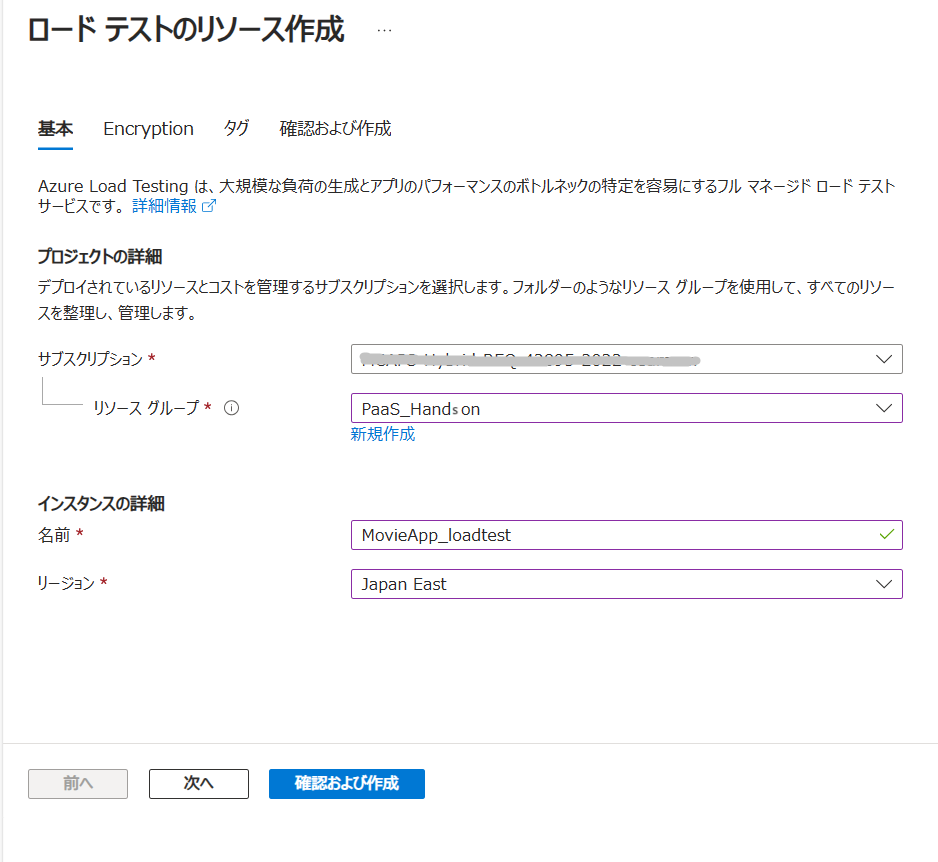

    \[**確認および作成**\] ボタンをクリックし、\[**作成**\] ボタンが有効になったらクリックします

4. リソースが作成されると \[**リソースに移動**\] ボタンが表示されるのでクリックします

5. [ロード テスト] 画面に遷移するので、画面左のメニューから \[**テスト**\] ボタンをクリックし、遷移した画面上部の \[**+ 作成**\] ボタンをクリックし\[**クイックテストを作成する**\] を選択します

    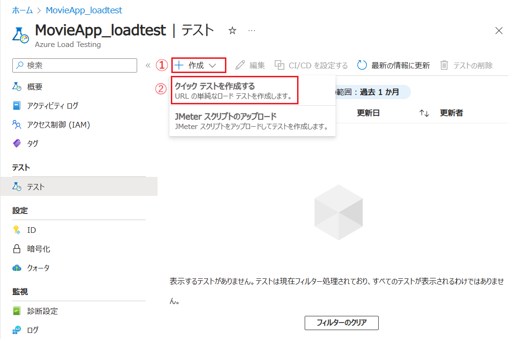


6. \[**クイック テスト**\] の画面に遷移するので、項目 \[**テスト URL \***\] に演習用 Web アプリケーションの URL を設定し、他の項目は既定のまま \[*テストの実行**\] ボタンをクリックします

    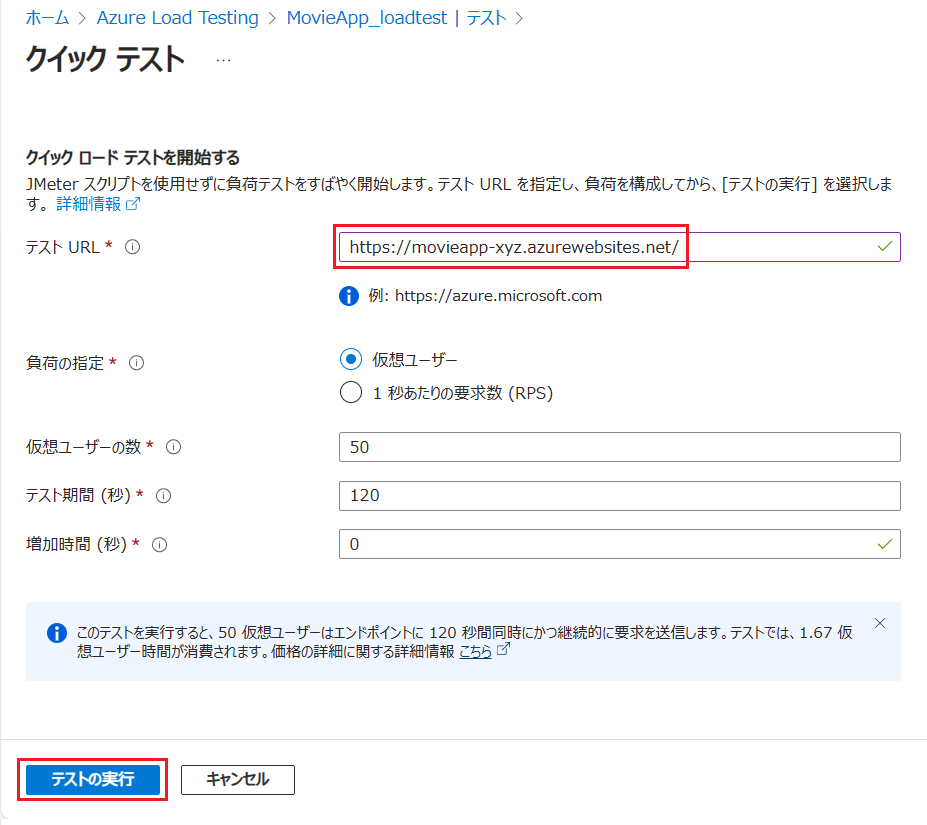

    「**テストの実行は間もなく開始されます**」のメッセージが表示されるので、しばらく待ちます。

    テストが完了するとテストの結果画面が表示されます。

    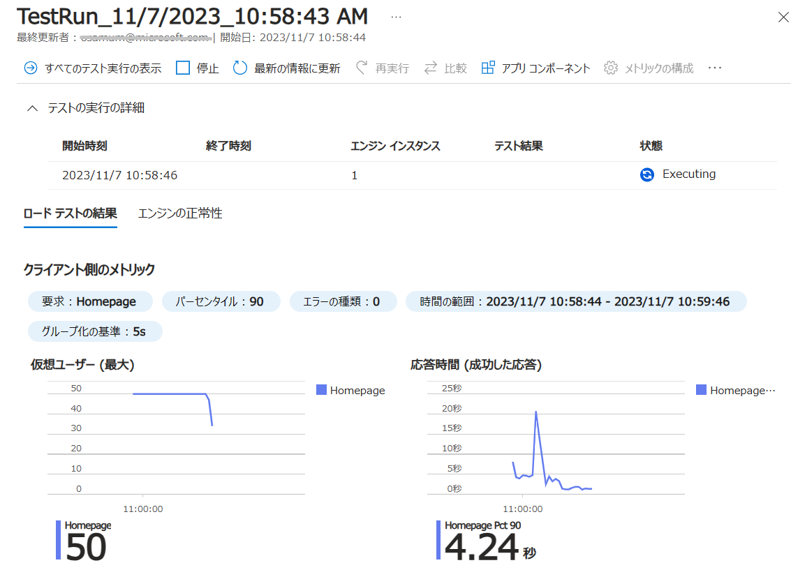

    本来のテストであればテストの結果からエラーの発生の有無やスループット等を確認しますが、今回の目的はスケールアウトの動作確認なので、画面上部の \[**テスト実行の削除**\] をクリックして削除しても構いません。

7. スケールアウトが実行されたか確認するために自動スケールのログを確認します

    Azure ポータルのホーム画面で、画面左のメニューから [\[**モニター**\]](https://portal.azure.com/#view/Microsoft_Azure_Monitoring/AzureMonitoringBrowseBlade/~/overview) を選択し、遷移した画面でさらなる左のメニューから [\[**自動スケーリング**\]](https://portal.azure.com/#view/Microsoft_Azure_Monitoring/AzureMonitoringBrowseBlade/~/autoscale) を選択します。

8. 自動スケーリングが適用できるすべてのリソースが表示されるので、演習で使用している App Service、`MovieApp-XYZ` の App Service プランの名前を選択します

    

9. \[**自動スケーリング設定**\] の画面に遷移するので、画面上部の \[**実行履歴**\] タブをクリックして選択します

    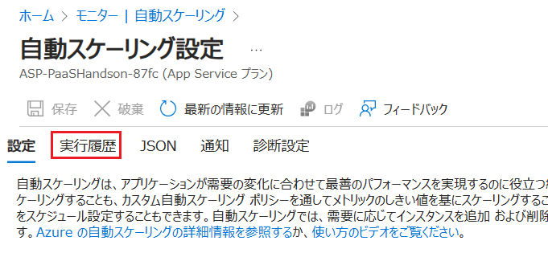

    同タブの内の \[**観察されたリソースのインスタンス数**\] のグラフの最大値が **3** であることを確認し、さらに \[**Observed Capacity (最大値)**\] の値が **3** であることを確認します。

    

ここまでの手順で自動スケーリングの動作確認は完了です。

なお、今回の手順では紹介しませんでしたが、\[**自動スケーリングの設定**\] 画面の \[**通知**\] タブでメールアドレスや Web フック用の URL を指定することで、スケーリング イベント発生時に通知を受け取ることもできます。

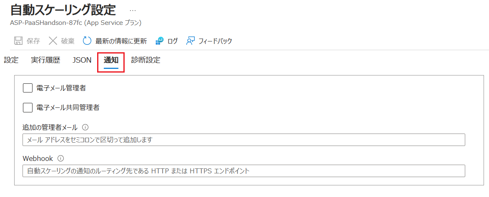

また、この手順で紹介したリソースの利用状況をもとにしたルールベースのスケールアウトでなく、日時を指定してスケーリングをスケジュールすることもできます。

具体的な手順については以下のドキュメントをご参照ください。

* [**Azure での自動スケールの使用 - スケジュール化されたスケール条件**](https://learn.microsoft.com/ja-jp/azure/azure-monitor/autoscale/autoscale-get-started?toc=%2Fazure%2Fapp-service%2Ftoc.json#scheduled-scale-conditions)


<br>

**■ Note : スケールアウト時のアプリケーションのセッション情報の保持について** 

Web コンテンツの基本はページ間にまたがる状態を保持しないステートレスなものであるべきですが、多くの動的ページ アプリケーションではセッション情報として状態(ステート)保持し利用しています。

このセッション情報は多くの場合、アプリケーションをシングルサーバーでホストする場合はサーバーのメモリ上に保持されますが、スケールアウトを行うと複数のインスタンスにリクエストが振り分けされてしまい、次回の接続が前回の状態情報を保持しているサーバーに着信するとは限らないため、セッション情報を保持し、かつリクエストが必要とするセッション情報をマッチングさせる仕組みが必要になります。

Azure App Service では、既定でリクエストが必要とするセッション情報をマッチングさせる仕組み、セッション アフィニティが有効になっているので開発者はサーバーサイドのスケールアウトの動作を意識することなくセッション情報を保持することができます。この分散されている、個々のサーバー上の特定のアプリケーションのインスタンスに各セッションを結び付ける方式は"固定セッション(sticky sessions)" とも呼ばれます。  

セッション アフィニティの設定は App Service の \[**構成**\] メニューの \[**一般設定**\] タブで確認できます。

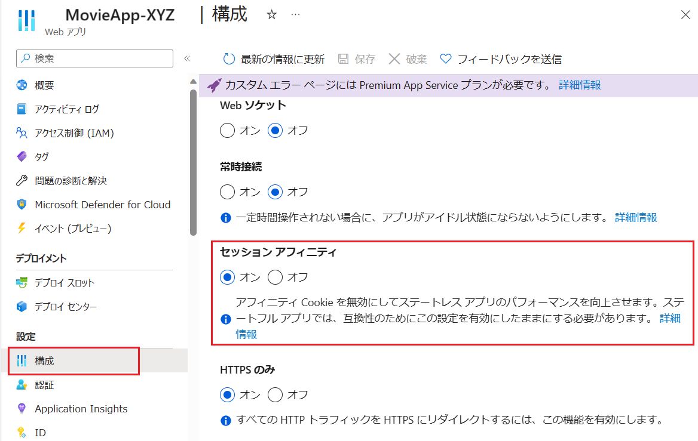

しかし、セッション アフィニティが有効である場合、複数インスタンスに対しリクエストはラウンドロビンされない(均等に振り分けられない)ため、負荷が偏る可能性があります。とくにあらかじめ複数インスタンスでのホストを前提としている場合は負荷が各インスタンスに対し均等でないことについて熟考する必要があります。

App Service の複数インスタンスに対し均等に負荷を振り分けるにはセッション アフィニティを無効にし、[Azure Cache for Redis](https://learn.microsoft.com/ja-jp/azure/azure-cache-for-redis/cache-overview) や [Azure SQL Database](https://learn.microsoft.com/ja-jp/azure/azure-sql/azure-sql-iaas-vs-paas-what-is-overview?view=azuresql) などの外部のデータベースにセッション情報を保持する必要があります。
これにはアプリケーション側の変更が必要になりますが、各開発言語のフレームワークによってはセッション情報を外部のデータベースに保持するためのライブラリが提供されている場合があります。

たとえば ASP.NET Core では、[Microsoft.Extensions.Caching.SqlServer](https://www.nuget.org/packages/Microsoft.Extensions.Caching.SqlServer) パッケージを使用することで、SQL Server にセッション情報を保持することができます。


外部のセッションストアとして Azure Cache for Redis を使用する方法については以下のドキュメントが用意されていますので利用する開発言語に応じてご参照ください。

* [**ASP.NET Web アプリで Azure Cache for Redis を使用する**](https://learn.microsoft.com/ja-jp/azure/azure-cache-for-redis/cache-web-app-howto)

* [**ASP.NET Core Web アプリで Azure Cache for Redis を使用する**](https://learn.microsoft.com/ja-jp/azure/azure-cache-for-redis/cache-web-app-aspnet-core-howto)

* [**Node.js で Azure Cache for Redis を使用する**](https://learn.microsoft.com/ja-jp/azure/azure-cache-for-redis/cache-nodejs-get-started)

* [**Java で Azure Cache for Redis を使用する**](https://learn.microsoft.com/ja-jp/azure/azure-cache-for-redis/cache-java-get-started)

* [**Python で Azure Cache for Redis を使用する**](https://learn.microsoft.com/ja-jp/azure/azure-cache-for-redis/cache-python-get-started)

* [**Go で Azure Cache for Redis を使用する**](https://learn.microsoft.com/ja-jp/azure/azure-cache-for-redis/cache-go-get-started)

* [**Rust で Azure Cache for Redis を使用する**](https://learn.microsoft.com/ja-jp/azure/azure-cache-for-redis/cache-rust-get-started)

<br>


## タスク 3 : 高度なログ監視

演習 2 の [タスク 2 : App Service ログの設定と有効化](ex02.md#%E3%82%BF%E3%82%B9%E3%82%AF-2--app-service-%E3%83%AD%E3%82%B0%E3%81%AE%E8%A8%AD%E5%AE%9A%E3%81%A8%E6%9C%89%E5%8A%B9%E5%8C%96) では、一般的な Web サーバーで取得可能なログを Azure App Service で取得する手順について紹介しましたが、Azure App Service では、Azure に用意されている監視ソリューションある [Azure Monitor](https://learn.microsoft.com/ja-jp/azure/azure-monitor/overview) の機能を使用してさらに詳細なアプリケーションの実行状況を監視するためのログを取得することができます。

このタスクでは、[Log Analytics](https://learn.microsoft.com/ja-jp/azure/azure-monitor/logs/log-analytics-overview) を使用して Azure Monitor が取得したログをクエリーし、必要な情報を取得する方法、また、[Application Insights](https://learn.microsoft.com/ja-jp/azure/azure-monitor/app/app-insights-overview) の[自動インストルメンテーション](https://learn.microsoft.com/ja-jp/azure/azure-monitor/app/codeless-overview)のアプリケーション監視の機能について確認します。

**■ メモ : Azure の監視ソリューションについて**

この演習で使用する Log Analytics、Application Insights はいづれも Azure Monitor の機能です。Azure Monitor はクラウド環境、オンプレミス環境問わず監視データを収集し、分析し、それに対応するための包括的な監視ソリューションであり、Azure におけるアプリケーションを監視するサービスの基盤となっています。Azure Monitor は、アプリケーションのパフォーマンスを把握し、アプリケーションに影響を与える問題と、アプリケーションが依存するリソースを事前に特定するのに役立ちます。

その他の監視ソリューションとして [**Azure Service Health**](https://learn.microsoft.com/ja-jp/azure/service-health/overview) があります。
Azure Service Health は、停止や計画メンテナンスなどの Azure サービスの問題が影響を受けた場合に、常に情報を入手し、アクションを実行するのに役立ちます。つまり、ホストしているアプリケーションではなく、Azure サービスそのものに対しての監視を行うことができます。


この 2 つの監視サービスの役割と違いについての詳細は以下のドキュメントをご参照ください。

* [**What’s the difference between Azure Monitor and Azure Service Health?**](https://azure.microsoft.com/en-us/blog/what-s-the-difference-between-azure-monitor-and-azure-service-health/)


<!--
Azure MonitorのLog Analyticsとログクエリは、Azure Monitorの機能の一部で、それぞれ異なる目的を持っています。

**Log Analytics**は、Azure Monitor Logsストア内のデータに対するログクエリの編集と実行に使用されるツールです²。Azure MonitorのLog Analyticsは、Azure portalのツールで、Azure Monitor Logsストア内のデータに対するログクエリの編集と実行に使用します²。一連のレコードを返す単純なクエリを作成した後、Log Analyticsの機能を使用して、それらを並べ替え、フィルター、および分析できます²。

一方、**ログクエリ**は、Azure Monitor ログデータに対して使用され、より複雑な分析を行うことができます⁷。Azure Monitor メトリックでは特定の数値データのみを格納できる一方で、Azure Monitor ログにはテキスト ログを含む様々なデータ型を格納することができます⁷。このような Azure Monitor ログ データに対してログクエリを使用することで、より複雑な分析を行うことができます⁷。

したがって、Log Analyticsはデータのクエリと分析のためのツールであり、ログクエリはその分析を行うための手段です。²⁷。

ソース: Bing との会話 2023/11/8
(1) Azure Monitor の Log Analytics の概要 - Azure Monitor. https://learn.microsoft.com/ja-jp/azure/azure-monitor/logs/log-analytics-overview.
(2) . https://bing.com/search?q=Azure+monitor+%e3%81%ae+Log+analytics+%e3%81%a8%e3%83%ad%e3%82%b0%e3%82%af%e3%82%a8%e3%83%aa%e3%81%ae%e9%81%95%e3%81%84.
(3) . https://bing.com/search?q=Azure+monitor+%e3%81%a8+Log+analytics+%e3%81%ae%e9%81%95%e3%81%84.
(4) Azure Monitor を使用して仮想マシンを監視する: 監視データの分析. https://learn.microsoft.com/ja-jp/azure/azure-monitor/vm/monitor-virtual-machine-analyze.
(5) Azure Monitor エージェントとLog Analytics エージェントの違い .... https://cloudsteady.jp/2021/11/15/50012/.
(6) 【AZ-900】Azure Monitorとは？監視ツールの全体像を解説！. https://az-start.com/azure-monitor-overview/.
(7) undefined. https://learn.microsoft.com/ja-jp/azure/azure-monitor/overview.
(8) Azure VM の監視について | Japan Azure Monitoring Support Blog. https://jpazmon-integ.github.io/blog/LogAnalytics/MonitorAzVM_logs/.
(9) Azure Log Analyticsで可能なログデータの収集・蓄積、検索 .... https://www.rworks.jp/cloud/azure/azure-column/azure-entry/28368/.
-->