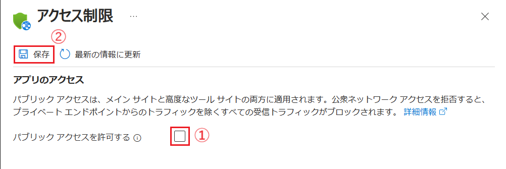

# 演習 4 : Advanced なネットワーク設定

Azure App Service の既定の設定では、デプロイされたアプリケーションはインターネットに公開されます。

しかし、アプリケーションをインターネットに公開せず、クローズドなネットワーク環境からのみアクセスしたいという場合もあります。たとえば、アプリケーションの構成がフロント部分とバックエンド部分に分かれていて、フロント部分はインターネットに公開し、バックエンド部分はクローズドなネットワーク環境内に配置するといった場合です。

このような場合には Azure Virtual Network (仮想ネットワーク)環境を作成し、これに対し [Azure Private Link](https://learn.microsoft.com/ja-jp/azure/private-link/private-link-overview) 機能を使用してプライベート エンドポイントを公開し、かつ App Service でパブリック アクセスを無効にすることで、インターネットに公開しないようにすることができます。

また、App Service 上のアプリケーションからクローズドなネットワーク環境内のリソースにアクセスしたいという場合もあります。たとえば、App Service 上のアプリケーションから Azure Virtual Network 内の仮想マシンにアクセスしたいといった場合です。

このような場合には、App Service の [仮想ネットワーク統合](https://learn.microsoft.com/ja-jp/azure/app-service/overview-vnet-integration) 機能を使用して、App Service と Azure Virtual Network を接続することができます。

この演習では以下の 2 つについて手順を説明します。

* [アプリケーションを仮想ネットワーク内にのみ公開する](#private-link)

* [アプリケーションから仮想ネットワーク内のリソースに接続する](#vnet-integration)


<br>

## タスク 1 : アプリケーションを仮想ネットワーク内にのみ公開する

App Service 上のアプリケーションへのインターネットからのアクセスを不可とし、クローズドなネットワーク環境内からのアクセスのみに制限します。

そのために [Azure Virtual Network](https://learn.microsoft.com/ja-jp/azure/virtual-network/virtual-networks-overview) を使用して仮想ネットワーク環境を作成し、その後 [Azure Private Link](https://learn.microsoft.com/ja-jp/azure/private-link/private-link-overview) を使用して仮想ネットワーク環境に対してプライベート エンドポイントを公開します。

<br>

### タスク 1.1 : 仮想ネットワーク環境の作成

Azure Portal を使用して仮想ネットワーク環境を作成します。

具体的な手順は以下のとおりです。

1. Azure Portal [ホーム画面](https://portal.azure.com/#home) の上部の検索ボックスに `仮想ネットワーク` と入力し、検索結果から `仮想ネットワーク` を選択します

    

2. \[**仮想ネットワーク**\] の画面に遷移するので、画面上部にある \[**+ 作成**\] ボタンをクリックします

3. \[**仮想ネットワークの作成**\] 画面の \[**基本**\] タブに遷移するので、各項目を以下のように設定します

    |項目|設定値|
    |:---|:---|
    |サブスクリプション|使用するサブスクリプション|
    |リソース グループ|\[**PaaS_Handson**\]|
    |名前|`handson-vnet`|
    |リージョン|\[**(Asia Pacific) Japan East**\]|
    
    

    設定が完了したら \[**次へ**\] ボタンをクリックします

4. \[**セキュリティ**\] タブに遷移するので、各項目を以下のように設定します

    **Azure Bastio**

    |項目|設定値|
    |:---|:---|
    |Azure Bastion を有効にする|\[**Bastion を有効にする**\]|
    |Azure Bastion ホスト名|`handson-vnet-Bastion`(※既定のまま)|
    |Azure Bastion のパブリック IP アドレス|入力ボックス下の \[パブリック IP アドレスを作成\] リンクをクリックし、表示された\[**パブリック IP アドレス**\] ダイアログ ボックスで既定の設定のまま \[**OK**\] ボタンをクリック|

    **Azure Firewall** と **Azure DDoS ネットワーク保護** は既定のままとします

    
   
   設定が完了したら \[**次へ**\] ボタンをクリックします

5. \[**IP アドレス**\] タブに遷移するので、アドレス空間情報が表示されているボックスの \[**サブネット**\] フィールドの **default**　をクリックします

    

6. 画面右に \[**サブネットの編集**\] ブレードが表示されるので、各項目を以下のように設定します

    |項目|設定値|
    |:---|:---|
    |サブネットの目的|`Default`|
    |名前 \*|`handson-subnet`|
    
    **IPv4**、**IPv6**、**プライベート サブネット**、**セキュリティ** はすべて既定のままです

    

    設定が完了したら \[**保存**\] ボタンをクリックし\[**サブネットの編集**\] ブレードを閉じます

7. \[**確認作成**\] ボタンをクリックし、\[**作成**\] ボタンが表示されたらクリックします 

ここまでの手順で仮想ネットワーク環境の作成は完了です。

<br>

### タスク 1.2 : プライベート エンドポイントの作成

仮想ネットワーク環境にアプリケーションを公開するためのプライベート エンドポイントを作成します。

具体的な手順は以下のとおりです。

1. Azure Portal [ホーム画面](https://portal.azure.com/#home) の上部の検索ボックスに `プライベート リンク サービス` と入力し、検索結果から `プライベート リンク サービス` を選択します

    


2. \[**Private Link センター | プライベート エンドポイント**] の画面に遷移するのけで、画面上部の \[**+ 作成**] ボタンをクリックします

3. \[**プライベート エンドポイントを作成する**] 画面に遷移するので、各項目を以下のように設定します

    **プロジェクトの詳細**

    |項目|設定値|
    |:---|:---|
    |サブスクリプション|使用するサブスクリプション|
    |リソース グループ|\[**PaaS_Handson**\]|

    **インスタンスの詳細**

    |項目|設定値|
    |:---|:---|
    |名前 \*|`handson-vnet-endpoint`|
    |ネットワーク インターフェイス名 \*|(自動生成されるもの)|
    |地域 \*|\[**Japan East**\]|

    

    設定が完了したら \[**次: リソース >**\] ボタンをクリックします

4. \[**リソース**\] 画面に遷移するので、各項目を以下のように設定します

    |項目|設定値|
    |:---|:---|
    |接続方法|\[**マイ ディレクトリ内の Azure リソースに接続します。**\] にチェック|
    |サブスクリプション \*|(お使いのサブスクリプション)|
    |リソースの種類 \*|\[**Microsoft.Web/sites**\]|
    |リソース \*|\[**MovieApp-XYZ**\]|
    |対象サブリソース \*|\[**sites**\]|

    


    設定が完了したら \[**次: 仮想ネットワーク >**\] ボタンをクリックします

5. \[**仮想ネットワーク**\] 画面に遷移するので、各項目が以下のように設定されていることを確認します

    **ネットワーク**

    |項目|設定値|
    |:---|:---|
    |仮想ネットワーク \*|\[**handson-vnet (PaaS_Handson)**\]|
    |サブネット \*|\[**handson-subnet**\]|


    **プライベート IP 構成**

    |項目|設定値|
    |:---|:---|
    |IP アドレスを動的に割り当てる|チェックする|

    **アプリケーション セキュリティ グループ**

    なにも指定しない (既定のまま)

    

    設定が完了したら \[**次: DNS >**\] ボタンをクリックします

6. \[**DNS**\] 画面に遷移するので既定のままなにも設定せず \[**次: タグ >**\] ボタンをクリックします

7. \[**タグ**\] 画面に遷移するので同様に既定のままなにも設定せず \[**次: 確認および作成 >**\] ボタンをクリックします

8. \[**作成**\] ボタンが有効になったらクリックします

    ここまでの手順でプライベート エンドポイントの作成は完了です。

    この設定で App Service 上のアプリケーション `MovieApp-XYZ` は仮想ネットワーク **handson-vnet** 内の環境からアクセス可能になりました。

    なお、この段階ではまだインターネットからもアクセスできる状態となっています。


<br>

### タスク 1.3 : テスト用の仮想マシンを作成し結果を確認する

仮想ネットワーク環境内から App Service 上のアプリケーション `MovieApp-XYZ` にアクセスできることを確認するために、仮想ネットワーク環境内にテスト用の仮想マシンを作成し、その仮想マシンから App Service 上のアプリケーションにアクセスします。

仮想マシンからアプリケーションへの正常な接続を確認後、インターネットからアプリケーションへの接続を無効にします。

具体的な手順は以下のとおりです。

1. Azure Portal [ホーム画面](https://portal.azure.com/#home) の上部の検索ボックスに `仮想マシン` と入力し、検索結果から `仮想マシン` を選択します

    

2. \[**仮想マシンの作成**\] の画面の \[**基本**\] タブに遷移するので各項目を以下のように設定します

    **プロジェクトの詳細**

    |項目|設定値|
    |:---|:---|
    |サブスクリプション \*|使用するサブスクリプション|
    |リソース グループ|\[**PaaS_Handson**\]|

    **インスタンスの詳細**

    |項目|設定値|
    |:---|:---|
    |仮想マシン名 \*|`vnet-mon-vm`|
    |地域 \*|\[**(Asia Pacific) Japan East**\]|
    |可用性オプション|\[**インフラストラクチャ冗長は必要ありません**\]|
    |セキュリティの種類|\[**Standard**\]|
    |イメージ \*|\[**[Windows Server 2022 Datacenter - x64 Gen2**\]|
    |VM アーキテクチャ|\[**x64**\]|
    |サイズ|(※任意のものを選択します。価格の安いものでかまいません)|


    **管理者アカウント**

    |項目|設定値|
    |:---|:---|
    |ユーザー名 \*|`handson-vmadmin`|
    |パスワード \*|`P@ssw0rd1234`|
    |パスワードの確認 \*|`P@ssw0rd1234`|

    **受信ポートの規則**

    |項目|設定値|
    |:---|:---|
    |パブリック受信ポート \*|\[**なし**\]|

    **ライセンス**

    |項目|設定値|
    |:---|:---|
    |既存の Windows Server ライセンスを使用しますか?|チェックしない|


    

    設定が完了したら \[**次: ディスク >**\] ボタンをクリックします

3. \[**ディスク**\] タブの画面に遷移しますが、既定のままで \[**次: ネットワーク >**\] ボタンをクリックします

4. \[**ネットワーク**] タブの画面に遷移するので各項目が既定で以下のように設定されていることを確認します

    **ネットワーク インターフェイス**

    |項目|設定値|
    |:---|:---|
    |仮想ネットワーク \*|\[**handson-vnet**\]|
    |サブネット \*|\[**handson-subnet (10.0.0.0/24)**\]|
    |パブリック IP|\[**(新規) vnet-mon-vm-ip**\]|
    |NIC ネットワーク セキュリティ グループ|\[**詳細**\ にチェック]|
    |ネットワーク セキュリティ グループの構成 /*|\[**(新規) vnet-mon-vm-nsg**\]|
    |VM が削除されたときにパブリック IP と NIC を削除する|チェックしない(※任意)|
    |高速ネットワークを有効にする|チェック|

    **負荷分散**

    |項目|設定値|
    |:---|:---|
    |負荷分散のオプション|\[**なし**\]にチェック|

    

    設定が完了したら \[**確認および作成**\] ボタンをクリックし、\[**作成**\] ボタンが有効になったらクリックしてデプロイを開始します。

5. 仮想マシンのデプロイが完了すると \[**リソースに移動**\] ボタンが表示されるので、クリックして作成した仮想マシンのリソース画面に遷移します

6. 画面左のメニューから \[**Bastion**\] をクリックし、遷移した画面の各項目を以下のように設定します

    |項目|設定値|
    |:---|:---|
    |認証の種類|\[**VM パスワード**\]|
    |ユーザー名 \*|`handson-vmadmin`|
    |VM パスワード \*|`P@ssw0rd1234`|
    |新しいブラウザー タブで開く|**チェックしない**|

    

    設定が完了したら \[**接続**\] ボタンをクリックします

7. 仮想マシンへの接続が完了すると、Azure ポータル画面内に仮想マシンのデスクトップが表示されるので
 PowerShell を起動します

    

8. PowerShell で以下のコマンドを実行し、App Service 上のアプリケーションにアクセスできることを確認します

    ```powershell
        nslookup movieapp-xyz.azurewebsites.net
    ```
    (※) コマンド中の `movieapp-xyz` は自身のアプリケーション名に置き換えてください

    以下のような結果が表示されることを確認します。

    ```powershell
        Server:  UnKnown
        Address:  168.63.129.16

        Non-authoritative answer:
        Name:    movieapp-xyz.privatelink.azurewebsites.net
        Address:  10.0.0.10
        Aliases:  movieapp-xyz.azurewebsites.net
    ```

    Web アプリ名として ***10.0.0.10*** というプライベート IP アドレスが返されていることを確認します。

9. 仮想マシンの画面で Web ブラウザーを起動し、URL `http://movieapp-xyz.azurewebsites.net` アクセスし、アプリケーションの画面が正常に表示されることを確認します

    (※) URL 中の `movieapp-xyz` は自身のアプリケーション名に置き換えてください

    

8. アプリケーションへのインターネットからのアクセスを遮断します

    Azure ポータルで、App Service 上のアプリケーション `MovieApp-XYZ` のリソース画面を開き、画面左のメニューから \[**ネットワーク**\] をクリックします。

    \[**受信トラフィック**\] ボックス中の \[**アクセス制限**\] をクリックします

    

    \[**アクセス制限**\] 画面に遷移するので、\[**パブリック アクセスを許可する**\] チェックのチェックを外し、\[**保存**\] ボタンをクリックします

    

    **アクセス拒否の確認** の確認ブレードが表示されるので、\[**続行**\] ボタンをクリックします

    これでインターネットからアプリケーション `MovieApp-XYZ`へのアクセスができなくなりました。

    ローカルコンピューターの Web ブラウザーで URL `http://movieapp-xyz.azurewebsites.net` にアクセスし、HTTP403 のエラーが表示されることを確認します。

    (※) URL 中の `movieapp-xyz` は自身のアプリケーション名に置き換えてください

9. 仮想ネットワークに参加している仮想マシンの画面で Web ブラウザーから、URL `http://movieapp-xyz.azurewebsites.net` アクセスし、アプリケーションの画面が正常に表示されることを確認します

    (※) URL 中の `movieapp-xyz` は自身のアプリケーション名に置き換えてください

    

    


<!--
https://learn.microsoft.com/ja-jp/azure/private-link/create-private-endpoint-portal?tabs=dynamic-ip
-->