# 演習 4 : Advanced なネットワーク設定

Azure App Service の既定の設定では、デプロイされたアプリケーションはインターネットに公開されます。

しかし、アプリケーションをインターネットに公開せず、クローズドなネットワーク環境からのみアクセスしたいという場合もあります。たとえば、アプリケーションの構成がフロント部分とバックエンド部分に分かれていて、フロント部分はインターネットに公開し、バックエンド部分はクローズドなネットワーク環境内に配置するといった場合です。

このような場合には Azure Virtual Network (仮想ネットワーク)環境を作成し、これに対し [Azure Private Link](https://learn.microsoft.com/ja-jp/azure/private-link/private-link-overview) 機能を使用してプライベート エンドポイントを公開し、かつ App Service でパブリック アクセスを無効にすることで、インターネットに公開しないようにすることができます。

また、App Service 上のアプリケーションからクローズドなネットワーク環境内のリソースにアクセスしたいという場合もあります。たとえば、App Service 上のアプリケーションから Azure Virtual Network 内の仮想マシンにアクセスしたいといった場合です。

このような場合には、App Service の [仮想ネットワーク統合](https://learn.microsoft.com/ja-jp/azure/app-service/overview-vnet-integration) 機能を使用して、App Service と Azure Virtual Network を接続することができます。

この演習では以下の 3 つについてタスクを実行します。

1. [アプリケーションを仮想ネットワーク内にのみ公開する (プライベート エンドポイント)](##%E3%82%BF%E3%82%B9%E3%82%AF-1--%E3%82%A2%E3%83%97%E3%83%AA%E3%82%B1%E3%83%BC%E3%82%B7%E3%83%A7%E3%83%B3%E3%82%92%E4%BB%AE%E6%83%B3%E3%83%8D%E3%83%83%E3%83%88%E3%83%AF%E3%83%BC%E3%82%AF%E5%86%85%E3%81%AB%E3%81%AE%E3%81%BF%E5%85%AC%E9%96%8B%E3%81%99%E3%82%8B)
2. [アプリケーションから仮想ネットワーク内のリソースに接続する](#%E3%82%BF%E3%82%B9%E3%82%AF-2--%E3%82%A2%E3%83%97%E3%83%AA%E3%82%B1%E3%83%BC%E3%82%B7%E3%83%A7%E3%83%B3%E3%81%8B%E3%82%89%E4%BB%AE%E6%83%B3%E3%83%8D%E3%83%83%E3%83%88%E3%83%AF%E3%83%BC%E3%82%AF%E5%86%85%E3%81%AE%E3%83%AA%E3%82%BD%E3%83%BC%E3%82%B9%E3%81%AB%E6%8E%A5%E7%B6%9A%E3%81%99%E3%82%8B)

3. [アプリケーションへのアクセスを Application Gateway を経由してのみ許可する (サービス エンドポイント)](#%E3%82%BF%E3%82%B9%E3%82%AF-3--%E3%82%A2%E3%83%97%E3%83%AA%E3%82%B1%E3%83%BC%E3%82%B7%E3%83%A7%E3%83%B3%E3%81%B8%E3%81%AE%E3%82%A2%E3%82%AF%E3%82%BB%E3%82%B9%E3%82%92-application-gateway-%E3%82%92%E7%B5%8C%E7%94%B1%E3%81%97%E3%81%A6%E3%81%AE%E3%81%BF%E8%A8%B1%E5%8F%AF%E3%81%99%E3%82%8B-%E3%82%B5%E3%83%BC%E3%83%93%E3%82%B9-%E3%82%A8%E3%83%B3%E3%83%89%E3%83%9D%E3%82%A4%E3%83%B3%E3%83%88)


<br>

## タスク 1 : アプリケーションを仮想ネットワーク内にのみ公開する (プライベート エンドポイント)

App Service 上のアプリケーションへのインターネットからのアクセスを不可とし、クローズドなネットワーク環境内からのアクセスのみに制限します。

この構成は、インターネットからアクセスできない仮想ネットワーク内に管理ツールを配置し、操作は同じ仮想ネットワーク内の仮想マシンから行うといった場合に使用されます。

このタスクで構成する環境は以下のとおりです。

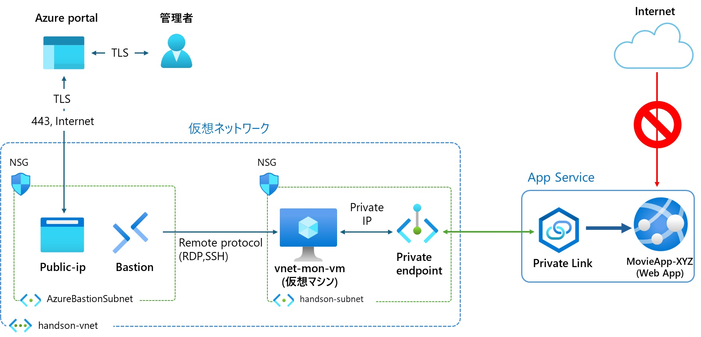

このタスクでは [Azure Virtual Network](https://learn.microsoft.com/ja-jp/azure/virtual-network/virtual-networks-overview) を使用して仮想ネットワーク環境を作成し、その後 [Azure Private Link](https://learn.microsoft.com/ja-jp/azure/private-link/private-link-overview) を使用して仮想ネットワーク環境に対してプライベート エンドポイントを公開します。

<br>

### タスク 1.1 : 仮想ネットワーク環境の作成

Azure Portal を使用して仮想ネットワーク環境を作成します。

具体的な手順は以下のとおりです。

1. Azure Portal [ホーム画面](https://portal.azure.com/#home) の上部の検索ボックスに `仮想ネットワーク` と入力し、検索結果から `仮想ネットワーク` を選択します

    

2. \[**仮想ネットワーク**\] の画面に遷移するので、画面上部にある \[**+ 作成**\] ボタンをクリックします

3. \[**仮想ネットワークの作成**\] 画面の \[**基本**\] タブに遷移するので、各項目を以下のように設定します

    |項目|設定値|
    |:---|:---|
    |サブスクリプション|使用するサブスクリプション|
    |リソース グループ|\[**PaaS_Handson**\]|
    |名前|`handson-vnet`|
    |リージョン|\[**(Asia Pacific) Japan East**\]|
    
    

    設定が完了したら \[**次へ**\] ボタンをクリックします

4. \[**セキュリティ**\] タブに遷移するので、各項目を以下のように設定します

    **Azure Bastion**

    |項目|設定値|
    |:---|:---|
    |Azure Bastion を有効にする|\[**Bastion を有効にする**\]|
    |Azure Bastion ホスト名|`handson-vnet-Bastion`(※既定のまま)|
    |Azure Bastion のパブリック IP アドレス|入力ボックス下の \[パブリック IP アドレスを作成\] リンクをクリックし、表示された\[**パブリック IP アドレス**\] ダイアログ ボックスで既定の設定のまま \[**OK**\] ボタンをクリック|

    **Azure Firewall** と **Azure DDoS ネットワーク保護** は既定のままとします

    
   
   設定が完了したら \[**次へ**\] ボタンをクリックします

5. \[**IP アドレス**\] タブに遷移するので、アドレス空間情報が表示されているボックスの \[**サブネット**\] フィールドの **default**　をクリックします

    

6. 画面右に \[**サブネットの編集**\] ブレードが表示されるので、各項目を以下のように設定します

    |項目|設定値|
    |:---|:---|
    |サブネットの目的|`Default`|
    |名前 \*|`handson-subnet`|
    
    **IPv4**、**IPv6**、**プライベート サブネット**、**セキュリティ** はすべて既定のままです

    

    設定が完了したら \[**保存**\] ボタンをクリックし\[**サブネットの編集**\] ブレードを閉じます

7. \[**確認 + 作成**\] ボタンをクリックし、\[**作成**\] ボタンが表示されたらクリックします 

ここまでの手順で仮想ネットワーク環境の作成は完了です。

<br>

### タスク 1.2 : プライベート エンドポイントの作成

仮想ネットワーク環境にアプリケーションを公開するためのプライベート エンドポイントを作成します。

具体的な手順は以下のとおりです。

1. Azure Portal [ホーム画面](https://portal.azure.com/#home) の上部の検索ボックスに `プライベート リンク サービス` と入力し、検索結果から `プライベート エンドポイント` を選択します

    


2. \[**Private Link センター | プライベート エンドポイント**] の画面に遷移するのけで、画面上部の \[**+ 作成**] ボタンをクリックします

3. \[**プライベート エンドポイントを作成する**] 画面に遷移するので、各項目を以下のように設定します

    **プロジェクトの詳細**

    |項目|設定値|
    |:---|:---|
    |サブスクリプション|使用するサブスクリプション|
    |リソース グループ|\[**PaaS_Handson**\]|

    **インスタンスの詳細**

    |項目|設定値|
    |:---|:---|
    |名前 \*|`handson-vnet-endpoint`|
    |ネットワーク インターフェイス名 \*|(自動生成されるもの)|
    |地域 \*|\[**Japan East**\]|

    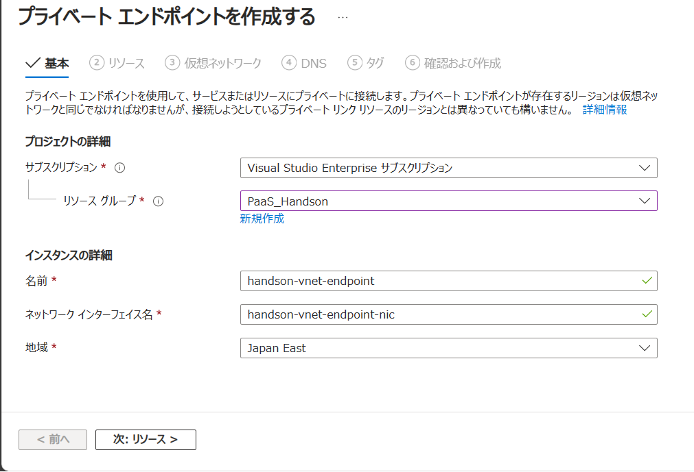

    設定が完了したら \[**次: リソース >**\] ボタンをクリックします

4. \[**リソース**\] 画面に遷移するので、各項目を以下のように設定します

    |項目|設定値|
    |:---|:---|
    |接続方法|\[**マイ ディレクトリ内の Azure リソースに接続します。**\] にチェック|
    |サブスクリプション \*|(お使いのサブスクリプション)|
    |リソースの種類 \*|\[**Microsoft.Web/sites**\]|
    |リソース \*|\[**MovieApp-XYZ**\]|
    |対象サブリソース \*|\[**sites**\]|

    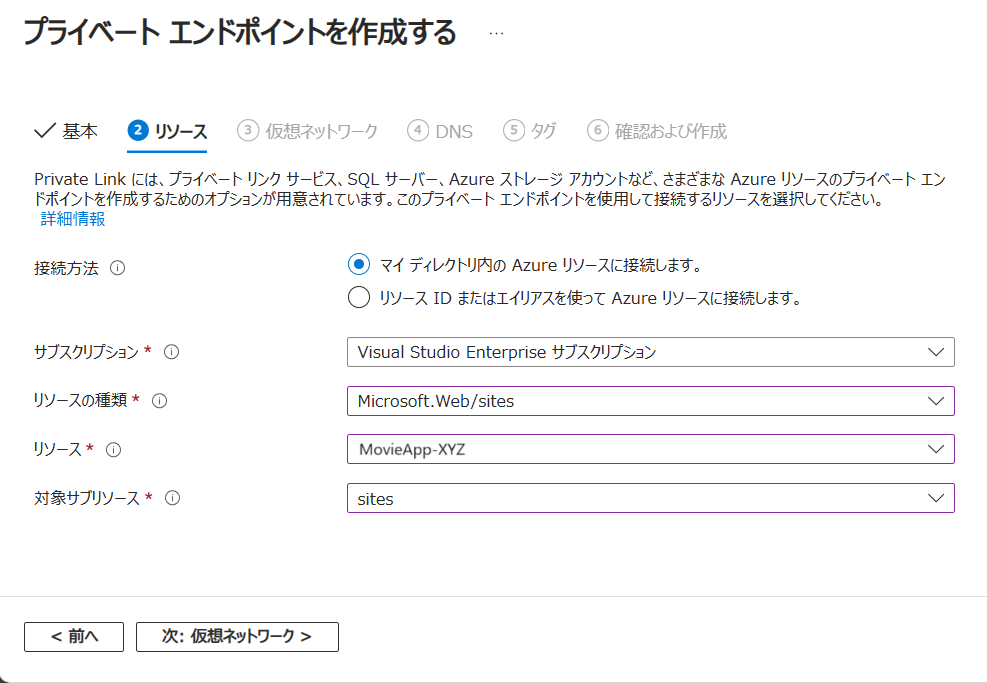


    設定が完了したら \[**次: 仮想ネットワーク >**\] ボタンをクリックします

5. \[**仮想ネットワーク**\] 画面に遷移するので、各項目が以下のように設定されていることを確認します

    **ネットワーク**

    |項目|設定値|
    |:---|:---|
    |仮想ネットワーク \*|\[**handson-vnet (PaaS_Handson)**\]|
    |サブネット \*|\[**handson-subnet**\]|


    **プライベート IP 構成**

    |項目|設定値|
    |:---|:---|
    |IP アドレスを動的に割り当てる|チェックする|

    **アプリケーション セキュリティ グループ**

    なにも指定しない (既定のまま)

    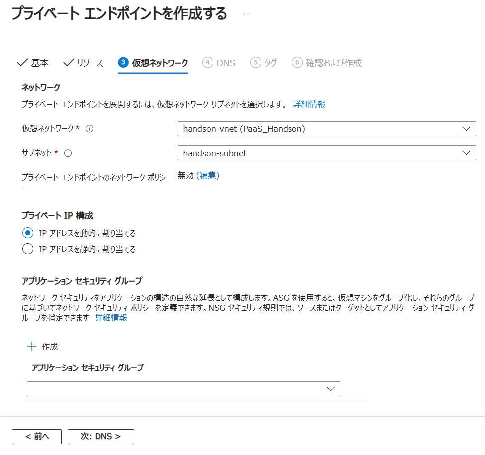

    設定が完了したら \[**次: DNS >**\] ボタンをクリックします

6. \[**DNS**\] 画面に遷移するので既定のままなにも設定せず \[**次: タグ >**\] ボタンをクリックします

7. \[**タグ**\] 画面に遷移するので同様に既定のままなにも設定せず \[**次: 確認および作成 >**\] ボタンをクリックします

8. \[**作成**\] ボタンが有効になったらクリックします

    ここまでの手順でプライベート エンドポイントの作成は完了です。

    この設定で App Service 上のアプリケーション `MovieApp-XYZ` は仮想ネットワーク **handson-vnet** 内の環境からアクセス可能になりました。

    なお、この段階ではまだインターネットからもアクセスできる状態となっています。


<br>

### タスク 1.3 : テスト用の仮想マシンを作成し結果を確認する

仮想ネットワーク環境内から App Service 上のアプリケーション `MovieApp-XYZ` にアクセスできることを確認するために、仮想ネットワーク環境内にテスト用の仮想マシンを作成し、その仮想マシンから App Service 上のアプリケーションにアクセスします。

仮想マシンからアプリケーションへの正常な接続を確認後、インターネットからアプリケーションへの接続を無効にします。

具体的な手順は以下のとおりです。

1. Azure Portal [ホーム画面](https://portal.azure.com/#home) の上部の検索ボックスに `仮想マシン` と入力し、検索結果から `仮想マシン` を選択します

    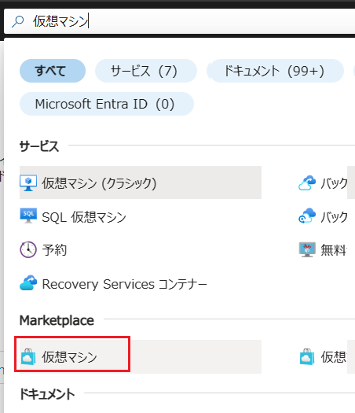

2. \[**仮想マシンの作成**\] の画面の \[**基本**\] タブに遷移するので各項目を以下のように設定します

    **プロジェクトの詳細**

    |項目|設定値|
    |:---|:---|
    |サブスクリプション \*|使用するサブスクリプション|
    |リソース グループ|\[**PaaS_Handson**\]|

    **インスタンスの詳細**

    |項目|設定値|
    |:---|:---|
    |仮想マシン名 \*|`vnet-mon-vm`|
    |地域 \*|\[**(Asia Pacific) Japan East**\]|
    |可用性オプション|\[**インフラストラクチャ冗長は必要ありません**\]|
    |セキュリティの種類|\[**Standard**\]|
    |イメージ \*|\[**[Windows Server 2022 Datacenter - x64 Gen2**\]|
    |VM アーキテクチャ|\[**x64**\]|
    |サイズ|(※任意のものを選択します。価格の安いものでかまいません)|


    **管理者アカウント**

    |項目|設定値|
    |:---|:---|
    |ユーザー名 \*|`handson-vmadmin`|
    |パスワード \*|`P@ssw0rd1234`|
    |パスワードの確認 \*|`P@ssw0rd1234`|

    **受信ポートの規則**

    |項目|設定値|
    |:---|:---|
    |パブリック受信ポート \*|\[**なし**\]|

    **ライセンス**

    |項目|設定値|
    |:---|:---|
    |既存の Windows Server ライセンスを使用しますか?|チェックしない|


    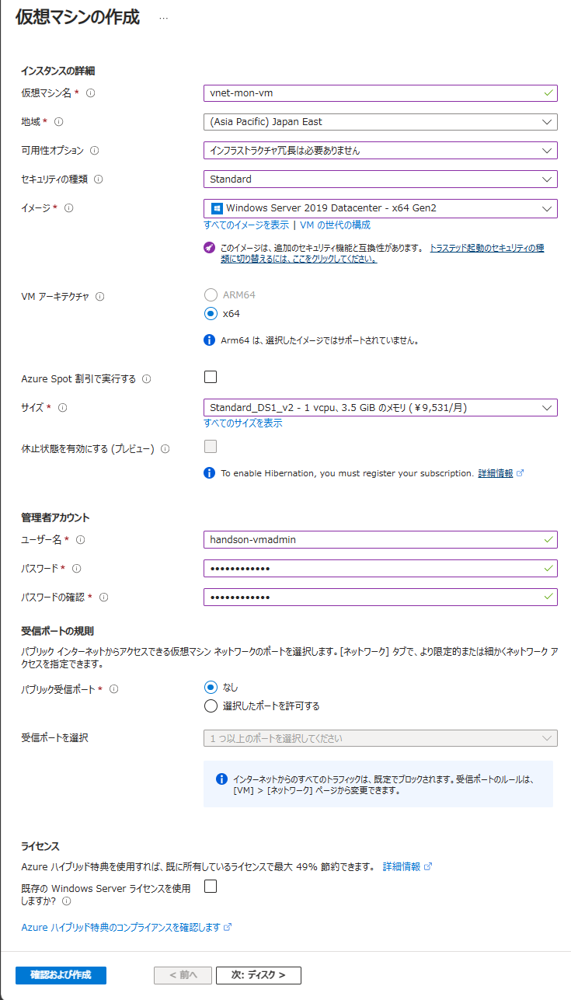

    設定が完了したら \[**次: ディスク >**\] ボタンをクリックします

3. \[**ディスク**\] タブの画面に遷移しますが、既定のままで \[**次: ネットワーク >**\] ボタンをクリックします

4. \[**ネットワーク**] タブの画面に遷移するので各項目が既定で以下のように設定されていることを確認します

    **ネットワーク インターフェイス**

    |項目|設定値|
    |:---|:---|
    |仮想ネットワーク \*|\[**handson-vnet**\]|
    |サブネット \*|\[**handson-subnet (10.0.0.0/24)**\]|
    |パブリック IP|\[**(新規) vnet-mon-vm-ip**\]|
    |NIC ネットワーク セキュリティ グループ|\[**詳細**\ にチェック]|
    |ネットワーク セキュリティ グループの構成 /*|\[**(新規) vnet-mon-vm-nsg**\]|
    |VM が削除されたときにパブリック IP と NIC を削除する|チェックしない(※任意)|
    |高速ネットワークを有効にする|チェック|

    **負荷分散**

    |項目|設定値|
    |:---|:---|
    |負荷分散のオプション|\[**なし**\]にチェック|

    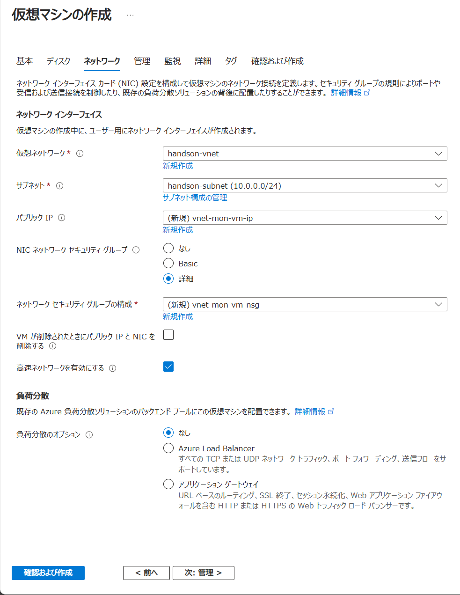

    設定が完了したら \[**確認および作成**\] ボタンをクリックし、\[**作成**\] ボタンが有効になったらクリックしてデプロイを開始します。

5. 仮想マシンのデプロイが完了すると \[**リソースに移動**\] ボタンが表示されるので、クリックして作成した仮想マシンのリソース画面に遷移します

6. 画面左のメニューから \[**Bastion**\] をクリックし、遷移した画面の各項目を以下のように設定します

    |項目|設定値|
    |:---|:---|
    |認証の種類|\[**VM パスワード**\]|
    |ユーザー名 \*|`handson-vmadmin`|
    |VM パスワード \*|`P@ssw0rd1234`|
    |新しいブラウザー タブで開く|**チェックしない**|

    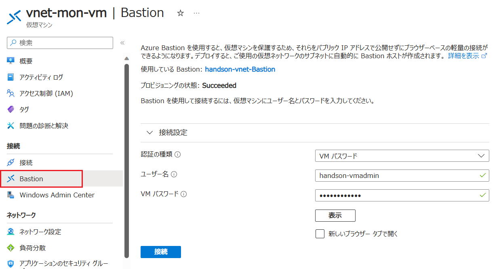

    設定が完了したら \[**接続**\] ボタンをクリックします

7. 仮想マシンへの接続が完了すると、Azure ポータル画面内に仮想マシンのデスクトップが表示されるので
 PowerShell を起動します
    
    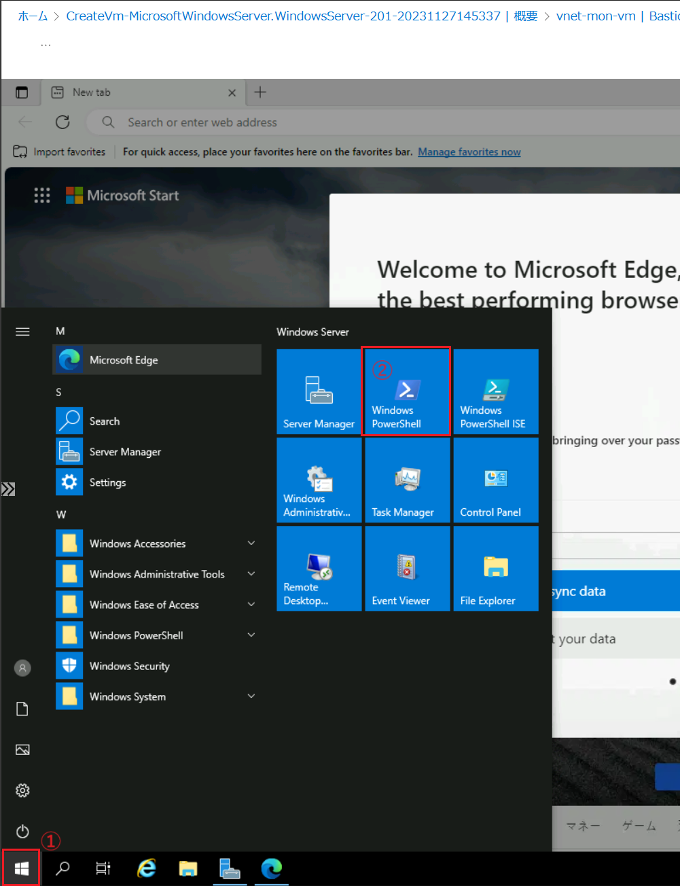

8. PowerShell で以下のコマンドを実行し、App Service 上のアプリケーションにアクセスできることを確認します

    ```powershell
        nslookup movieapp-xyz.azurewebsites.net
    ```
    (※) コマンド中の `movieapp-xyz` は自身のアプリケーション名に置き換えてください

    以下のような結果が表示されることを確認します。

    ```powershell
        Server:  UnKnown
        Address:  168.63.129.16

        Non-authoritative answer:
        Name:    movieapp-xyz.privatelink.azurewebsites.net
        Address:  10.0.0.10
        Aliases:  movieapp-xyz.azurewebsites.net
    ```

    Web アプリ名として ***10.0.0.10*** というプライベート IP アドレスが返されていることを確認します。

9. 仮想マシンの画面で Web ブラウザーを起動し、URL `http://movieapp-xyz.azurewebsites.net` アクセスし、アプリケーションの画面が正常に表示されることを確認します

    (※) URL 中の `movieapp-xyz` は自身のアプリケーション名に置き換えてください

    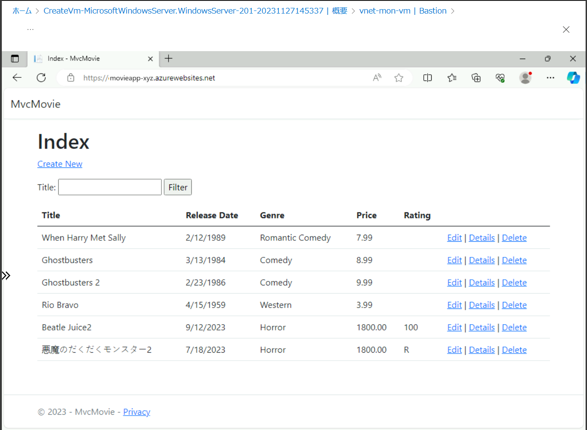

8. アプリケーションへのインターネットからのアクセスを遮断します

    Azure ポータルで、App Service 上のアプリケーション `MovieApp-XYZ` のリソース画面を開き、画面左のメニューから \[**ネットワーク**\] をクリックします。

    \[**受信トラフィックの構成**\] の \[**アクセス制限なしで有効**\] をクリックします

    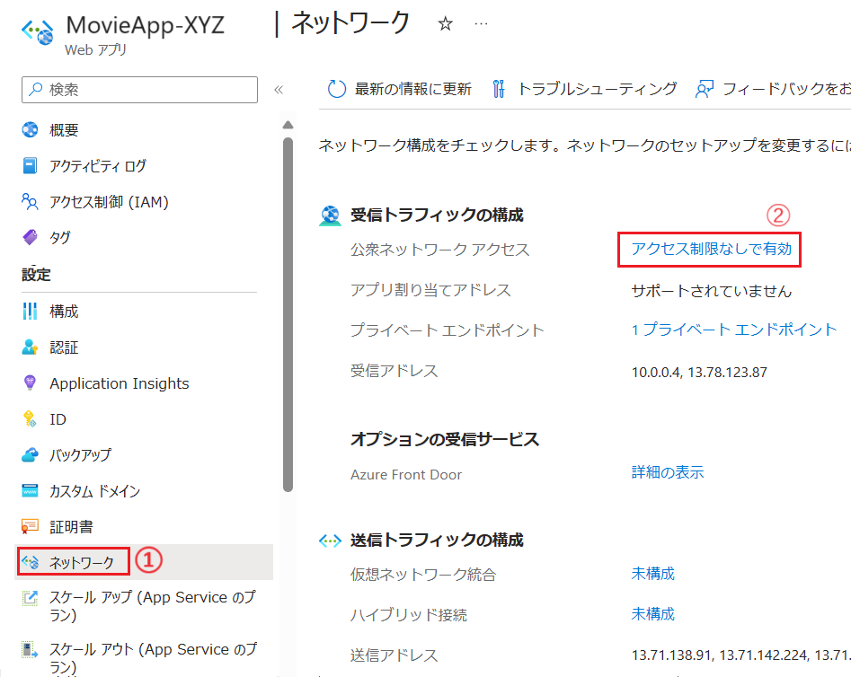

    \[**アクセス制限**\] 画面に遷移するので、項目 \[**公衆ネットワーク アクセス**\] で \[**無効**\]にチェックし、画面上部にある \[**保存**\] ボタンをクリックします

    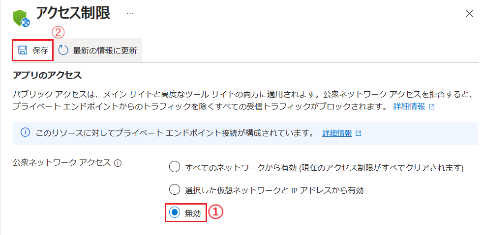

    **アクセス拒否の確認** の確認ブレードが表示されるので、\[**続行**\] ボタンをクリックします

    これでインターネットからアプリケーション `MovieApp-XYZ`へのアクセスができなくなりました。

    ローカルコンピューターの Web ブラウザーで URL `http://movieapp-xyz.azurewebsites.net` にアクセスし、HTTP403 のエラーが表示されることを確認します。

    (※) URL 中の `movieapp-xyz` は自身のアプリケーション名に置き換えてください

9. 仮想ネットワークに参加している仮想マシンの画面で Web ブラウザーから、URL `http://movieapp-xyz.azurewebsites.net` アクセスし、アプリケーションの画面が正常に表示されることを確認します

    (※) URL 中の `movieapp-xyz` は自身のアプリケーション名に置き換えてください

    

ここまでの手順で、App Service 上のアプリケーション `MovieApp-XYZ` はインターネットからのアクセスを遮断し、仮想ネットワーク環境内からのみアクセス可能な状態になりました。

この手順で使用した Private Link と プライベート エンドポイントについての詳細は以下のドキュメントを参照してください。

* [**Azure Private Link とは**](https://learn.microsoft.com/ja-jp/azure/private-link/private-link-overview)

* [**プライベート エンドポイントとは**](https://learn.microsoft.com/ja-jp/azure/private-link/private-endpoint-overview)


<br>

## タスク 2 : アプリケーションから仮想ネットワーク内のリソースに接続する

タスク 1 では、App Service 上のアプリケーションへのインターネットからのアクセスを遮断し、仮想ネットワーク環境内からのみアクセス可能な状態にしましたが、タスク 2 ではインターネットにフェイシングした状態のまま、App Service 上のアプリケーションから仮想ネットワーク内のリソースに接続する方法を説明します。

この構成はインターネットにフェイシングした App Service から、仮想ネットワーク内のデータベースや API、共有ファイルなどのリソースに接続する場合に使用されます。

このタスクで構成する環境は、タスク 1 で構成した環境に以下の **A**、**B** を追加したものです。 

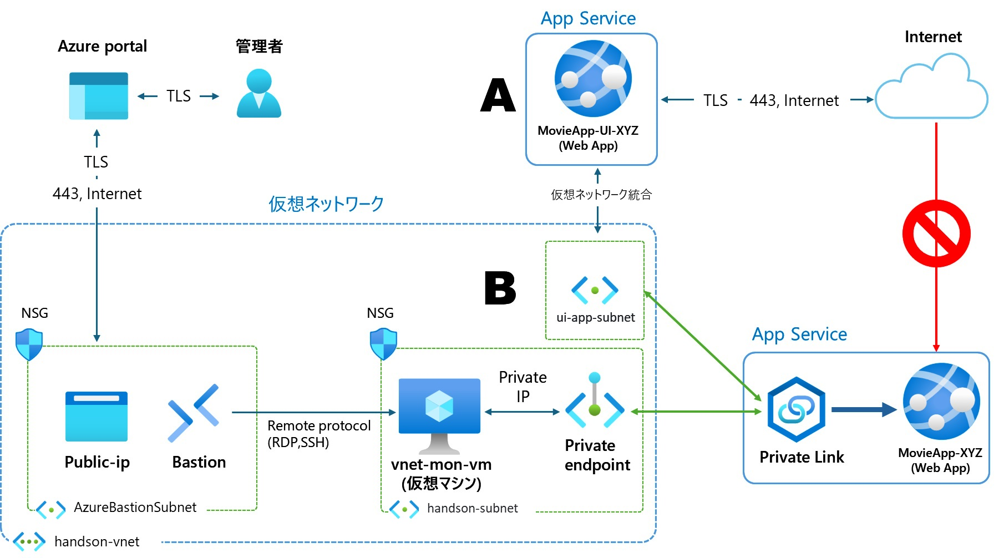

App Service 上のアプリケーションから仮想ネットワーク内のリソースに接続するために、App Service の [仮想ネットワーク統合](https://learn.microsoft.com/ja-jp/azure/app-service/overview-vnet-integration) 機能を使用します。

このタスクでは、新規にデプロイした App Service 上のシンプルなアプリケーション `MovieApps-UI-XYZ` のサーバーサイドロジックから、タスク1 で仮想ネットワーク環境内からのみアクセス可能になっている `MovieApps-XYZ` の API を参照できるよう、サブネット `ui-app-subnet` を作成し仮想ネットワーク統合を行います。

### タスクの準備

この演習ではアプリケーション MovieApp-XYZ の API を参照するためのシンプルなアプリケーションを使用します。

#### 演習用アプリケーションの入手

以下のリポジドリからアプリケーションを Clone するか、ダウンロードしてください。

* [**VnetTestUI-MovieApp**](https://github.com/osamum/VnetTestUI-MovieApp)

このアプリケーション Node.js の Express で作成されていますが、ローカル環境ではソースの書き換えのみ行うので、Node.js の実行環境は不要です。

#### Visual Studio Code 拡張のインストール

この演習では Visual Studio Code と Azure App Service 拡張機能を使用して App Service 上にアプリケーションをデプロイしますので、事前に以下のいずれかのリンクから拡張機能をインストールしておいてください。

* [**Azure App Service 拡張**](https://marketplace.visualstudio.com/items?itemName=ms-azuretools.vscode-azureappservice)

* [**Azure Tools 拡張**](https://marketplace.visualstudio.com/items?itemName=ms-vscode.vscode-node-azure-pack)

<br>

### タスク 2.1 演習用アプリケーションのデプロイ

GitHub から Clone した演習用アプリケーション [**VnetTestUI-MovieApp**](https://github.com/osamum/VnetTestUI-MovieApp) に MovieApp-XYZ の API を参照するための設定を追加し、Azure に新規に App Service を作成してデプロイします。

具体的な手順は以下のとおりです。

1. 演習用アプリケーション **VnetTestUI-MovieApp** のプロジェクトを Visual Studio Code で開きます

2. プロジェクト中のファイル routes/index.js の 5 行目にある変数 MOVIEAPP_API の値を以下のように変更します

    ```javascript
        const MOVIEAPP_API = "http://movieapp-xyz.azurewebsites.net/api/movie";
    ```

    (※) URL 中の `movieapp-xyz` は自身のアプリケーション名に置き換えてください


3. Visual Studio Code の左側のメニュー バーから Azure のアイコンをクリックします

    はじめて Azure 拡張機能を使用する場合は、メニュー バーの右隣のツリーより \[**Sign in Azure**\] をクリックします

    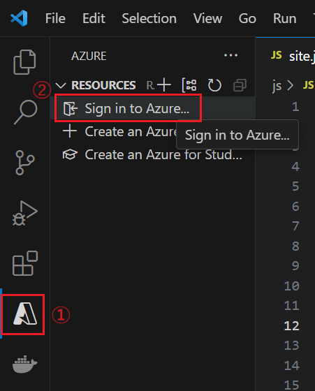

    メッセージ ボックスに `The extension 'Azure Resources' wants to sign in using Microsoft.` と表示されるので \[**Allow**\] ボタンをクリックすると Web ブラウザーが起動し認証が行われ、認証が完了すると Visual Studio Code に Azure サブスクリプションの一覧が表示されます。

4. サブスクリプションのアイコンをクリックすると、Azure リソースのアイコンの一覧が表示されるので、\[**App Service**\] を右クリックし、表示されたコンテンツの中から \[**Create New Web App...(Advanced)**\] をクリックします

    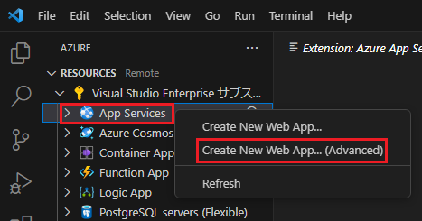

5. Visual Studio Code 画面上部のコマンド パレットがドロップダウンし、Web App (App Service) を作成するためのプロンプトが表示されるので、各項目を以下のように設定します


    |プロンプト|設定値|
    |:---|:---|
    |Enter a globally unique name for the App Service plan|`MovieApp-UI-XYZ`|
    |Select a resource group for new resources|`PaaS_Handson`|
    |Select the runtime stack|`Node 20 LTS`|
    |select an OS|`Windows`|
    |select a Windows App Service plan|※MovieApp-XYZ が使用している App Service プランを選択しますが、もし App Service プランが表示されない場合は **S1** で新規に作成してください|
    |select an Application Insights for your app|\[**Skip for now**\]|
    
    すべての項目の設定が完了すると Azure に新規の App Service が作成されます。
    
    App Service の作成が完了すると画面右下に以下のようなメッセージが表示されますが、このメッセージは無視して \[**Deploy**\] ボタンは**押さずに**(※)閉じるボタンで閉じてください

    ```
    Created new web app "MovieApp-UI-XYZ": 
    https://movieapp-ui-xyz.azurewebsites.net
    
    Source: Azure App Service (Extension)
    ```
    (※)ボタンをクリックしてこのままアプリケーションをデプロイしてしまっても構いませんが、引き続きこの手順の説明をお読みください

6. App Service の作成が完了後、Visual Studio Code の左側のツリービューから \[**App Service**\] のアイコンをクリックすると、作成した App Service `MovieApp-UI-XYZ` が表示されるので、クリックして展開します

    さらに同ツリー下の \[**Application Settings**\] を展開し、以下の環境変数が設定されていることを確認します。

    ```
    SCM_DO_BUILD_DURING_DEPLOYMENT = true
    ``` 
    もし存在しない場合は、\[**Application Settings**\] でマウスの右ボタンをクリックし、表示されたコンテキストメニュー \[**Add New Setting..**\] を使用して追加してください。

    この設定は Azure App Service で Node.js アプリケーションを動作させるのに必要な設定です。

    この手順では Viausl Studio Code 拡張が自動で設定しましたが、それ以外の方法でデプロイをする場合には手動でこの設定を行う必要があります。

7. ツリービュー で \[**MovieApp-UI-XYZ**\] を右クリックし、表示されたコンテンツの中から \[**Deploy to Web App...**\] をクリックします

    
    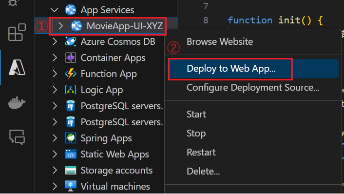

7. コマンドパレットに \[**Select the folder to deploy**\] とプロンプトが表示されるので現在 Visual Studio Code でオープンしているアプリケーションのフォルダを選択します

    `Are you sure you eant to deploy to "MovieApp-UI-XYZ"? This will overwrite any previous deployment and cannot be undone.' と書かれたメッセージボックスが表示されるので、同メッセージ中の \[**Deploy**\] ボタンをクリックしてデプロイを開始します

8. アプリケーションのデプロイが完了した際に表示される \[**Brows Website**\] ボタンをクリックし、デプロイしたアプリケーションの画面が表示されることを確認します

    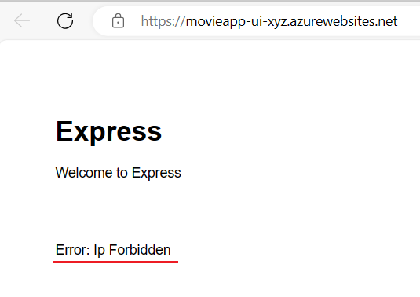

    この時点では、App Service 上のアプリケーション `MovieApp-UI-XYZ` は仮想ネットワーク環境内のアプリケーション　MovieApp-XYZ　の API に接続できないため映画のタイトル一覧は表示されず、`Ip Forbidden` というエラーメッセージが表示されます。

    次のタスクでは App Service の仮想ネットワーク統合の設定を行い、App Service 上のアプリケーション `MovieApp-UI-XYZ` から仮想ネットワーク環境内のアプリケーション　MovieApp-XYZ　の API に接続できるようにします。

<br>

### タスク 2.2 App Service の仮想ネットワーク統合の設定

前のタスクでデプロイしたアプリケーション `MovieApp-UI-XYZ` から仮想ネットワーク内のアプリケーション　MovieApp-XYZ　の API に接続できるようにします。

App Service 側で設定を行う前に、仮想ネットワーク側で App Service の仮想ネットワーク統合で使用するためのサブネットを作成します。

具体的な手順は以下のとおりです。

1. Azure Portal [ホーム画面](https://portal.azure.com/#home) の上部の検索ボックスに `仮想ネットワーク` と入力し、検索結果から `仮想ネットワーク` を選択します

    検索結果に[タスク 1.1](#%E3%82%BF%E3%82%B9%E3%82%AF-11--%E4%BB%AE%E6%83%B3%E3%83%8D%E3%83%83%E3%83%88%E3%83%AF%E3%83%BC%E3%82%AF%E7%92%B0%E5%A2%83%E3%81%AE%E4%BD%9C%E6%88%90) で作成した仮想ネットワーク `handson-vnet` が表示されるのでクリックします

2.  `handson-vnet` の概要画面に遷移するので、画面左のメニューから \[**サブネット**\] をクリックします

3. \[**サブネット**\] の画面に遷移するので、画面上部のメニューバーより \[**+ サブネット**\] ボタンをクリックします

    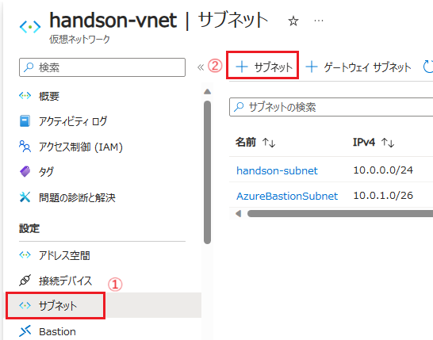

4. 画面左に \[**サブネットの追加**\] ブレードが表示されるので各項目を以下のように設定します

    |項目|設定値|
    |:---|:---|
    |名前 \*|`ui-app-subnet`|
    |アドレス範囲 \*|(既定で設定されたもの)|
    |IPv6 アドレス空間の追加 \*|チェックしない|
    |NAT ゲートウェイ|なし|
    |ネットワークセキュリティグループ|なし|
    |サービス|\[**Microsoft.web**\]|
    |サブネットをサービスに委任|\[**Microsoft.Web/serverFrams**\]|
    |プライベート エンドポイント ネットワーク ポリシー|選択しない|

    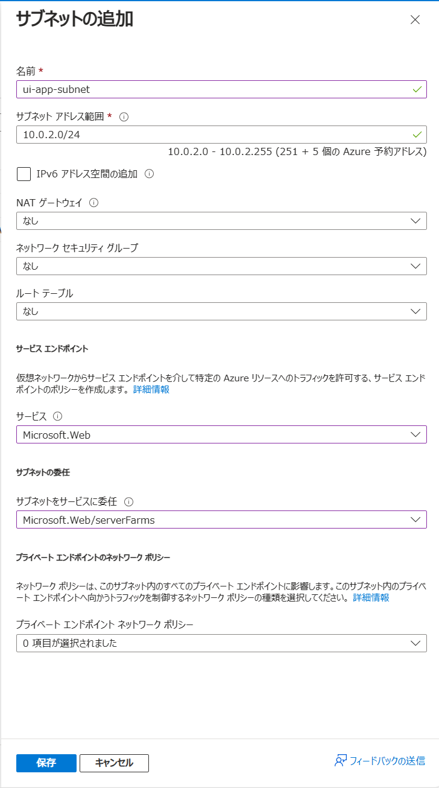

    設定が完了したら \[**保存**\] ボタンをクリックします。

    ここまでの手順で、App Service の仮想ネットワーク統合で使用するためのサブネットが作成されました。

5. App Service の仮想ネットワーク統合の設定を行います。

    Azure ポータルのホーム画面から、アプリケーション \[**MovieApp-UI-XYZ**\] のリソース画面を開き、画面左のメニューから \[**ネットワーク**\] をクリックします。

6. \[**ネットワーク**\] の画面に遷移するので、項目 \[**送信トラフィックの構成**] の \[**仮想ネットワーク統合**\] - \[**未構成**\]　をクリックします

    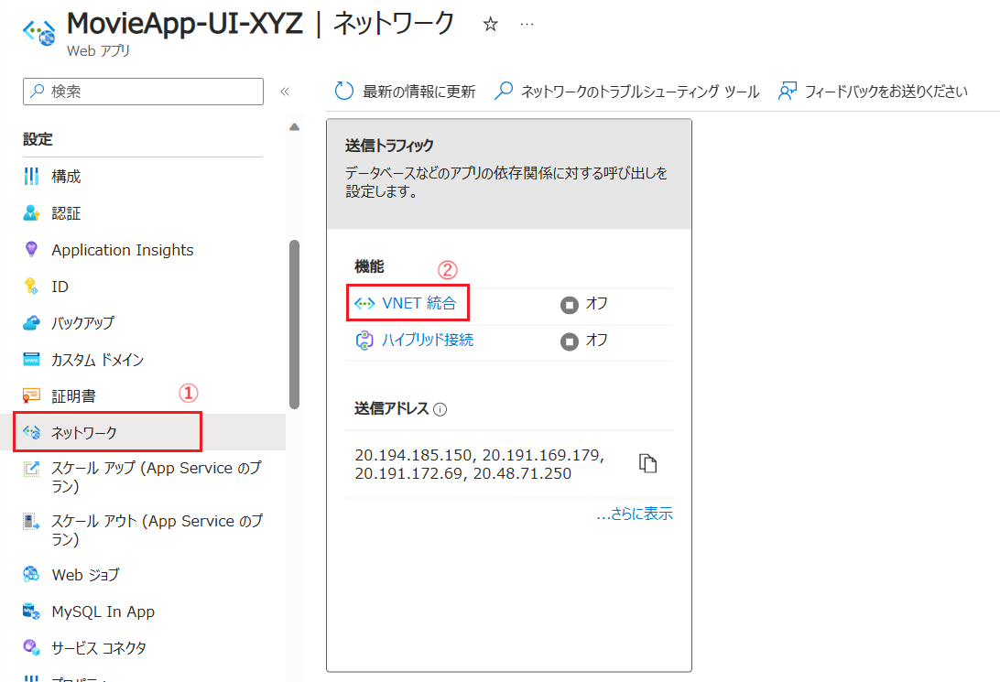

7. \[**仮想ネットワーク統合**\] の画面に遷移するので、\[**仮想ネットワーク統合の追加**\] ボタンをクリックします

    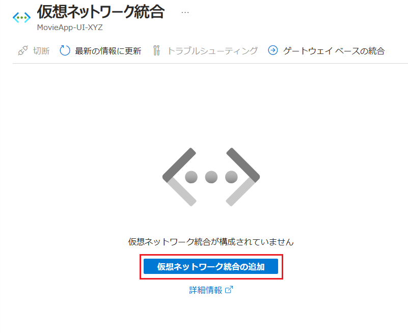

8. 画面右に \[**仮想ネットワーク統合の追加**\] ブレードが表示されるので各項目を以下のように設定します

    |項目|設定値|
    |:---|:---|
    |サブスクリプション |(お使いのサブスクリプション)|
    |仮想ネットワーク |\[**handson-vnet**\]|
    |サブネット |\[**ui-app-subnet**\]|

    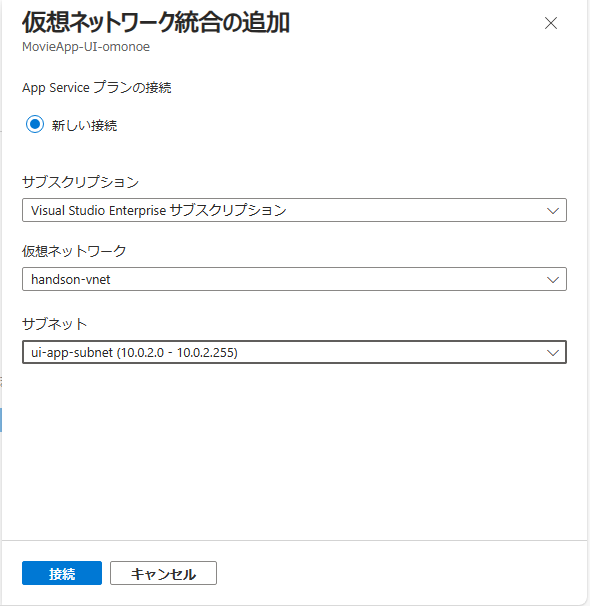

    設定が完了したら \[**接続**\] ボタンをクリックし、接続を開始します。

    接続が完了すると以下のような画面が表示されます。

    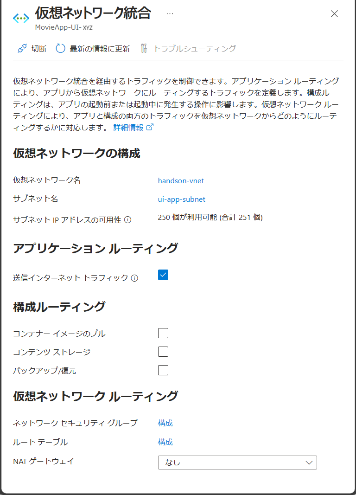

9. 画面左のメニューから \[**概要**\] をクリックし、遷移した \[**概要**\] 画面内の \[**既定のドメイン**\] の URL をクリックします

    アプリケーションの画面に映画のタイトルリストが表示されていることを確認します。

    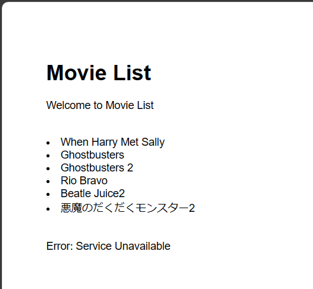

ここまでの設定で App Service 上のサーバーサイド ロジックから仮想ネットワーク内のリソースに接続できるようになりました。

今回は仮想ネットワーク内の Web API にアクセスしましたが、同様に仮想ネットワーク内のデータベースや仮想マシン、Azure Storage などのリソースにも接続できます。

Azure App Service の仮想ネットワーク統合についての詳細は以下のドキュメントを参照してください。

* [**アプリを Azure 仮想ネットワークに統合する**](https://docs.microsoft.com/ja-jp/azure/app-service/web-sites-integrate-with-vnet)


<br>

## タスク 3 : アプリケーションへのアクセスを Application Gateway を経由してのみ許可する (サービス エンドポイント)

タスク 1 では、App Service 上のアプリケーションへのインターネットからのアクセスを遮断し、仮想ネットワーク環境内からのみアクセス可能な状態にしましたが、タスク 3 ではインターネットにフェイシングした状態のまま、App Service 上のアプリケーションへのアクセスを Application Gateway を経由してのみ許可する方法を説明します。

Azure Application Gateway は、Web アプリケーションに対するトラフィックを管理できる Web トラフィック (OSI レイヤー 7) ロード バランサーです。 Application Gateway では、URI パスやホスト ヘッダーなど、HTTP 要求の追加属性に基づいてルーティングを決定できます。

Azure Application Gateway が提供する機能の詳細については以下のドキュメントを参照してください。

* [**Azure Application Gateway の機能**](https://learn.microsoft.com/ja-jp/azure/application-gateway/features)


この手順ではタスク 1 で作成したプライベート エンドポイントの環境を保持するため、演習で使用する アプリケーションは `MovieApp-XYZ` **ではなく**、タスク 2 で追加した UI を描画するためだけのシンプルなアプリケーション `MovieApp-UI-XYZ` を使用します。

このタスクで構成する環境は、タスク 2　で構成した環境に以下の **C** を追加したものです。

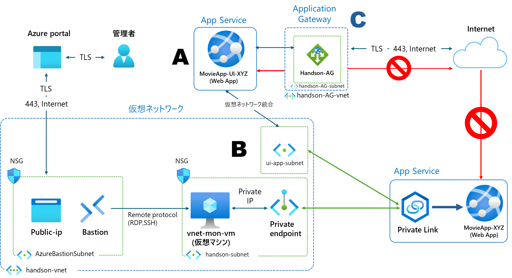

このタスクでは Application Gateway 用に新規に仮想ネットワークを追加し、この仮想ネットワークとサブネットに対して App Service ネットワーク設定でアクセスを許可するルール設定を行います。

### タスク 3.1 : Application Gateway 用 仮想ネットワーク作成とサブネットの追加

Azure Portal を使用して仮想ネットワーク環境を作成します。

具体的な手順は以下のとおりです。

1. Azure Portal [ホーム画面](https://portal.azure.com/#home) の上部の検索ボックスに `仮想ネットワーク` と入力し、検索結果から `仮想ネットワーク` を選択します

    

2. \[**仮想ネットワーク**\] の画面に遷移するので、画面上部にある \[**+ 作成**\] ボタンをクリックします

3. \[**仮想ネットワークの作成**\] 画面の \[**基本**\] タブに遷移するので、各項目を以下のように設定します

    |項目|設定値|
    |:---|:---|
    |サブスクリプション|使用するサブスクリプション|
    |リソース グループ|\[**PaaS_Handson**\]|
    |名前|`handson-AG-vnet`|
    |リージョン|\[**(Asia Pacific) Japan East**\]|
    
    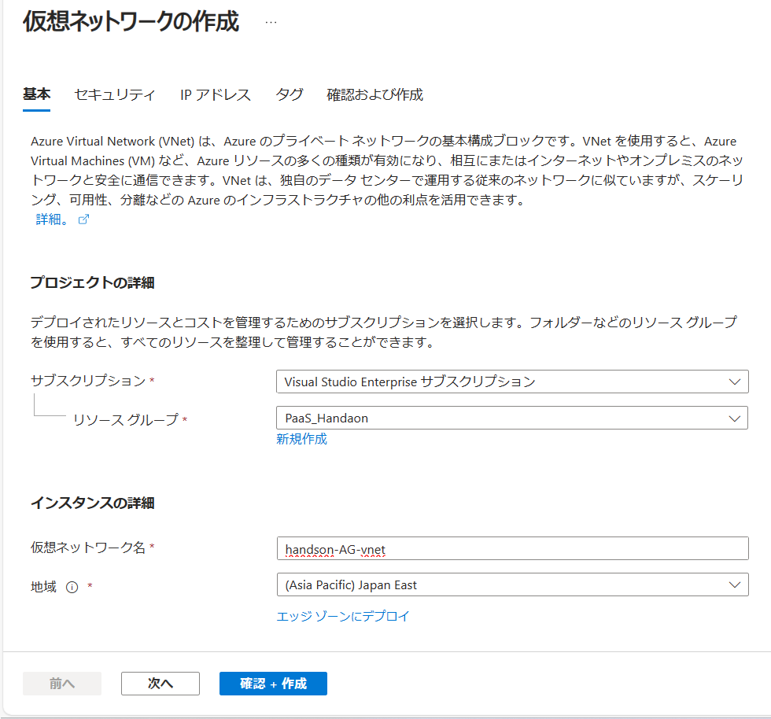

    設定が完了したら \[**確認 + 作成**\] ボタンをクリックし、\[**作成**\] ボタンが有効になったらクリックしてデプロイを開始します

    デプロイが完了すると \[**リソースに移動**\] ボタンが表示されるので、クリックして作成した仮想ネットワークのリソース画面に遷移します。

4. 画面左のメニューから \[**サブネット**\] をクリックし、遷移した画面上部の \[**+ サブネット**\] ボタンをクリックします

    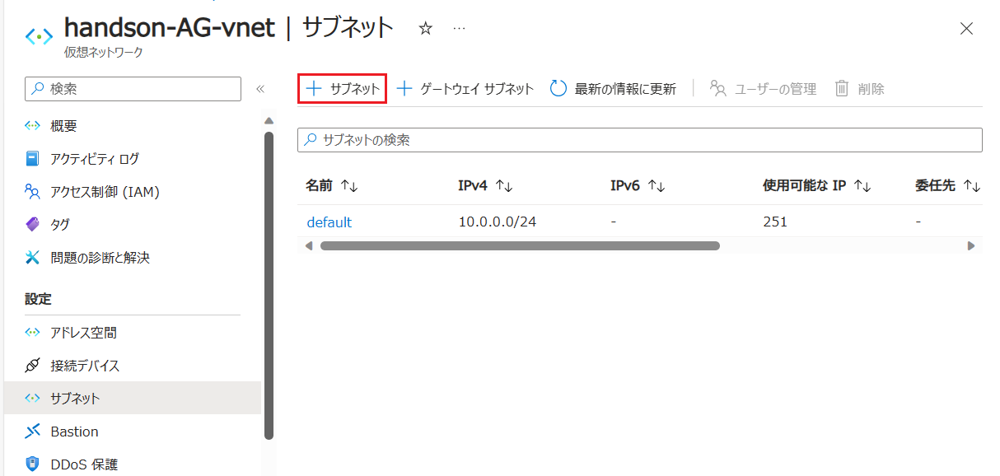

5. \[**サブネットの追加**\] ブレードが表示されるので名前以外の各項目は規定のまま以下のように設定します

    |項目|設定値|
    |:---|:---|
    |名前 \*|`handson-AG-subnet`|
    |アドレス範囲 \*|(既定で設定されたもの)|
    |IPv6 アドレス空間の追加 \*|チェックしない|
    |NAT ゲートウェイ|なし|
    |ネットワークセキュリティグループ|なし|
    |ルート テーブル|なし|
    |サービス|選択しない|
    |サブネットをサービスに委任|なし|
    |プライベート エンドポイント ネットワーク ポリシー|選択しない|

    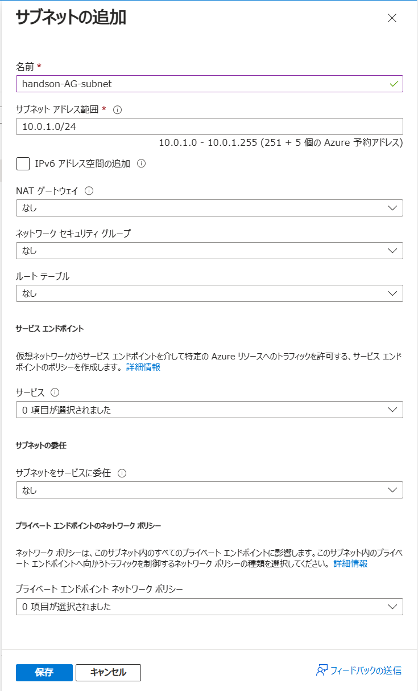

    設定が完了したら \[**保存**\] ボタンをクリックします。

ここまでの手順で、Application Gateway 用の仮想ネットワークとサブネットが作成されました。

<br>

### タスク 3.2 : Application Gateway の作成

Application Gateway のリソースを新規作成し、作成した仮想ネットワークとサブネットを関連付け、アプリケーション `MovieApp-UI-XYZ` をバックエンドプールに追加します。

具体的な手順は以下のとおりです。

1. [Azure Portal](http://portal.azure.com) にログインします。

2. ポータル画面上部の \[**+**\] リソースの作成 アイコンか、表示されていない場合は画面左上のハンバーガーメニューをクリックし、\[**リソースの作成**\] をクリックします

    

3. \[**リソースの作成**\] 画面に遷移するので、検索ボックスに `Application Gateway` と入力し、表示された検索結果の \[**ストレージ アカウント**\] のタイルをクリックします

    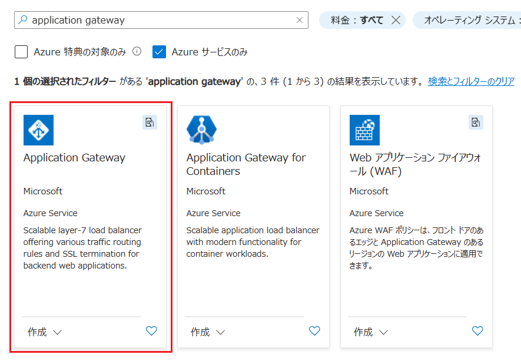

4. \[**Application Gateway**\] の画面に遷移するので、\[**作成**\] ボタンをクリックします

5. \[**アプリケーション ゲートウェイの作成**\] の \[**基本**\] タブ画面に遷移するので、各項目を以下のように設定します

    |項目|設定値|
    |:---|:---|
    |サブスクリプション \*|使用するサブスクリプション|
    |リソース グループ \*|\[**PaaS_Handson**\]|
    |ゲートウェイ名 \*|`handson-AG`|
    |地域 \*|\[**(Asia Pacific) Japan East**\]|
    |レベル|\[**Standard v2**\]|
    |自動スケール|はい|
    |最小インスタンス数 \*|0|
    |最大インスタンス数 \*|10|
    |可用性ゾーン|既定、もしくは 1 |
    |HTTP2|無効|
    |仮想ネットワーク \*| \[`handson-AG-vnet`\]|
    |サブネット \*|\[`handson-AG-subnet`\]|

    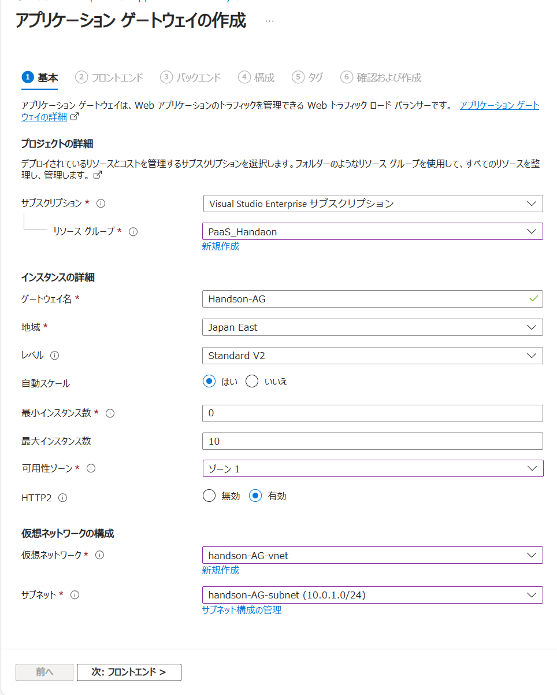

    設定が完了したら画面下部の \[**次:フロントエンド \>**\] ボタンをクリックします。

6. \[**フロントエンド**\] タブの画面に遷移するので、\[**フロントエンド IP の種類**\] で、\[**パブリック**\] にチェックし、\[**パブリック IP アドレス**\] のドロップダウンボックスの下にある \[**新規作成**\] リンクをクリックします。

    \[**パブリック IP アドレスの追加**\] ポップアップが表示されるので、\[**名前 \***\] に `handson-AG-pip` と入力し \[**OK**\] ボタンをクリックします。

    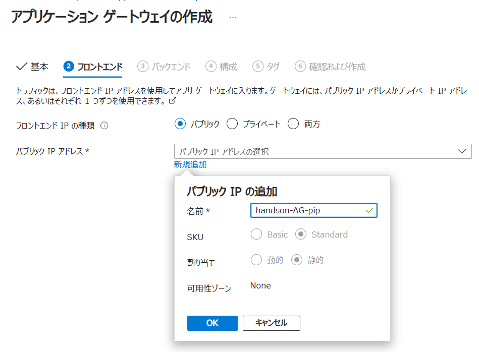

    \[**次 : バックエンド \>**\] ボタンをクリックします。

7.  \[**バックエンド**\] タブの画面に遷移するので、\[**バックエンド プールの作成**\] リンクをクリックします

8. 画面右に \[**バックエンド プールの作成**\] ブレードが表示されるので、各項目を以下のように設定します

    |項目|設定値|
    |:---|:---|
    |名前 \*|`handson-AG-backendpool`|
    |ターゲットを持たないバックエンド プールを追加します|いいえ|
    |ターゲットの種類| \[**App Service**\]|
    |ターゲット \*| \[**MovieApp-UI-XYZ**\]|

    設定が完了したら \[**追加**\] ボタンをクリックします。

    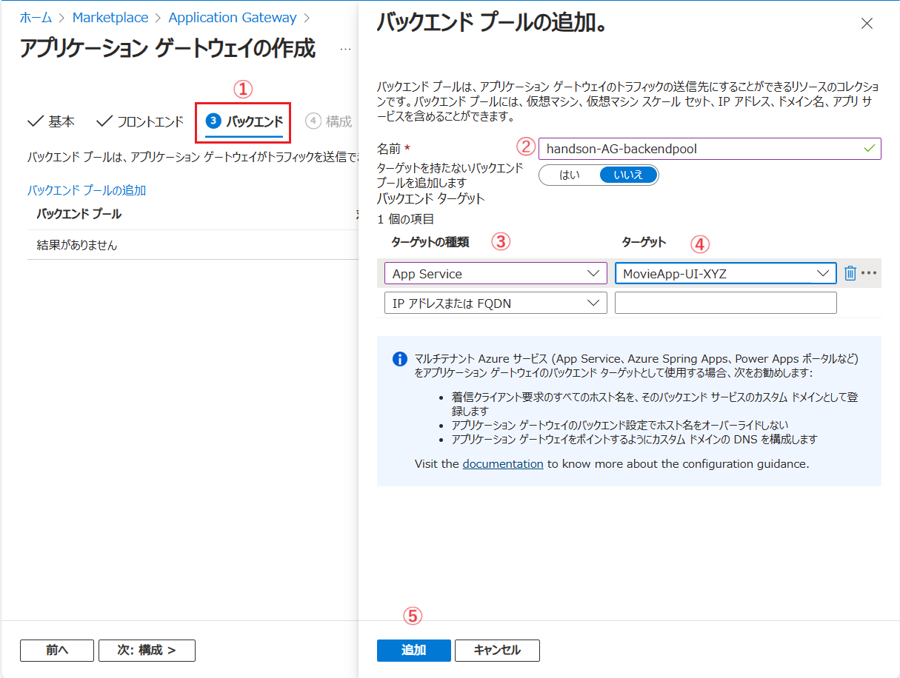

    \[**バックエンド**\] タブの画面に戻るので、\[**次 : 構成 \>**\] ボタンをクリックします。

9. \[**構成**\] タブの画面に遷移するので、画面中央の \[**+ ルーティング規則の追加**\] タイルをクリックします

    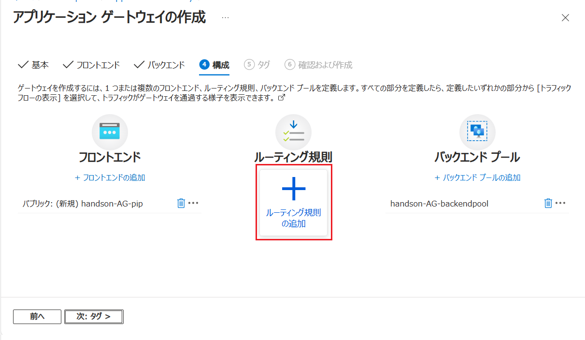

    画面右に \[**+ ルーティング規則の追加**\] ブレードが表示されるので、各項目を以下のように設定します

    |項目|設定値|
    |:---|:---|
    |ルール名 \*|`handson-AG-routingRule`|
    |優先度　\*|`100`|

    \[**\* リスナー**\] タブ

    |項目|設定値|
    |:---|:---|
    |リスナー名 \*|`handson-AG-listener`|
    |フロントエンド IP \*|\[**パブリック**\]|
    |プロトコル|\[**HTTP**\]|
    |ポート \*|\[**80**\]|
    |リスナーの種類|\[**Basic**\]|
    |カスタム エラー ページ|既定のまま指定しない|

    


    \[**\* バックエンド ターゲット**\] タブ

    |項目|設定値|
    |:---|:---|
    |ターゲットの種類\*|\[**バックエンド プール**\]|
    |バックエンド ターゲット \*|\[**handson-AG-backendpool**\]|
    |バックエンド 設定 \*|\[**handson-AG-backendSetting**\] (※)**新規追加** リンクをクリックすると \[**バックエンド設定の追加**\] ブレードが表示されるので別表の項目のとおりに設定して作成|

    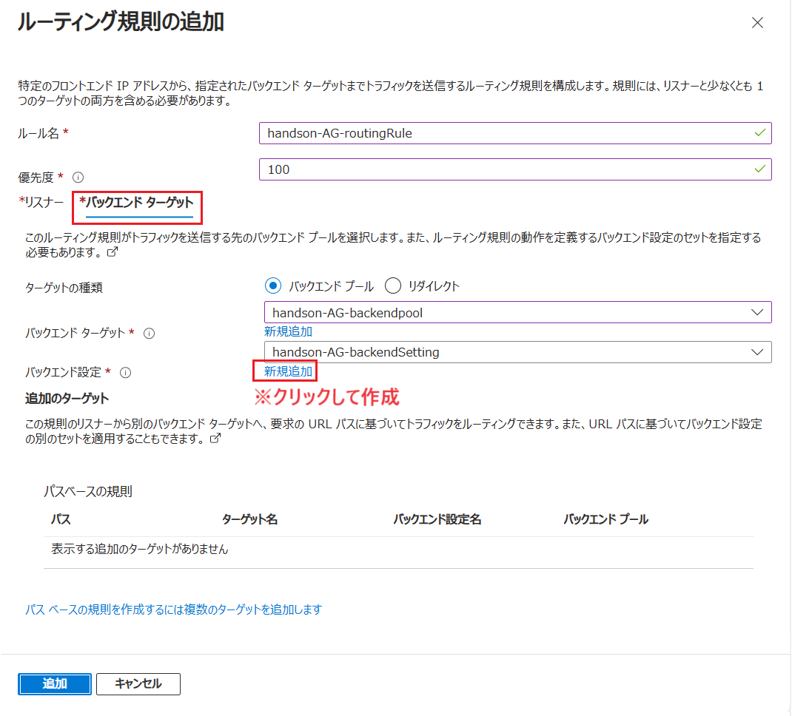


    \[**バックエンド設定の追加**\] ブレード

    |項目|設定値|
    |:---|:---|
    |バックエンド設定名 \*|`handson-AG-backendSetting`|
    |バックエンド プロトコル| \[**HTTP**\]|
    |Cookie ベースのアフィニティ| \[**無効化**\]|
    |接続のドレイン| \[**有効化**\]|
    |要求のタイムアウト| `20`|
    |バックエンド パスのオーバーライド|指定なし|
    |新しいホスト名でオーバーライドする|\[**はい**\]|
    |ホスト名をオーバーライドする|\[**バックエンドターゲットからホスト名を選択する**\]|
    |カスタム プローブを作成する|\[**はい**\]|

    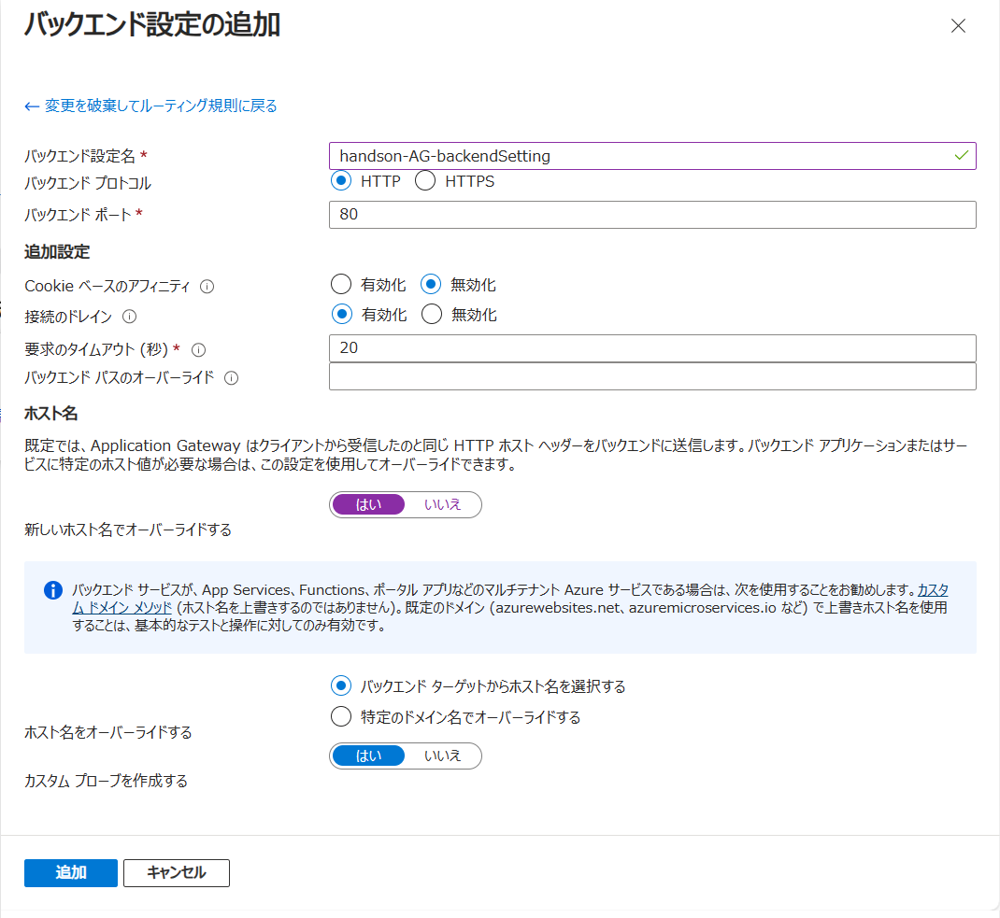

    設定したら \[**追加**\] ボタンをクリックし、\[**+ ルーティング規則の追加**\] ブレードに戻ります。

    \[**\* バックエンド ターゲット**\] タブの項目 \[**バックエンド 設定 \***\] に先ほど作成した \[**handson-AG-backendSetting**\] が選択されていることを確認し、\[**追加**\] ボタンをクリックします。

10. \[**構成**\] タブの画面に戻るので、\[**次 : タグ \>**\] ボタンをクリックし、遷移した画面で \[**確認および作成**\] ボタンをクリックします。

    \[**作成**\] ボタンが有効になったらクリックしてデプロイを開始します。

    デプロイが完了すると \[**リソースに移動**\] ボタンが表示されるのでクリックして作成した Application Gateway のリソース画面に遷移します。

11. 画面左のメニューから \[**概要**\] をクリックし、遷移した画面の \[**フロントエンド　パブリック IP**\] の IP アドレス部分をコピーします。

    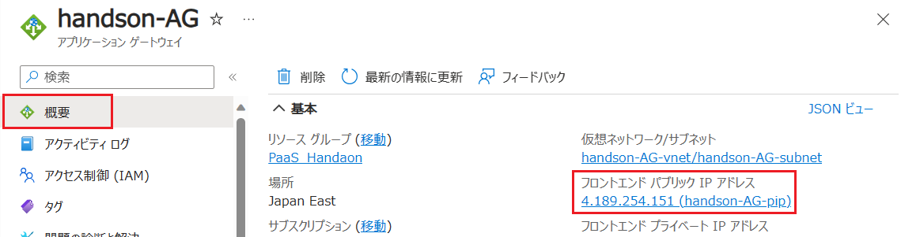

    
12. コピーした IP アドレスを Web ブラウザーのアドレスバーに貼り付け `MovieApp-UI-XYZ` の画面が表示されることを確認します

    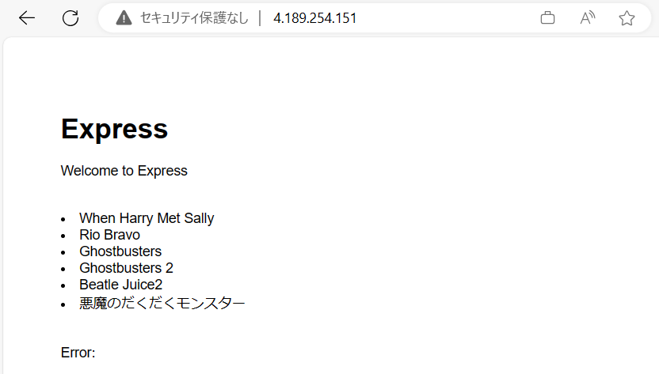

13. `MovieApp-UI-XYZ` の設定で Application Gateway 経由のアクセスのみを許可するようにします

     App Service `MovieApp-UI-XYZ` のリソース画面を開き、画面左のメニューから \[**ネットワーク**\] をクリックします。

14. \[**ネットワーク**\] の画面に遷移するので、項目 \[**受信トラフィックの構成**] の \[**公衆ネットワーク アクセス**\] - \[**アクセスなしで有効**\] リンクをクリックします

    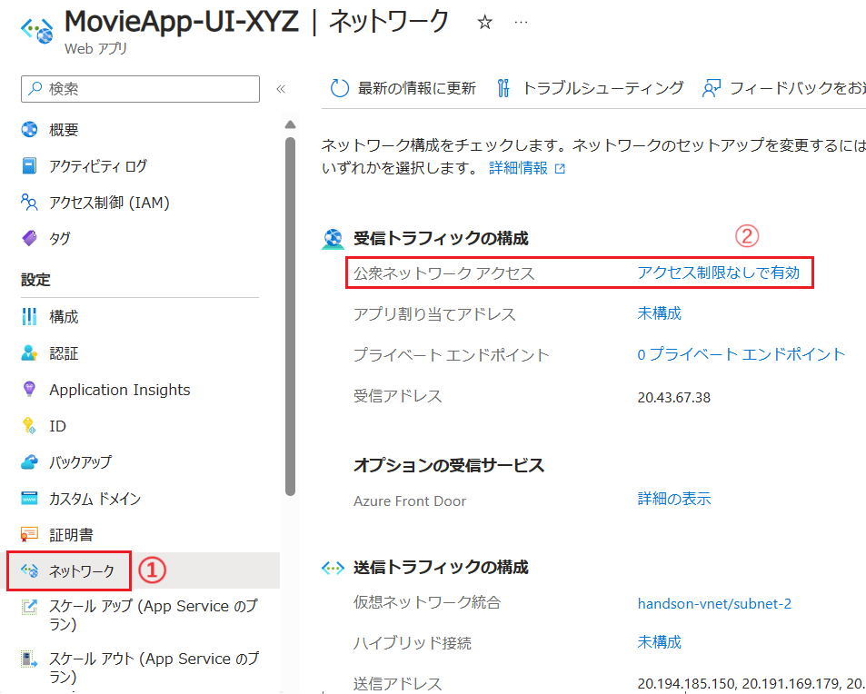

15. \[**アクセス制限**\] の画面に遷移するので、項目 \[**公衆ネットワーク アクセス**\] の \[**選択した仮想ネットワークと IP アドレスから有効**\] オプション ボタンにチェックを入れ、\[**サイトのアクセスとルール**\] の \[**メインサイト**\] タブの \[**+ 追加**\] ボタンをクリックします

    画面右に \[**規則追加**\] ブレードが表示されるので、各項目を以下のように設定します。

    |項目|設定値|
    |:---|:---|
    |名前|`handson-AG-access`|
    |アクション|`許可`|
    |優先度 \*|`300`|
    |説明|`Application Gateway 経由のアクセスを許可します。`|
    |種類|\[**仮想ネットワーク**\]|
    |サブスクリプション \*|お使いのサブスクリプション|
    |仮想ネットワーク　\*|`handson-AG-vnet`|
    |サブネット \*|`handson-AG-subnet`|
    |見つからない Microsoft.Web サービス エンドポイントを無視する|チェックしない|
    |X-Forwarded-Host|指定しない|
    |X-Forwarded-For|指定しない|
    |X-Azure-FDID|指定しない|
    |X-FD-HealthProbe|指定しない|

    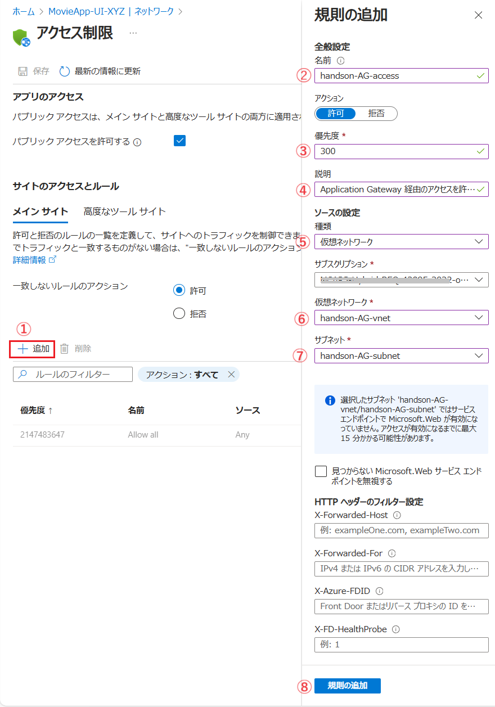

    設定が完了したら \[**規則の追加**\] ボタンをクリックします。

    \[**アクセス制限**\] の画面に戻るので、\[**保存**\] ボタンをクリックします。

16. 画面左のメニューから \[**概要**\] をクリックし、遷移した画面の \[**既定のドメイン**\] の URL をクリックします

    Web ブラウザーに `Error 403 - Forbidden` と表示されることを確認します。

    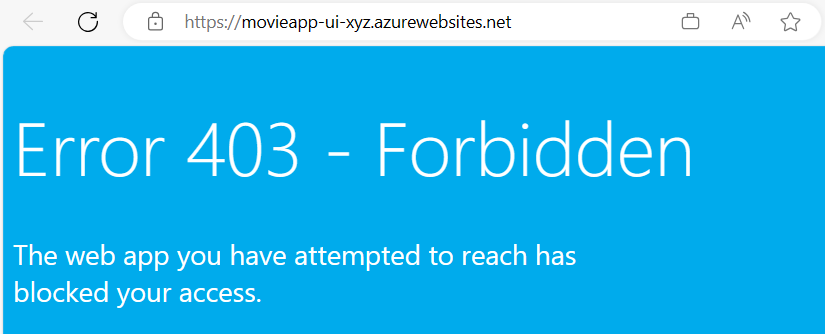

    次に Application Gateway の IP アドレスを直接指定してアクセスし`MovieApp-UI-XYZ` の画面が表示されることを確認します。

    

ここまでの手順により、Application Gateway を経由してのみ App Service 上のアプリケーションへのアクセスが許可されるようになりました。

この手順では作業を簡単にするためにリスナーを HTTP (HTTPS を使用するには証明書が必要です)で作成し、既定のドメインに App Service が提供する ".azurewebsites.net" を使用しましたが実際のシナリオでは Application Gateway とバックエンドの App Service の両方でカスタム ドメインを使用することが推奨されています。

具体的な手順は以下のドキュメントを参照してください。

* [**Application Gateway を使用した App Service の構成**](https://learn.microsoft.com/ja-jp/azure/application-gateway/configure-web-app?tabs=customdomain%2Cazure-portal)

またこの手順ではリクエストを `MovieApp-UI-XYZ` にルーティングするように構成しましたが、プライベート エンドポイント内の `MovieApp-UI-XYZ` にルーティングするように構成することも可能です。

<br>

## まとめ

この演習では Azure 仮想ネットワークを使用してネットワーク分離を行うための方法として Private Link (プライベート エンドポイント)を作成する方法と Azure Application Gateway 経由でのみアクセスを許可する方法(サービス エンドポイント)を学習しました。

Azure はパブリック クラウドであるため、パブリックなインターネット経由でそのサービスに接続します。ただし、アプリケーションのトラフィックをインターネット経由で接続したくない場合があります。Azure ネットワークには、リソースに安全に接続するためのさまざまな方法が用意されており、プライベート エンドポイントとサービス エンドポイントもそれを実現するためのネットワーク分離の機能です。


**プライベート エンドポイント**は、仮想ネットワーク内の Azure サービス用の特別なネットワーク インターフェイスであり、プライベート エンドポイントをサポートする任意の Azure サービスを仮想ネットワークに取り込むことができます。

これにより仮想ネットワーク内にある仮想マシンなどから**プライベート IP アドレス**を介して PaaS サービスにアクセスできます。その後、サービスへの接続はプライベートになり、Azure Private Link によってセキュリティで保護されます。

**サービス エンドポイント**も Azure サービスへのセキュリティで保護された直接接続を提供します。サービス エンドポイントは、VNet トラフィックをパブリック インターネットから Azure バックボーン ネットワークに転送し Azure サービスに安全に直接接続できます。

プライベートな仮想ネットワーク上のコンピューティング リソースは、Azure サービスに接続するときに、プライベート IP アドレスをソース アドレスとして使用しますが、コンピューティング リソースは Azure サービスの**パブリック IP アドレス**に接続します。このパブリック接続は、コンピューティング リソースが Azure サービスの特定のインスタンスに関連付けられているプライベート IP アドレスに接続する**プライベート エンドポイントとは異なります**。

プライベート エンドポイントとサービス エンドポイントの詳細については以下のドキュメントを参照してください。

* [**ネットワーク分離のために Azure サービスと仮想ネットワークを統合する - プライベート エンドポイントとサービス エンドポイントの比較**](https://learn.microsoft.com/ja-jp/azure/virtual-network/vnet-integration-for-azure-services#compare-private-endpoints-and-service-endpoints)

* [**プライベート エンドポイントとは**](https://learn.microsoft.com/ja-jp/azure/private-link/private-endpoint-overview)

* [**仮想ネットワーク サービス エンドポイント**](https://learn.microsoft.com/ja-jp/azure/virtual-network/virtual-network-service-endpoints-overview)


<br>

---

👈 : [**演習 3) 演習 3 : Advanced なアプリケーション設定**](ex03.md)へ

🏚️ :  [**README**](README.md)

