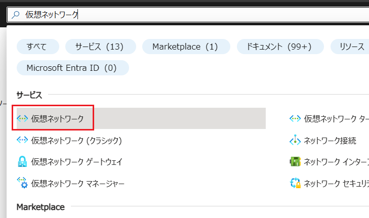
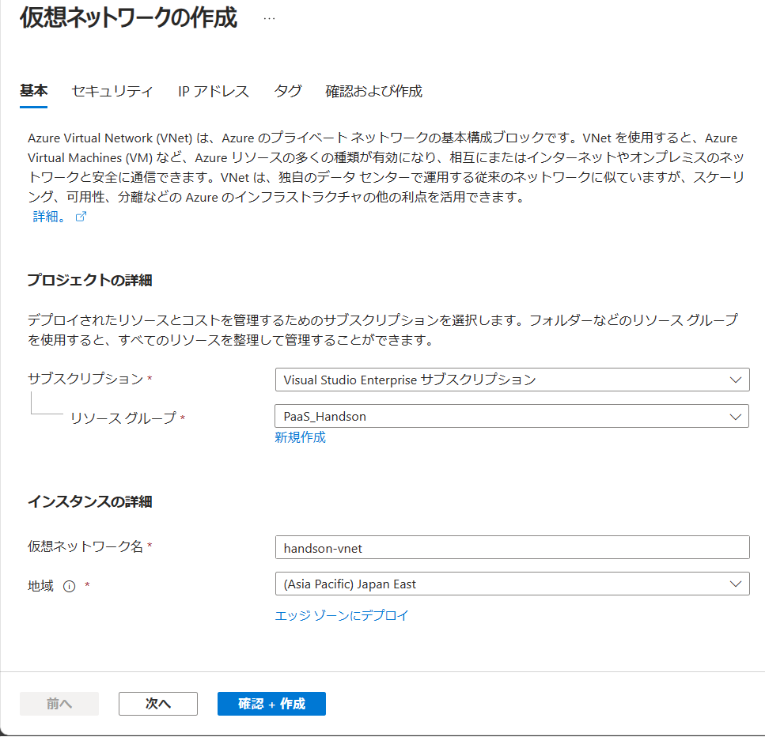
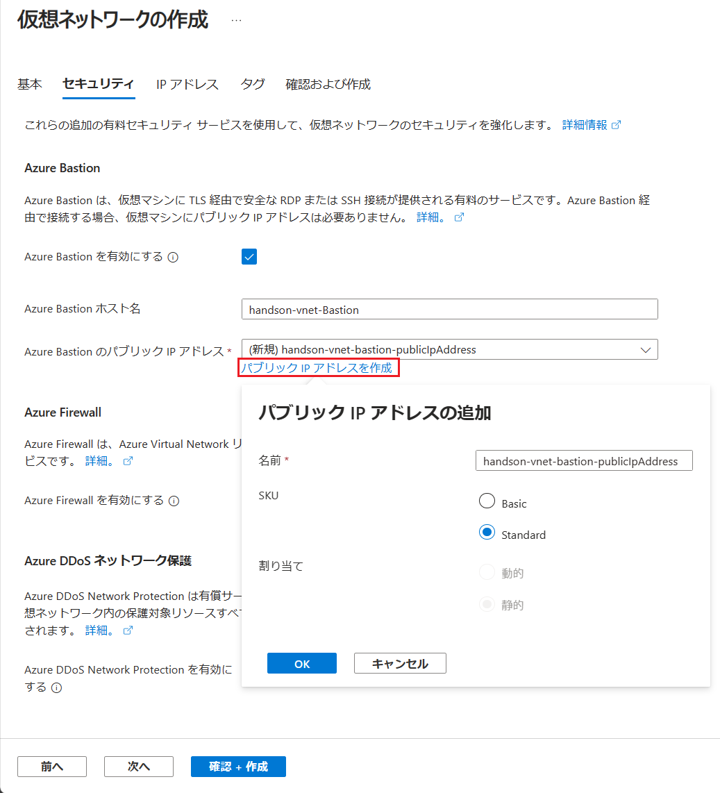
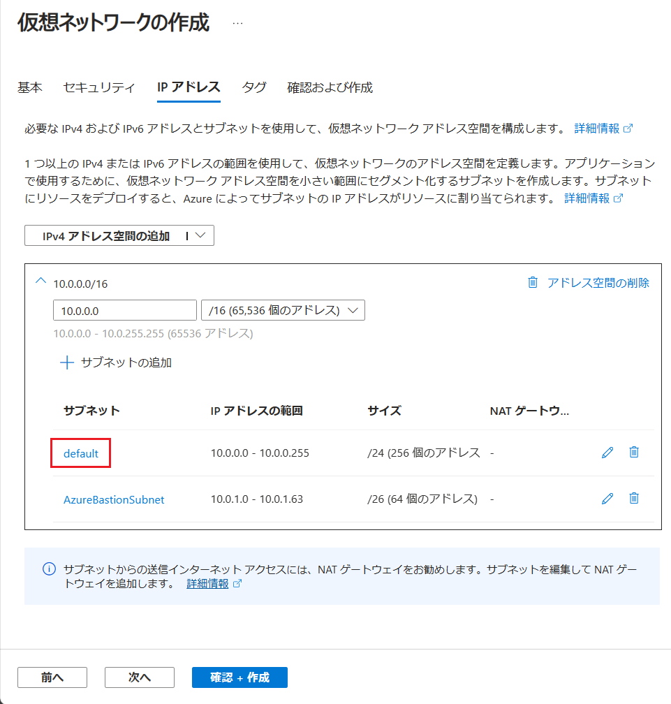
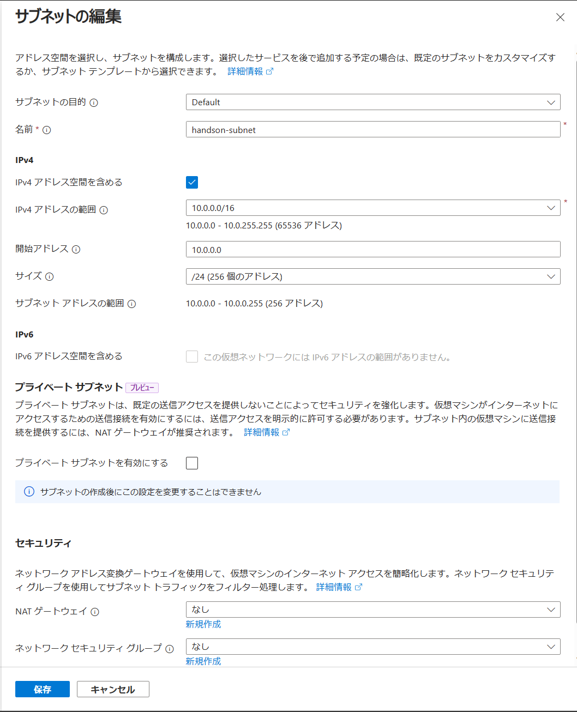
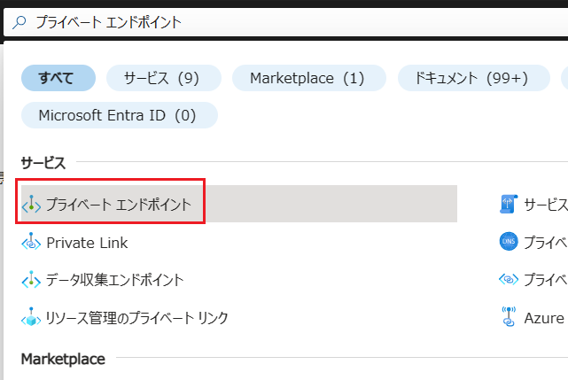

# 演習 4 : Advanced なネットワーク設定

Azure App Service の既定の設定では、デプロイされたアプリケーションはインターネットに公開されます。

しかし、アプリケーションをインターネットに公開せず、クローズドなネットワーク環境からのみアクセスしたいという場合もあります。たとえば、アプリケーションの構成がフロント部分とバックエンド部分に分かれていて、フロント部分はインターネットに公開し、バックエンド部分はクローズドなネットワーク環境内に配置するといった場合です。

このような場合には Azure Virtual Network (仮想ネットワーク)環境を作成し、これに対し [Azure Private Link](https://learn.microsoft.com/ja-jp/azure/private-link/private-link-overview) 機能を使用してプライベート エンドポイントを公開し、かつ App Service でパブリック アクセスを無効にすることで、インターネットに公開しないようにすることができます。

また、App Service 上のアプリケーションからクローズドなネットワーク環境内のリソースにアクセスしたいという場合もあります。たとえば、App Service 上のアプリケーションから Azure Virtual Network 内の仮想マシンにアクセスしたいといった場合です。

このような場合には、App Service の [仮想ネットワーク統合](https://learn.microsoft.com/ja-jp/azure/app-service/overview-vnet-integration) 機能を使用して、App Service と Azure Virtual Network を接続することができます。

この演習では以下の 2 つについて手順を説明します。

* [アプリケーションを仮想ネットワーク内にのみ公開する](#private-link)

* [アプリケーションから仮想ネットワーク内のリソースに接続する](#vnet-integration)

 

## タスク 1 : アプリケーションを仮想ネットワーク内にのみ公開する

App Service 上のアプリケーションへのインターネットからのアクセスを不可とし、クローズドなネットワーク環境内からのアクセスのみに制限します。

そのために [Azure Virtual Network](https://learn.microsoft.com/ja-jp/azure/virtual-network/virtual-networks-overview) を使用して仮想ネットワーク環境を作成し、その後 [Azure Private Link](https://learn.microsoft.com/ja-jp/azure/private-link/private-link-overview) を使用して仮想ネットワーク環境に対してプライベート エンドポイントを公開します。

 

### タスク 1.1 : 仮想ネットワーク環境の作成

Azure Portal を使用して仮想ネットワーク環境を作成します。

具体的な手順は以下のとおりです。

1. Azure Portal [ホーム画面](https://portal.azure.com/#home) の上部の検索ボックスに `仮想ネットワーク` と入力し、検索結果から `仮想ネットワーク` を選択します

    

2. \[**仮想ネットワーク**\] の画面に遷移するので、画面上部にある \[**+ 作成**\] ボタンをクリックします

3. \[**仮想ネットワークの作成**\] 画面の \[**基本**\] タブに遷移するので、各項目を以下のように設定します

    |項目|設定値|
    |:---|:---|
    |サブスクリプション|使用するサブスクリプション|
    |リソース グループ|\[**PaaS_Handson**\]|
    |名前|`handson-vnet`|
    |リージョン|\[**(Asia Pacific) Japan East**\]|
    
    

    設定が完了したら \[**次へ**\] ボタンをクリックします

4. \[**セキュリティ**\] タブに遷移するので、各項目を以下のように設定します

    **Azure Bastio**

    |項目|設定値|
    |:---|:---|
    |Azure Bastion を有効にする|\[**Bastion を有効にする**\]|
    |Azure Bastion ホスト名|`handson-vnet-Bastion`(※既定のまま)|
    |Azure Bastion のパブリック IP アドレス|入力ボックス下の \[パブリック IP アドレスを作成\] リンクをクリックし、表示された\[**パブリック IP アドレス**\] ダイアログ ボックスで既定の設定のまま \[**OK**\] ボタンをクリック|

    **Azure Firewall** と **Azure DDoS ネットワーク保護** は既定のままとします

    
   
   設定が完了したら \[**次へ**\] ボタンをクリックします

5. \[**IP アドレス**\] タブに遷移するので、アドレス空間情報が表示されているボックスの \[**サブネット**\] フィールドの **default**　をクリックします

    

6. 画面右に \[**サブネットの編集**\] ブレードが表示されるので、各項目を以下のように設定します

    |項目|設定値|
    |:---|:---|
    |サブネットの目的|`Default`|
    |名前 \*|`handson-subnet`|
    
    **IPv4**、**IPv6**、**プライベート サブネット**、**セキュリティ** はすべて既定のままです

    

    設定が完了したら \[**保存**\] ボタンをクリックし\[**サブネットの編集**\] ブレードを閉じます

7. \[**確認作成**\] ボタンをクリックし、\[**作成**\] ボタンが表示されたらクリックします 

ここまでの手順で仮想ネットワーク環境の作成は完了です。

 

### タスク 1.2 : プライベート エンドポイントの作成

仮想ネットワーク環境にアプリケーションを公開するためのプライベート エンドポイントを作成します。

具体的な手順は以下のとおりです。

1. Azure Portal [ホーム画面](https://portal.azure.com/#home) の上部の検索ボックスに `プライベート リンク サービス` と入力し、検索結果から `プライベート リンク サービス` を選択します

    

2. \[**Private Link センター | プライベート エンドポイント**] の画面に遷移するのけで、画面上部の \[**+作成**] ボタンをクリックします

 

### タスク 1.3 : テスト用の仮想マシンを作成し結果を確認する

<!--
https://learn.microsoft.com/ja-jp/azure/private-link/create-private-endpoint-portal?tabs=dynamic-ip
-->