# 演習 5 : Web API サービスのホスト

クライアントからのリクエストに対し、HTML ページを返すのではなく、処理の結果を特定のデータ形式で返す Web API と呼ばれるアプリケーションがあります。

Web API の機能は一般的に 「REST (REpresentational State Transfer) の 4 原則」にもとづき GET、POST、PUT、DELETE などの HTTP メソッドに準拠して実装されており、処理結果は JSON や XML などのデータ形式で結果を返します。

Web API を提供するアプリケーションは Azure App Service でホストすることができますが、不特定多数のユーザーに対してサービスを提供する場合、API の保護や入出力データのルール設定、サービスの統合など、より効率的に運用するための機能が必要になってきます。

 Azure API Management は、API の公開、保護、管理、モニタリング、分析などの機能を提供するマネージド サービスで、API を提供するアプリケーションをより効率的に運用するための機能を提供するもので、これを介して API を公開することで、API のセキュリティ、スロットリング、モニタリングなどの機能を追加することができます。

この演習では Azure API Management を使用して Web API アプリケーションのサービスを公開する方法と入出力のルール設定、VNET 内でホストされている Web API を Azure API Management で公開する方法を学習します。

この演習では以下のタスクを実行します。

1. [**Azure API Management のインスタンスを作成して Web API アプリケーションのサービスを公開する**](#%E3%82%BF%E3%82%B9%E3%82%AF-1--azure-api-management-%E3%81%AE%E3%82%A4%E3%83%B3%E3%82%B9%E3%82%BF%E3%83%B3%E3%82%B9%E3%82%92%E4%BD%9C%E6%88%90%E3%81%97%E3%81%A6-web-api-%E3%82%A2%E3%83%97%E3%83%AA%E3%82%B1%E3%83%BC%E3%82%B7%E3%83%A7%E3%83%B3%E3%81%AE%E3%82%B5%E3%83%BC%E3%83%93%E3%82%B9%E3%82%92%E5%85%AC%E9%96%8B%E3%81%99%E3%82%8B)

2. [**入出力処理ポリシーの追加**](#%E3%82%BF%E3%82%B9%E3%82%AF-2--%E5%85%A5%E5%87%BA%E5%8A%9B%E5%87%A6%E7%90%86%E3%83%9D%E3%83%AA%E3%82%B7%E3%83%BC%E3%81%AE%E8%BF%BD%E5%8A%A0)

3. [**VNET 内でホストされている Web API を Azure API Management で公開する**](#%E3%82%BF%E3%82%B9%E3%82%AF-3--vnet-%E5%86%85%E3%81%A7%E3%83%9B%E3%82%B9%E3%83%88%E3%81%95%E3%82%8C%E3%81%A6%E3%81%84%E3%82%8B-web-api-%E3%82%92-azure-api-management-%E3%81%A7%E5%85%AC%E9%96%8B%E3%81%99%E3%82%8B)

<br>

## タスク 1 : Azure API Management のインスタンスを作成して Web API アプリケーションのサービスを公開する

Microsoft Azure API Management は、すべての API に対する "フロント ドア" として機能します。 

Azure API Management を使用することで複数の Web API アプリを統合し、クライアント アプリケーションに対して統一されたエンドポイントを提供することができます。また、API のセキュリティ、スロットリング、モニタリング、分析などの機能を提供します。

このタスクでは、Azure API Management を使用して Web API アプリケーションのサービスをホストする基本的な手順を学習します。

### タスク 1.1 : Azure API Management サービスを作成する

Azure API Management サービスのインスタンスを作成します。

なお、Azure API Management サービスのデプロイには時間がかかりますので、この手順は早めに実行しておくことをお勧めします。

具体的な手順は以下の通りです。


1. [Azure Portal](http://portal.azure.com) にログインします。

2. ポータル画面上部の \[**+**\] リソースの作成 アイコンか、表示されていない場合は画面左上のハンバーガーメニューをクリックし、\[**リソースの作成**\] をクリックします

    

3. 検索バーに `API Management`と入力し、表示された「API Management」をクリックします

    


4. \[**API Management**\] の画面に遷移するので \[**作成**\] をクリックします

5. API Management の作成画面に遷移するで各項目を以下のように設定します

    |項目|値|
    |---|---|
    |サブスクリプション \* |使用するサブスクリプション|
    |リソース グループ \* |`PaaS_Handson`|
    |リージョン \* | \[**(Asia Pacific) Japan East**\] |
    |リソース名 \*|`handson-apim-xyz`(※1)|
    |Organization name \*|`PaaSHandson`|
    |管理者のメール アドレス|自身のメールアドレス|
    |価格レベル|\[**Developer(SLA なし)**\]|

    ※1: `handson-apim-xyz` の `xyz` には自分のイニシャルなどを入力してください。

    

    設定が完了したら画面下部の \[**確認と作成**\] ボタンをクリックし、\[**作成**\] ボタンが表示されたらクリックします。

    API Management サービスのデプロイには 20 分前後かかる場合があり、そのため完了の通知はメールでも行われます。

<br>

### タスク 1.2 : API の公開

API Management サービスを使用して MovieApp の API を公開します。

なお、MovieApp-XYZ は演習 4 でプライベート リンクの仮想ネットワーク内からしかアクセスできなっているので、このタスクでは作業を単純にすために MovieApp-XYZ のステージングスロットのインスタンスである MovieApp-XYZ-Staging を使用します。

このタスクを実行する前に、ステージング スロットの URL に問題なくアクセスできることを確認してください。URL は以下の URL の `movie-app-xyz-staging` の **xyz** 部分をご自身のアプリケーション名に変更したものになります。

```
https://movieapp-xyz-staging.azurewebsites.net/api/movie
```

API Management サービスを使用して MovieApp-XYZ-Staging の API を公開する手順は以下の通りです。

1. 作成した API Management サービスのリソース画面の左側メニューから \[**APIs**\] をクリックします

2. \[**+ API**\] をクリックし、画面左の **Define a new API** で \[**HTTP**\] のタイルをクリックします

    

3. \[**Create an HTTP API**\] のダイアログ ボックスがポップアップするので、以下のように設定します

    |項目|値|
    |---|---|
    |\* Display name|`MovieApp API`|
    |\* Name|`movieapp-api`|
    |Web service URL|`https://movieapps-xyz-staging.azurewebsites.net/api/`|
    |API URL suffix|既定のまま|

    

    設定が完了したら \[**Create**\] ボタンをクリックします

4. 作成した **MovieApp API** の画面に遷移するので、画面左の[**Design**\]　タブの \[**Add Operation**\] をクリックし、\[**Frontend**\] 画面の各項目を以下のように設定します

    |項目|値|
    |---|---|
    |\* Display name|`getMovieList`|
    |\* Name|`getMovieList`|
    |\* URL| \[**GET**\] `movie`|
    |Description|`映画の一覧を取得します`|
    |Tags|既定のまま|

    

    設定が完了したら \[**Save**\] ボタンをクリックします 

5. 作成した `getMovieList` メソッドが選択された状態になっているので、画面上部の \[**Test**\] タブをクリックし、画面下部の \[Send\] ボタンをクリックします

    

    API の呼び出し結果が正しく返ることを確認します

    

    次のタスクで使用するために **Request URL** をメモしておきます。

    

ここまでの手順で、Azure API Management サービスを使用して Web API アプリケーションのサービスをホストする基本的な手順は完了です。

この手順ではバックエンドでホストされている Web API のエンドポイントを指定してメソッドを手動で追加しましたが、Azure API Management では OpenAPI 仕様書をインポートして API を追加することもできます。

手順については以下のドキュメントをご参照ください。

* [**API をインポートおよび発行する**](https://learn.microsoft.com/ja-jp/training/modules/publish-manage-apis-with-azure-api-management/4-import-and-publish-an-api)

<br>

### タスク 1.3 : HTTP クライアントからの呼び出し

タスク 1.2 で作成した API を HTTP クライアントから呼び出してみます。

curl コマンドを使用しても良いですが、ここでは Visual Studio Code の REST Client 拡張 を使用して呼び出します。

タスクを実行する前に以下のページから REST Client 拡張をインストールしてください。

* [**REST Client - Visual Studio Marketplace**](https://marketplace.visualstudio.com/items?itemName=humao.rest-client)

Visual Studio Code から REST Client 拡張を使用して API Management に作成した API を呼び出します。

具体的な手順は以下の通りです。

1. Visual Studio Code を起動します。

    画面左のツールバーの最上部にあるエクスプローラー アイコンをクリックし、表示されたブレードの \[**フォルダーを開く**\] をクリックして任意の作業フォルダーを指定します。

    

2. エクスプローラー画面で、フォルダー名の右側に表示される \[**新しいファイル**\] アイコンをクリックして、**Call-HandsonAPI.http** という名前でファイルを作成します

    


3. REST Client 拡張の動作を確認するために作成したファイル ***all-HandsonAPI.http** に以下の内容をコピーして貼り付けます。なお指定している URL は [Dummy Rest API Example](https://dummy.restapiexample.com/) が提供しているダミーの結果を返す API のエンドポイントです。

    ```
    // API の Endpoint
    GET https://dummy.restapiexample.com/api/v1/employees
    ```
4. 記述したエンドポイントの上部の \[**Send Request**\] をクリックして API を呼び出します
    
    

    画面右側にタブが開き、API の呼び出し結果が表示されることを確認します

5. 前の手順で記述したダミー API のエンドポイントを、タスク 1.2 で作成した API Management のエンドポイントに変更して実行し、**HTTP/1.1 401 Access Denied** で失敗することを確認します。

    

    **"message"** にサブスクリプション キーが設定されていないためアクセスが拒否されたことが表示されます。

    これは、API Management で API を公開した際の初期設定がサブスクリプション キーを要求するようになっているためです。

6. API Management の設定箇所の確認を行います。

    この演習で作成した API Management サービス **handson-apim-xyz**  のリソース画面の左側メニューから \[**APIs**\] をクリックします。

7. 画面左の API の一覧から **MovieAPP API** をクリックし、画面上部のメニューから \[**Settings**\] をクリックします

    項目 **Subscription** で \[**Subscription required**\] にチェックが入っていることを確認します。

    

    上記チェック ボックスが有効な場合、API Management で公開した API にアクセスする際には、HTTP リクエスト ヘッダーの `Ocp-Apim-Subscription-Key` かクエリーストリンク `subscription-key` にサブスクリプション キーを指定する必要があります。

    チェックを外すとサブスクリプション キーの指定が不要になりますが、この演習はこのままの設定で行います。

8. API を呼び出すためのサブスクリプション キーを入手します

    画面左のメニューから \[**サブスクリプション**\] をクリックします

9. \[**サブスクリプション**\] の画面に遷移し、サブスクリプションの一覧が表示されます

    既定ではリストにある `Built-in all-access subscription` のキーが使用されていますが、呼び出しに使用するとすべての API にアクセスできるため、セキュリティ上の理由から新しいサブスクリプションを作成します。

    画面上部の \[**+ サブスクリプションの追加**\] をクリックします

10. 画面右側に \[**新しいサブスクリプション**\] のブレードが表示されるので各項目を以下のように設定

    |項目|値|
    |---|---|
    |名前|`MoveApp-XYZ`|
    |表示名|`MoveApp-XYZ の API`|
    |トレースを許可|チェックしない|
    |スコープ|\[**API**\]|
    |ユーザー|指定しない|

    

    設定が完了したら \[**作成**\] ボタンをクリックします

11. 作成したサブスクリプションがリストに表示されるので、リスト右端にある \[**・・・**\] メニューをクリックし、表示されたコンテキスト メニューから \[**キーの表示/非表示**\] をクリックします

    

12. サブスクリプション キーが表示されるので、コピーボタンを使用してキーをコピーし、メモしておきます

     

12. Visual Studio Code でオープンしている ファイル **Call-HandsonAPI.http** の先頭に以下の記述を追加し、%SubscriptionKey% をコピーしたサブスクリプション キーに置き換えます

    ```
    //API の サブスクリプション キー
    @subscriptionKey= %SubscriptionKey%
    ```

    同様に API のエンドポイントの記述のすぐ下に以下の記述を追加します

    ```
    Ocp-Apim-Subscription-Key: {{subscriptionKey}}
    ```

    以下は記述例です

    ```
    //API の サブスクリプション キー
    @subscription = d061e7546f474d01a2ebf2802b3a9ba0

    GET https://handson-apim-xyz.azure-api.net/movie
    Ocp-Apim-Subscription-Key : {{subscription}}
    ```


13. 記述したエンドポイントの上部の [Send Request] をクリックして API を呼び出します

    

    画面右側にタブが開き、API の呼び出し結果が表示されることを確認します

    

ここまでの手順でサブスクリプション キーの作成と、サブスクリプションキーを使用して API Management で公開した API を呼び出す手順は完了です。

この手順ではサブスクリプションキーを使用して API のアクセス制御を行っていますが、この方法を SPA で使用する場合には、ユーザーが Web ブラウザーの開発者ツールなどを使用してサブスクリプションキーを不正に取得する可能性があるため、セキュリティ上のリスクがあります。

その場合には、IP アドレス制限や認証を使用したアクセス制御を検討することが必要です。

詳しくは以下のリンクを参照してください。

* [**呼び出し元 IP を制限する**](https://learn.microsoft.com/ja-jp/azure/api-management/ip-filter-policy)

* [**Azure API Management での API への認証と認可**](https://learn.microsoft.com/ja-jp/azure/api-management/authentication-authorization-overview)

* [**証明書を使用して API をセキュリティで保護する**](https://learn.microsoft.com/ja-jp/training/modules/explore-api-management/7-secure-access-api-certificates)
   
* [**クライアント証明書を使用して、API へのアクセスをセキュリティで保護する**](https://learn.microsoft.com/ja-jp/training/modules/control-authentication-with-apim/4-secure-access-client-certs)


<br>


## タスク 2 : 入出力処理ポリシーの追加

Azure API Management では公開する API のリクエストからレスポンスまでの Frontend、Inbound、Backend、Outbound の各ステージの入力、あるいは出力データについて処理を追加することができます。

具体的には、リクエストのヘッダーやボディ、クエリ パラメーター、パス パラメーターなどのデータを変更したり、レスポンスのヘッダーやボディを変更したりすることができます。また jwt などの認証情報の検証や、スロットリング、キャッシュの設定、トランスフォームなどの処理を追加することができます。

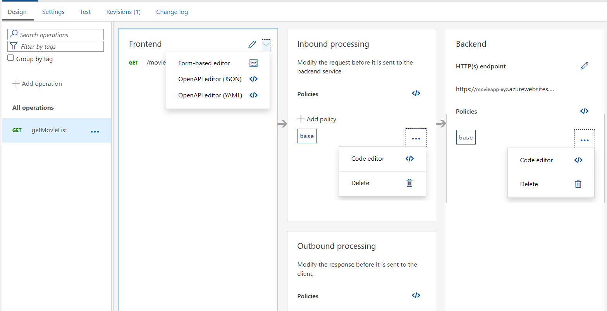


このタスクでは、API Management で公開した API が返すレスポンス ヘッダーから `X-Powerd-By` を削除する処理を追加します。この情報はサーバーが使用している技術情報を示すもので、攻撃者がこの情報を利用して、特定のバージョンの脆弱性を悪用する可能性があるため一般的には X-Powered-By ヘッダーをレスポンスに含めることは避けられます。

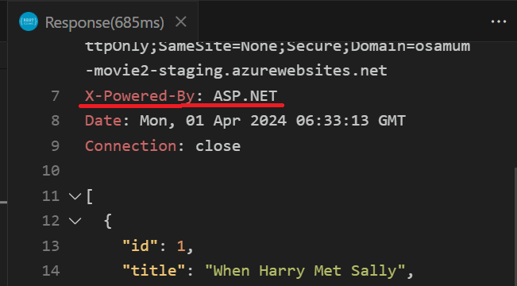

レスポンス ヘッダーから `X-Powerd-By` を削除するためのポリシーを追加する手順は以下の通りです。

1. 作成した API Management サービス **handson-apim-xyz**  のリソース画面の左側メニューから \[**APIs**\] をクリックします。

2. 画面左の API の一覧から **HandsonAPI** をクリックし、画面上部のメニューから \[**Design**\] タブをクリックし、メソッドの一覧から `GET getMovieList` をクリックします

    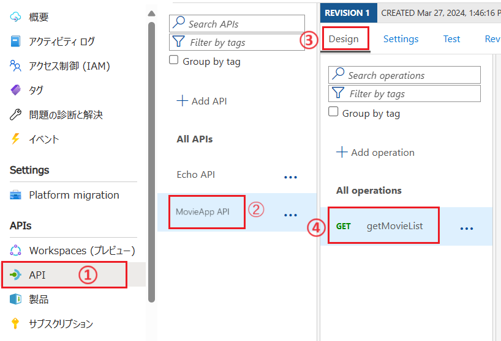

3. メソッドの設定画面が表示されるので、画面左ペインから \[**Inbound processing**\] ボックス内の \[**\</\>**\] (Policy code editor)をクリックします

    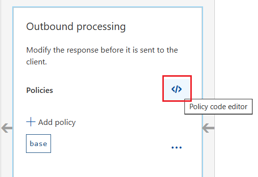

    ポリシー エディターが表示されるので既定の <outbound> タグを次のコードに置き換えます。

    ```xml
    <outbound>
        <set-header name="x-powered-by" exists-action="delete" />
        <base />
    </outbound>
    ```

    画面右上の \[**Save**\] ボタンをクリックして変更を保存します

    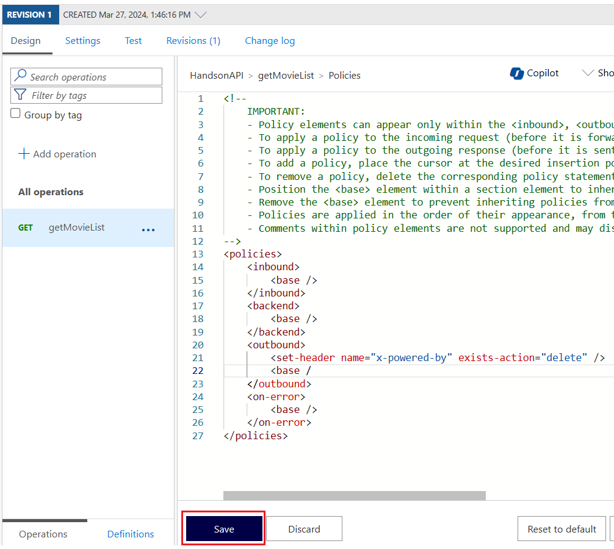

4. タスク 1.3 で作成したファイル **Call-HandsonAPI.http** を Visual Studio Code で開き、API `https://handson-apim-xyz.azure-api.net/movie` を呼び出してレスポンス ヘッダーに `X-Powered-By` が含まれていないことを確認します


ここまでの手順で、API Management で公開した API のレスポンス ヘッダーから `X-Powered-By` を削除する処理を追加する手順は完了です。

API Management では他にも様々なポリシーを追加することができます。

具体的な手順については以下のリンクを参照してください。


* [バックエンド API を作成する](https://learn.microsoft.com/ja-jp/training/modules/explore-api-management/8-exercise-import-api)


* [Azure API Management でキャッシュ ポリシーを追加することで API のパフォーマンスを向上させる](https://learn.microsoft.com/ja-jp/training/modules/improve-api-performance-with-apim-caching-policy/)


* [API 要求をスロットリングする](https://learn.microsoft.com/ja-jp/training/modules/protect-apis-on-api-management/6-rate-limit-policy)

* [API Management ポリシー リファレンス](https://learn.microsoft.com/ja-jp/azure/api-management/api-management-policies)

<br>

## タスク 3 : VNET 内でホストされている Web API を Azure API Management で公開する

Azure API Management では、仮想ネットワークとの統合機能を使用して VNET 内でホストされている Web API を Azure API Management 経由で公開することができます。

このタスクで[演習 4 のタスク 1](https://github.com/osamum/Azure-AppService-handson/blob/main/ex04.md#%E3%82%BF%E3%82%B9%E3%82%AF-1--%E3%82%A2%E3%83%97%E3%83%AA%E3%82%B1%E3%83%BC%E3%82%B7%E3%83%A7%E3%83%B3%E3%82%92%E4%BB%AE%E6%83%B3%E3%83%8D%E3%83%83%E3%83%88%E3%83%AF%E3%83%BC%E3%82%AF%E5%86%85%E3%81%AB%E3%81%AE%E3%81%BF%E5%85%AC%E9%96%8B%E3%81%99%E3%82%8B-%E3%83%97%E3%83%A9%E3%82%A4%E3%83%99%E3%83%BC%E3%83%88-%E3%82%A8%E3%83%B3%E3%83%89%E3%83%9D%E3%82%A4%E3%83%B3%E3%83%88)で、プライベート エンドポイントを使用して仮想ネットワーク内にのみサービを公開するように設定した `MovieApp-XYZ` の Web API をこの演習で作成した API Management `handson-apim-xyz` で公開します。

この手順を行うには、Public IP アドレスと Azure API Management のサブネット、ネットワーク セキュリティ グループ (NSG) の設定が必要です。

作業の流れは以下の通りです。

1. [**Public IP アドレスの作成**]()
2. [**ネットワーク セキュリティ グループ (NSG) の作成**]()
3. [**Azure API Management のサブネットへの追加**]()
4. [**API Management のネットワーク設定**]()

<br>

### タスク 3.1 : Public IP アドレスの作成

Azure API Management で VNET 内の Web API を公開するために、Public IP アドレスを作成します。

具体的な手順は以下の通りです。

1. [Azure Portal](http://portal.azure.com) ホーム画面上部の \[**+**\] リソースの作成 アイコンか、表示されていない場合は画面左上のハンバーガーメニューをクリックし、\[**リソースの作成**\] をクリックします

    

2. \[**リソースの作成**\] 画面に遷移するので、画面左のメニューから \[**ネットワーキング**\] をクリックすると、ネットワーク関連のリソースの一覧が表示されるので、\[**Public IP address**\] の **Create** リンクをクリックします

    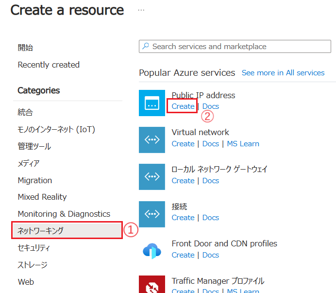

3. \[**パブリック IP アドレスの作成**\] 画面に遷移するので、各項目を以下のように設定します

    | UIの項目 | 設定値 |
    |---|---|
    | サブスクリプション | *お使いのサブスクリプション*　|
    | リソースグループ | PaaS-Handson |
    | ロケーション | (Asia Pacific) Japan East |
    | 名前 | `pubip-apim-xyz' |
    | IP バージョン | IPv4 |
    | SKU | Standard |
    | 可用性ゾーン | Zone-redundant |
    | レベル  | Regional |
    | IP アドレスの割り当て | 静的 |
    | ルーティングの優先順位 | Microsoft ネットワーク |
    | アイドル タイムアウト (分)  | 4 |
    | DNS 名ラベル | `pubip-apim-xyz` |
    | ドメイン名ラベルのスコープ (プレビュー) | None |

    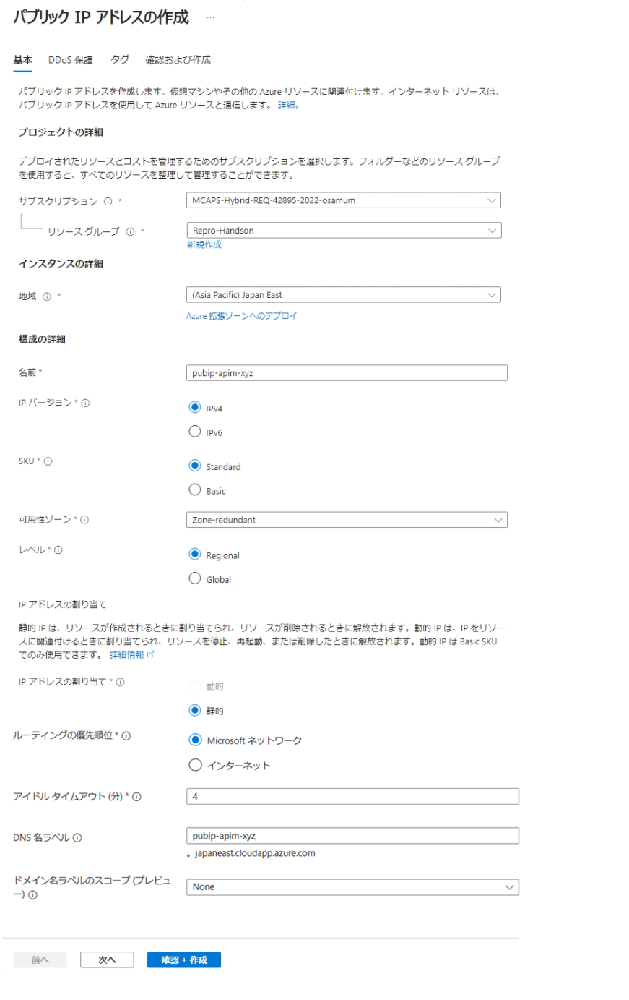

    設定が完了したら \[**確認 + 作成**\] ボタンをクリックし、\[**作成**\] ボタンが表示されたらクリックします。

パブリック IP アドレスの作成の手順は以上で完了です。

API Management の仮想ネットワーク統合で使用する Public IP アドレスには DNS 名ラベルが必要ですが、作成時に指定しているので追加の設定は必要ありません。

<br>

### タスク 3.2 : ネットワーク セキュリティ グループ (NSG) の作成

Azure API Management で VNET 内の Web API を公開するために、API Management のサブネットに適用するネットワーク セキュリティ グループ (NSG) を作成します。

この設定では Azure API Management の管理画面、Azure API Managementが公開するサービスが使用するポートを適切に許可する必要があります。

具体的な手順は以下の通りです。

1. [Azure Portal](http://portal.azure.com) ホーム画面上部の \[**+**\] リソースの作成 アイコンか、表示されていない場合は画面左上のハンバーガーメニューをクリックし、\[**リソースの作成**\] をクリックします

    

2. \[**リソースの作成**\] 画面に遷移するので、画面左のメニューから \[**ネットワーキング**\] をクリックすると、ネットワーク関連のリソースの一覧が表示されるので、\[**ネットワーク セキュリティ グループ**\] の **Create** リンクをクリックします

    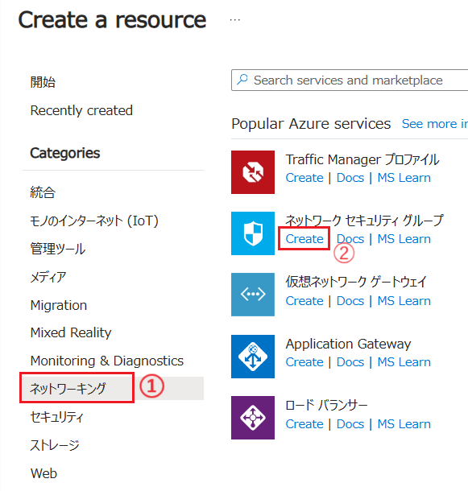

3. **ネットワーク セキュリティ グループの作成** 画面に遷移するので各項目を以下のように設定します

    | UIの項目 | 設定値 |
    |---|---|
    | サブスクリプション \* | *お使いのサブスクリプション*　|
    | リソースグループ \* | `PaaS-Handson` |
    | 名前 \* | `nsg-apim-xyz` |
    | 地域 \* | **(Asia Pacific) Japan East** |

    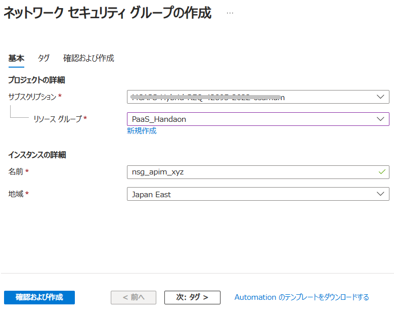

    設定が完了したら \[**確認 + 作成**\] ボタンをクリックし、\[**作成**\] ボタンが表示されたらクリックします。

4. NSG のデプロイが完了すると \[**リソースに移動**\] ボタンが表示されるので、クリックして作成した NSG のリソース画面に遷移するので、画面の左側メニューから \[**受信 セキュリティ 規則**\] をクリックし、画面上部の \[**+ 追加**\] ボタンをクリックします

    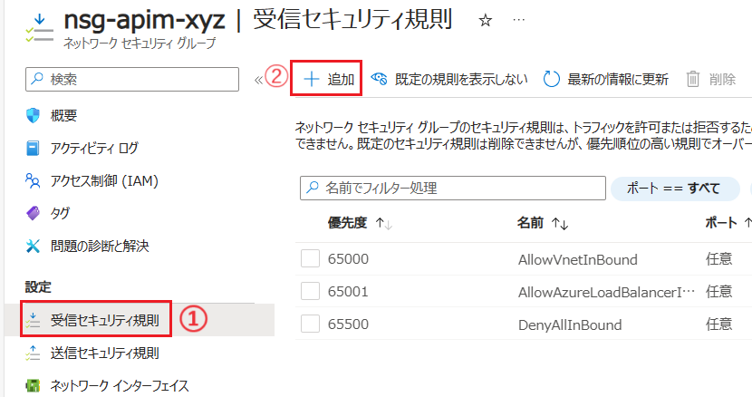

5. 画面の右側に \[**受信セキュリティ規則の追加**\] ブレードが表示されるので、各項目を以下のように設定します

    | 項目 | 設定値 |
    |---|---|
    | ソース | **Service Tag** |
    | ソース サービス タグ \* | **ApiManagement.JapanEast** |
    | ソース ポート範囲 \* | `*` |
    | 宛先 | **Service Tag** |
    | 宛先サービス タグ | **VirtualNetwork** |
    | サービス | **Custom** |
    | 宛先ポート範囲 \* | `3443`|
    | プロトコル | **TCP** |
    | アクション | **許可** |
    | 優先度 | `100` (※)|
    | 名前  | `Allow-apim-mgrportal` |
    | 説明  | `Azure API Management の管理ポータルのアクセスを許可します` |

    ※\[**優先度**\] に指定する数字は既定で設定されているものより小さい(優先度が高い)値であれば問題ありません

    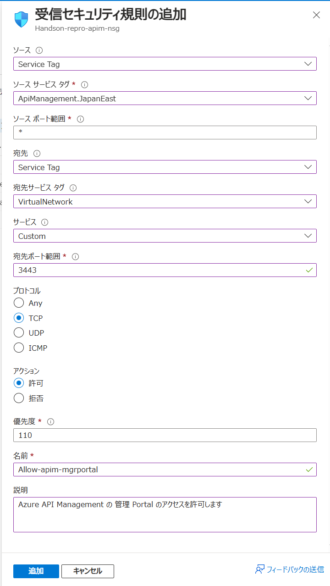

    設定が完了したら \[**追加**\] ボタンをクリックします

6. \[**受信 セキュリティ 規則**\] の画面に戻るので、再度画面上部の \[**+ 追加**\] ボタンをクリックします

7. 画面の右側に \[**受信セキュリティ規則の追加**\] ブレードが表示されるので、各項目を以下のように設定します

    | 項目 | 設定値 |
    |---|---|
    | ソース | **Service Tag** |
    | ソース サービス タグ \* | **Internet** |
    | ソース ポート範囲 \* | `*` |
    | 宛先 | **Service Tag** |
    | 宛先サービス タグ | **VirtualNetwork** |
    | サービス | **Custom** |
    | 宛先ポート範囲 \* | `80,443`|
    | プロトコル | **TCP** |
    | アクション | **許可** |
    | 優先度 | `110` (※)|
    | 名前  | `Allow-HTTPs-request` |
    | 説明  | `Azure API Management の管理ポータルのアクセスを許可します` |

    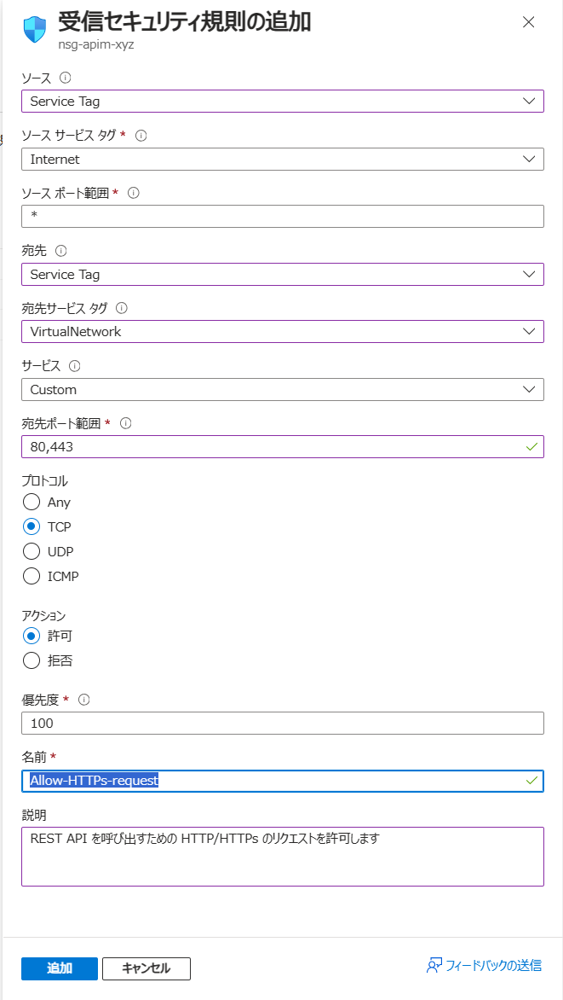

    設定が完了したら \[**追加**\] ボタンをクリックします

ここまでの作業で Azure API Management のサブネットに適用するネットワーク セキュリティ グループ (NSG) の作成と受信セキュリティ規則の追加が完了しました。

この演習では、VNET 内にある Web API を公開するだけなので、HTTP/HTTPs と、Azure API Management の管理ポータルへのアクセスを許可するセキュリティ規則を追加しましたが公開する機能やプロトコルによって設定内容は異なります。

詳しくは以下のドキュメントをご参照ください。

* [**Azure API Management インスタンスを仮想ネットワークにデプロイする - 外部モード - NSG 規則の構成**](https://learn.microsoft.com/ja-jp/azure/api-management/api-management-using-with-vnet?tabs=stv1#configure-nsg-rules)

<br>

### タスク 3.3 : VNET へのサブネットへの追加

演習用アプリケーション `MovieApp-XYZ` がプライベートリンクを提供している仮想ネットワーク `handson-vnet` にサブネットを追加します。

なお、この仮想ネットワークは [演習 4 のタスク 1](ex04.md#%E3%82%BF%E3%82%B9%E3%82%AF-11--%E4%BB%AE%E6%83%B3%E3%83%8D%E3%83%83%E3%83%88%E3%83%AF%E3%83%BC%E3%82%AF%E7%92%B0%E5%A2%83%E3%81%AE%E4%BD%9C%E6%88%90) で追加したものです。

具体的な手順は以下の通りです。

1. [Azure Portal](http://portal.azure.com) ホーム画面上部の検索ボックスに `handson-vnet` と入力して、検索結果から `handson-vnet` をクリックします

    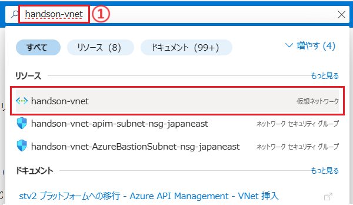

2. 仮想ネットワーク `handson-vnet` の概要画面が表示されるので、画面左側メニューから \[**サブネット**\] をクリックします

3. 遷移した画面で、上部の \[**+ サブネット**\] ボタンをクリックします

    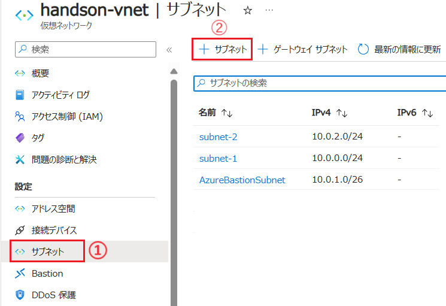

4. \[**サブネットの追加**\] ブレードが表示されるので、各項目を以下のように設定します

    | 項目 | 設定値 |
    |---|---|
    | 名前 | `apim-subnet` |
    | サブネット アドレス範囲 | *既定で設定されているもの* |
    | IPv6 アドレス空間の追加 | チェックしない |
    | NAT ゲートウェイ | なし |
    | ネットワークセキュリティグループ | **nsg-apim-xyz** (※) |
    | ルートテーブル | なし |
    | サービス | **Microsoft.Web** のみ |
    | サブネットをサービスに委任 | なし |
    | プライベート エンドポイント ネットワークポリシー | なし |

    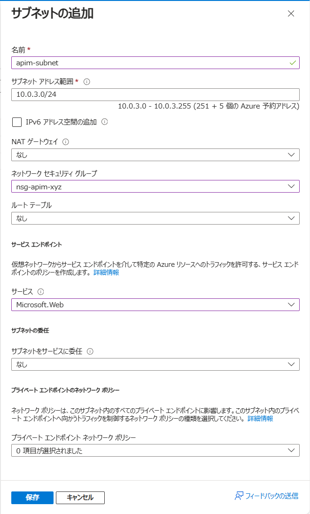

    (※) ネットワーク セキュリティ グループは、タスク 3.2 で作成したものを選択します

    設定が完了したら \[**保存**\] ボタンをクリックします

ここまでの作業で Azure API Management の VNET 統合時に使用するサブネットの追加が完了しました。

今回のサブネットの設定では、API Management 公開するサービスが Web API であるため、サービスには `Microsoft.Web` のみを選択しましたが、公開するサービスによっては適切なサービスを選択する必要があります。

詳細については以下のドキュメントを参照してください。

* [**仮想ネットワーク サービス エンドポイント**](https://learn.microsoft.com/ja-jp/azure/virtual-network/virtual-network-service-endpoints-overview)

<br>

### タスク 3.4 : API Management のネットワーク設定

この演習の [タスク 1](#%E3%82%BF%E3%82%B9%E3%82%AF-11--azure-api-management-%E3%82%B5%E3%83%BC%E3%83%93%E3%82%B9%E3%82%92%E4%BD%9C%E6%88%90%E3%81%99%E3%82%8B) で作成した Azure API Management サービス `handson-apim-xyz` のネットワーク設定を変更して、VNET 内の Web API を公開できるようにします。

具体的な手順は以下の通りです。

1. [Azure Portal](http://portal.azure.com) ホーム画面上部の検索ボックスに `handson-apim-xyz` と入力して、検索結果から `handson-apim-xyz` をクリックします

    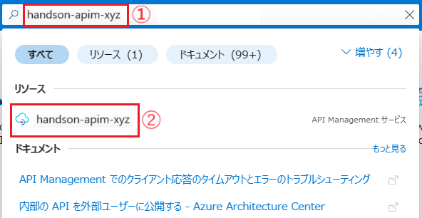

2. API Management サービス `handson-apim-xyz` の概要画面が表示されるので、画面左側メニューから \[**ネットワーク**\] をクリックします

3. ネットワーク設定画面が表示されるので、項目 \[仮想ネットワーク\] で \[**外部**\] オプションボタンにチェックをつけます

    項目 \[場所\] に、`handson-apim-xyz` がデプロイされているリージョン名のリンクが表示されるのでクリックします。
    
    なお、このハンズオンの手順のとおり作業している場合は **Japan East** になります。

    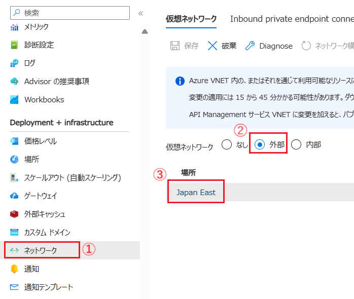

4. 画面右に \[**仮想ネットワーク**\] ブレードが表示されるので、各項目を以下のように設定します

    | 項目                   | 設定値          |
    |---|---|
    | 仮想ネットワーク \* | **handson-vnet** |
    | サブネット \* | **apim-subnet** |
    | パブリック IP アドレス | **pubip-apim-xyz**|

    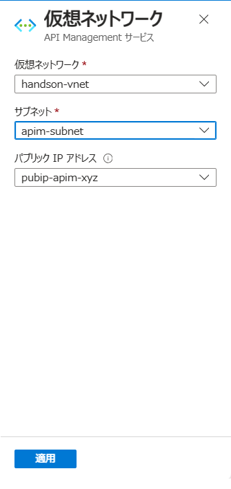

    設定が完了したら \[**適用**\] ボタンをクリックします

5. 仮想ネットワークの画面に戻るので、画面上部の \[**保存**\] ボタンをクリックします

    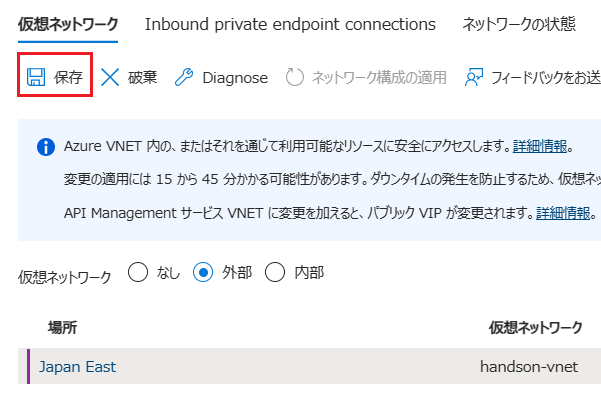

    ネットワーク構成の適用が開始されると `サービスを更新しています...` とメッセージが表示されるので、このメッセージが消えるまで待ちます。このハンズオンでは無料の開発者サブスクリプションを使用しているため **25 分前後かかります**。

    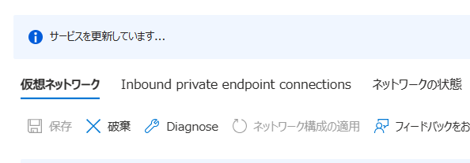


---


👈 : [**演習 4) Advanced なネットワーク設定**](ex04.md)へ

🏚️ :  [**README**](README.md)

