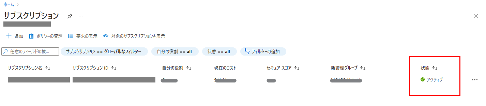
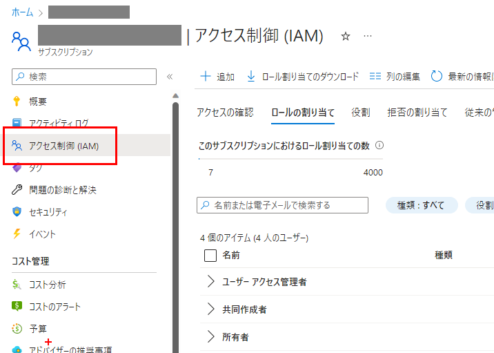
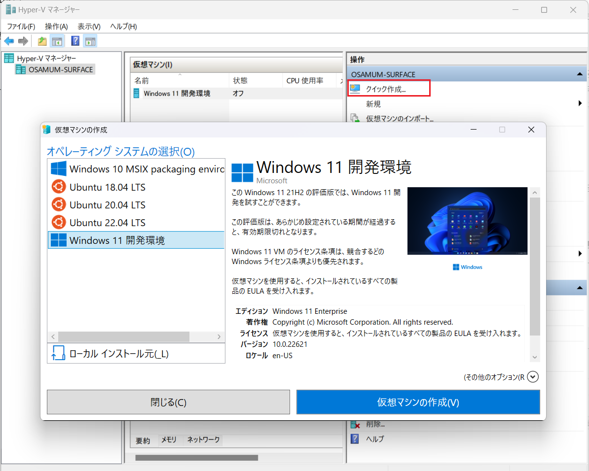
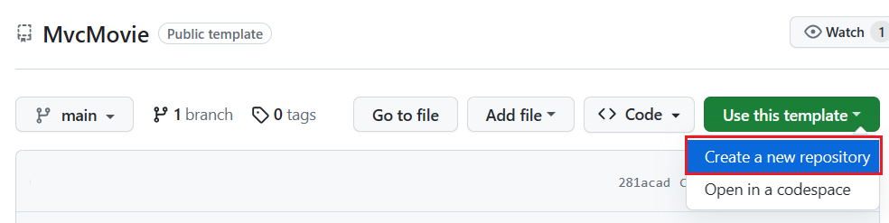
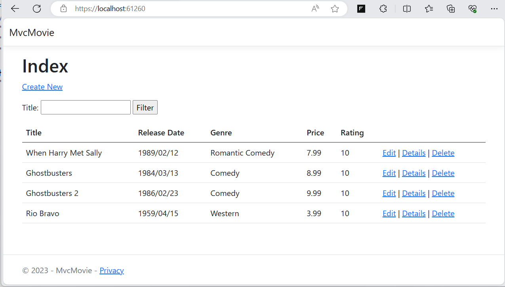
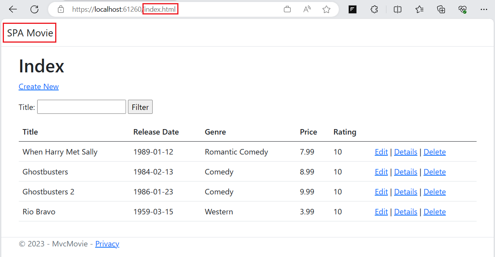
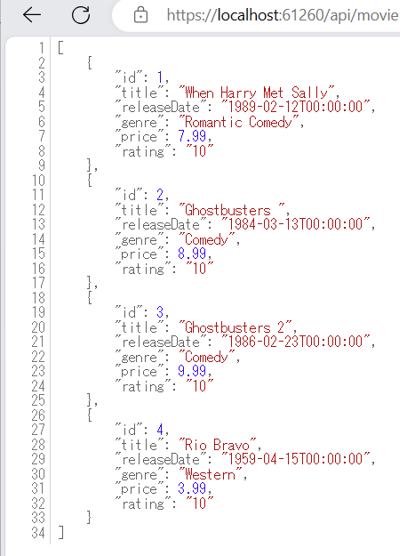

# 事前準備

このガイドで紹介される環境を、実際に Azure 上に構築して試す場合に準備しておく開発環境の構築や、演習用のプロジェクトの入手について紹介します。
<br><br>

## 1. アカウント
この演習では以下のアカウントが必要です。

お持ちでない場合は以下のリンク先で作成するか、提供されたチケット類がある場合は、提供元からの情報に従いアカウントを作成してください。

   - [**Microsoft Azure**](https://docs.microsoft.com/ja-jp/dotnet/azure/create-azure-account) のアカウント 
     
     Azure 上にリソースを作成するために必要です。

     お持ちでない方は以下のドキュメントに記載されているいずれかの方法でアカウントを入手してください。

      * [**Azure アカウントを作成する**](https://learn.microsoft.com/ja-jp/dotnet/azure/create-azure-account)


      アカウントが入手できたら使用するサブスクリプションの状態が下記のように `アクティブ` であることを、[Azure ポータル](https://portal.azure.com/#view/Microsoft_Azure_Billing/SubscriptionsBlade)より確認してください。
         
     
      ご利用のサブスクリプションの \[アクセス制御 (IAM)\] を開いて、`所有者` ロールもしくは `共同作成者` ロールとしてご利用のアカウントに割り当てられていることも併せて確認してください。  
       


   - [**GitHub**](https://github.com/join) のアカウント
     
     演習用リポジトリを作成、および、GitHub Actions を使用するために必要になります。

     お持ちでない方は以下のドキュメントに記載されているいずれかの方法でアカウントを入手してください。

      * [**Join GitHub - First, let's create your user account**](https://github.com/join)

<br />

## 2. ローカル開発環境とツール

### App Service (Web Apps) でホストするアプリケーションの開発環境

Azure App Service の演習で使用するアプリケーションは .NET7 の MVC Framework で作成されており、SQL Server Express LocalDB を使用する都合上、Windows 上での動作を前提としています。

このプロジェクトをビルドするには Visual Studio 2022 が必要です。

Visual Studio をお持ちでない場合は以下のサイトからライセンスに合致するものをダウンロードしてインストールすることができます。


* [**Visual Studio Tools のダウンロード**](https://visualstudio.microsoft.com/ja/downloads/)


Windows 以外の OS を使用していて Visual Studio がインストールできない場合は、以下のページよりあらかじめ Visual Studio がインストールされた Windows 11 の仮想マシンをダウンロードして使用することができます。

* [**Windows 11 開発環境を取得する**](https://developer.microsoft.com/ja-jp/windows/downloads/virtual-machines/)

また、Windows を使用しているけれども Visual Studio をインストールしたくない場合は、Windows 11 付属の Hyper-V マネージャーのメニュー \[**クイック作成**\] から Visual Studio があらかじめインストールされた Windows 11 の仮想マシンを作成することができます。



なお、これら仮想環境には git ツールはインストールされておりませんので、仮想マシン内から以下の URL にアクセスし git ツールをインストールしてください。

* [**Git-Downloading Packege**](https://git-scm.com/download/win)

また Visual Studio ローカルデータベースから Azure SQL Database への移行を行う際には、SQL Server Management Studio (SSMS) が必要になりますので以下の URL ょーを参照しインストールしておいてください。

* [**SQL Server Management Studio (SSMS) のダウンロード**](https://learn.microsoft.com/ja-jp/sql/ssms/download-sql-server-management-studio-ssms?view=sql-server-ver16)


<br><br>

## 3. 演習で使用するプロジェクトの入手

演習で使用するアプリケーションのプロジェクトは、ハンズオンの GitHub Action の演習でご自身のリポジトリを使用していただくためテンプレート リポジトリとして作成されています。

テンプレート リポジトリ テンプレートを使用した新規リポジトリの作成手順は以下のとおりです。

 1. 以下の URL にアクセスし、画面内のボタン `[Use this template]` をクリックします  
      https://github.com/osamum/MvcMovie 
      
      <br>
    
2. `Create a new project from MvcMovie` 画面の各項目を以下のように設定します
      
     |  項目  |  値  |
     | ---- | ---- |   
     | Owner * | 自身のアカウント |
     | Repository name * | MvcMovie |
     | Description (Optional) | 任意の説明 |
     | Public or Private|Public にチェック|
     | Include all branches | チェックしない|
   <br>
    
3. 同ページの `[Create repository from template]` ボタンをクリックしてご自身の GitHub アカウントに `MvcMovie` リポジトリが作成されたことを確認します
 
4. 自身の GitHub に作成された `MvcMovie` リポジトリの \[**Code**\] ボタンをクリックし、リポジトリの URL をコピーします

   

5. リポジトリの URL をコピーしたら、ターミナル画面で以下の以下のコマンドを実行し、リポジトリをローカルにクローンします

   ```bash
   git clone コピーした URL
   ```

エクスプローラー等で、クローンしたリポジトリのフォルダが作成されていることを確認します。

<br><br>


## 5. ローカル環境でのプロジェクトの実行

PC ローカルにクローンしたプロジェクトをビルドして実行する手順は以下のとおりです。

1. Visual Studio 2022 を起動し、メニューの \[**ファイル**\] > \[**開く**\] > \[**プロジェクト/ソリューション**\] を選択します

2. ファイル選択ダイアログで、クローンしたプロジェクトのフォルダを選択し、`MvcMovie.sln` を選択して開きます

3. メニューの \[**ビルド**\] > \[**ソリューションのリビルド**\] を選択し、プロジェクトの依存関係のあるモジュールを再取得してビルドします

4. メニューの \[**ツール**\] > \[**Nuget パッケージマネージャー**\] > \[**パッケージ マネージャー コンソール**\] を選択し、Nuget パッケージマネージャー コンソールを開きます

5. Nuget パッケージマネージャー コンソールで、以下の 2 つのコマンドを順番に実行し、データベースを作成し、既定のデータを挿入します

    ```powershell
    Add-Migration InitialCreate
    Update-Database
    ```
6. メニューの \[**デバッグ**\] > \[**デバッグの開始**\] を選択し、プロジェクトを実行します

7. ブラウザーが起動し、`https://localhost:61260/` にアクセスします
    https で接続されるため、Web ブラウザーによってはセキュリティ警告が表示されますが、警告を無視してアクセスしてください。

    もし、警告の無視が場合は Web ブラウザーのナビゲーションバーにある URL の先頭の `https` を `http` に、ポート番号の `61260` を `61261` に変更してください。

8. アプリケーションが起動し、以下のような画面が表示されます

    

    これは ASP.NET MVC フレームワークがサーバーサイドで生成した画面です。

9. Web ブラウザーのナビゲーションバーの URL を以下のように変更します
    
    ```
    http://localhost:61261/index.html
    ```
    
    一見すると同じ画面に見えますが、左上に '**SPA**' とあるように、これは Single Page Application (SPA) となっており、クライアントサイドで JavaScript によって生成された画面です。

    

10. Web ブラウザーのナビゲーションバーの URL を以下のように変更します

    ```
    http://localhost:61260/api/movie
    ```
    この URL は REST API のエンドポイントとなっており、JSON 形式のデータが返されます。前述の SPA もこの REST API を使用して動作しています。

    

ここまでの手順で、本プロジェクトのビルドと実行が完了しました。

このアプリケーションの機能と URL の対応は以下のとおりです。

|  URL |  機能  |
| ---- | ---- |   
| http://localhost:61260/ | 動的 Web 画面 |
| http://localhost:61260/index.html | SPA |
| http://localhost:61260/api/movie | REST API |

<br>

以降、PaaS ハンズオンではこのアプリケーションを Azure App Service にデプロイし、さまざまな設定や機能を実際に作業をしながら紹介しています。


<br><br>


👉 : [**演習1) タスク１ - ローカル環境でのプロジェクトの実行**](P1-01.md)へ

🏚️ :  [**README**](README.md)
